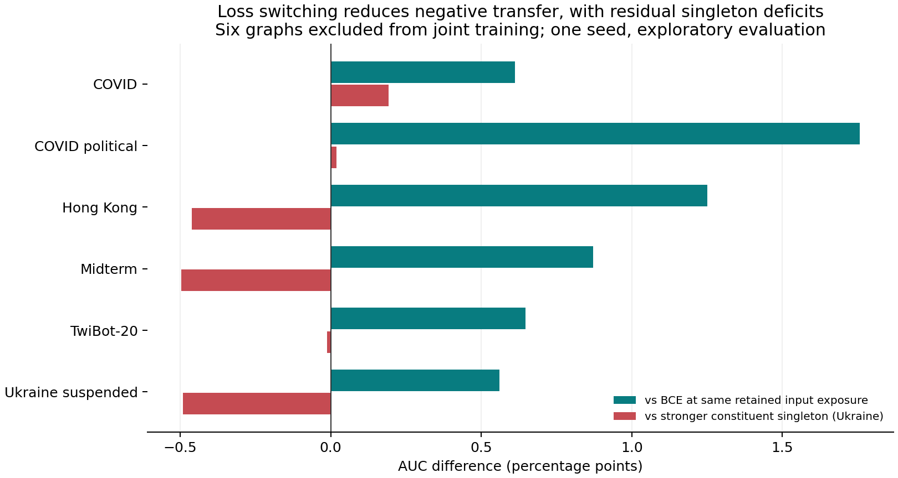
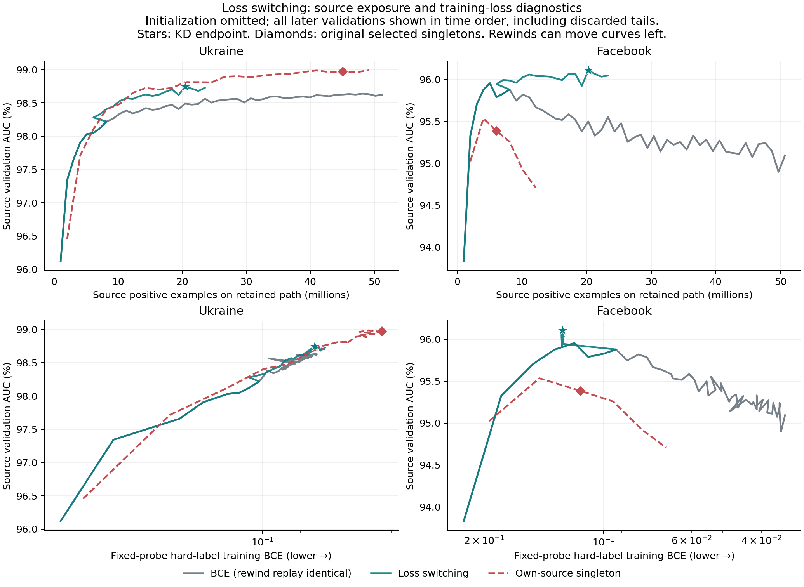

# Asynchronous loss switching: Ukraine + Facebook, seed 0

Completed 2026-09-12. **Replacing Facebook's hard-label loss with distillation mitigated negative transfer, but did not recover the stronger constituent singleton's transfer performance.** This pilot does not demonstrate synergy or a new general mechanism.

## Primary transfer result

All checkpoints were declared using source validation or fixed/matched exposure before downstream evaluation. These six evaluation graphs were excluded from this pair's training: COVID, COVID political, Hong Kong, Midterm, TwiBot-20, and Ukraine suspended. Their scores have been inspected repeatedly during development; they are not untouched confirmation data. Election2020 is excluded from this pilot's target set.

| Model | Mean transfer ROC-AUC (%) | KD minus comparator (pp) |
|---|---:|---:|
| Ukraine singleton, original selected 44k checkpoint | 95.7642 | -0.2084 |
| Asynchronous loss switching, declared endpoint | 95.5558 | — |
| Extended BCE, 100k total updates | 94.9305 | +0.6253 |
| BCE, matched 40k retained updates | 94.6060 | +0.9499 |

KD improves every one of the six targets versus both BCE controls. It exceeds Ukraine singleton on two targets and trails it on four. Ukraine is the stronger **constituent** singleton (Facebook averages 88.0123 on these targets), not the globally best model selected from every source. No uncertainty estimate across training seeds is available.

## Retention on the two training graphs

These are **source-validation** metrics used for convergence, not the separate test-pair metrics in the transfer matrix. Original singleton checkpoints remain selected by their historical rule; we did not reselect them by the maximum AUC along these replay curves.

| Source validation AUC (%) | Own selected singleton | Matched BCE 40k | Extended BCE 100k | KD endpoint | KD minus own singleton (pp) |
|---|---:|---:|---:|---:|---:|
| Ukraine | 98.9744 | 98.4896 | 98.6232 | 98.7459 | -0.2285 |
| Facebook | 95.3845 | 95.4979 | 95.0936 | 96.1067 | +0.7221 |

Facebook's joint teacher had validation AUC 95.9544%; the endpoint improves it by 0.1523 pp. Thus this run preserves Facebook on this validation metric and improves Ukraine relative to the joint BCE controls, while leaving a Ukraine singleton deficit. Neither preservation on these validation pairs nor distillation provides a general retention guarantee.

The curves omit only initialization, retain chronological order, and include evaluated patience tails later discarded by rewinding. The original selected singleton checkpoints are diamonds; the KD endpoint is a star. AUC axes differ across sources. The gray curve represents both BCE arms because their measurements and model weights replay identically.

## What ran and what was controlled

This is a fresh-initialization, seed-0 comparison using the existing node-neighbors BiasMLP, LR 0.0005, fixed source contexts, and alternating 1:1 source batches. The intervention uses a best **joint** teacher, not an initial singleton teacher. Convergence checks source AUC separately every 2k total updates, with patience 3 and min-delta 0.0001 AUC. The temperature and KD weight are both 1. Hard-label BCE is replaced, rather than supplemented, once a source converges. Full model, Adam, sampler, and RNG state rewind together.

1. At physical/logical 16k, Facebook triggered convergence. The student rewound to Facebook's best joint checkpoint at logical 10k, then switched Facebook to soft-target BCE.
2. At physical 52k / logical 46k, Ukraine triggered convergence. The final student rewound to its best at logical 40k. This is the method's all-converged endpoint.
3. Extended BCE continued to the fixed 100k cap (50k source updates each). Its endpoint is a fixed-horizon control, not a claim of convergence. The rewind-only sibling also reached logical 100k.

The KD endpoint retains 20k Ukraine supervised updates and 5k Facebook supervised + 15k Facebook KD updates. Both matched BCE controls retain 20k hard-label updates per source. Sampled positive/negative counts match at this endpoint, including partial batches. This is equal **retained input exposure**, not equal hard-label exposure or compute. KD actually executed 52k optimizer updates including discarded tails, plus 18k teacher batch forwards. Physical counts and teacher work are recorded in `data/aggregate.json`.

With exact state rewind and unchanged batches, the rewind-only arm reproduces extended BCE at all common logged points; the matched checkpoint's maximum parameter difference is exactly 0.0. This is an implementation/control check, not an independent scientific treatment or replication. It supports attributing the matched-exposure difference to the objective switch within this protocol. Comparison to the 100k endpoint additionally changes duration/selection.

Singleton replays reached their original final steps (Ukraine 48k, Facebook 12k); both original best and final model weights matched exactly. Five meaningful synthetic tests passed, covering sampler/Adam replay, frozen-teacher soft-loss replacement, measurement RNG isolation, best-vs-patience tracking, and successive rewinds/control exports. The launcher completed all five checkpoint evaluations across eight graph targets (40 cells); there were no missing matched-control exports.

## Training-loss diagnostic

The lower figure panels compare the same fixed hard-label training probe for all methods, including after KD starts. This is not a comparison of the KD optimization loss to the singleton BCE.

At the Ukraine KD endpoint, probe BCE is 0.086557. The nearest observed singleton checkpoint is 18k updates, BCE 0.086314 (absolute mismatch 0.000242), with validation AUC 98.7272%; KD is only 0.0187 pp higher. The nearest extended-BCE checkpoint is total 90k, BCE 0.086531 (mismatch 0.000026), with validation AUC 98.6335%; KD is 0.1123 pp higher.

These approximate, post hoc comparisons are descriptive. The small singleton separation at similar training loss cautions against interpreting its selected-endpoint gap as a distinct generalization mechanism. The nearby joint-BCE comparison suggests a residual difference worth testing, without establishing causality. Facebook's nearest saved singleton/KD loss mismatch is 0.01252 and its BCE-control mismatch is 0.00586; those are not close matches. No interpolation or loss-sorted trajectory is used. See `data/nearest_training_loss.csv` for the exact residuals.

## Interpretation and next decision

Longer ordinary BCE training recovers some transfer deficit, but loss switching performs better at its matched retained exposure and at the long BCE endpoint. The evidence favors this objective/stopping intervention for this pair and seed. It does not prove that gradient conflict caused negative transfer, isolate a universal mechanism, establish statistical significance, or separate every effect of supervision, regularization, and additional computation.

Before adding ForkMerge or another mechanism, the next useful experiment is to replicate the declared protocol over additional training seeds and compare a small, prespecified set of source-validation stopping settings. Ukraine's patience detector stopped with 20k retained source updates, below the singleton's selected 44k. A controlled longer-KD arm could determine whether keeping Facebook under distillation while giving Ukraine more supervision recovers that remaining deficit. Tune/select only with source validation; any transfer confirmation needs newly reserved evaluation data. This recommendation has **not** been launched.

## Reproduction and provenance

- Training implementation: `b7f23251e254efcef6fa6d2e289c5803238b494a`.
- Branch: `codex/mlp-async-convergence`; local worktree: `/tmp/mlp-pair-error-code`.
- Tucker isolated worktree: `/dataMeR1/phil/gfm/mixture-scaling-async-convergence`.
- Tucker run root: `/dataMeR1/phil/gfm/mixture-scaling/state/async_convergence_s0`.
- `data/aggregate.json`: exported histories, run summaries, singleton replay receipts, and frozen evaluation manifest. Checkpoints and full raw evaluations remain on Tucker.
- `data/matrix.csv`: five declared checkpoint evaluations, eight graph targets each, unscaled metric values.
- `data/singleton_baselines.csv`: historical bias-decoder singleton evaluations copied from the existing baseline export; not the older uniform-decoder baseline.
- Generated tables use AUC percent and differences in percentage points. `transfer_comparison.csv` marks graph roles to keep training-graph test metrics separate from transfer metrics.

Regenerate locally from this directory with `MPLCONFIGDIR=/tmp/mlp-mpl-cache /opt/homebrew/bin/python3.11 analyze.py` (numpy, pandas, matplotlib). The script asserts deterministic replay, verified singleton identities, and all-six-target improvements before writing the tables/figures.

The implementation and paper-specific adaptations are documented in [the protocol](../../docs/asynchronous_convergence_plan.md). The guiding methods are [Lu et al., NAACL 2022](https://aclanthology.org/2022.naacl-industry.18.pdf), [Jiang et al., ForkMerge](https://papers.nips.cc/paper_files/paper/2023/file/60f9118a849e8e9a0c67e2a36ad80ebf-Paper-Conference.pdf), and [Mueller et al., optimization trajectories](https://arxiv.org/html/2408.14677v2). These results are an application and audit of existing ideas.
