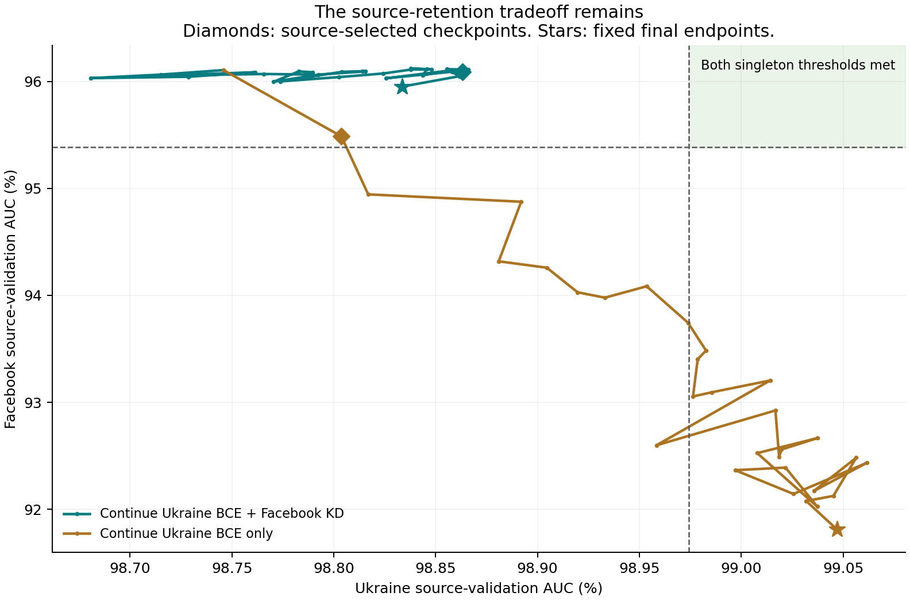

# KD extension with matched Ukraine-only controls

Completed 2026-09-12. **Longer KD training partly recovers Ukraine, but does not remove the source-retention tradeoff.** At equal Ukraine exposure, Ukraine-only fits Ukraine better while forgetting Facebook. No saved checkpoint in either continuation reaches both historical selected-singleton validation AUCs.

## Source-validation result

Both branches start from exactly the same selected KD model and full optimizer/sampler state. The original model has 20k Ukraine supervised updates. “Ukraine updates” below includes that prefix.

| Checkpoint | Ukraine updates | Ukraine AUC (%) | Facebook AUC (%) |
|---|---:|---:|---:|
| Historical own-source singleton thresholds | 44k / 6k | 98.9744 | 95.3845 |
| Original KD endpoint | 20k | 98.7459 | 96.1067 |
| Extended KD, fixed endpoint | 50k | 98.8336 | 95.9527 |
| Ukraine-only, matched Ukraine exposure | 50k | 98.9584 | 92.5982 |
| Ukraine-only, matched added optimizer updates | 80k | 99.0469 | 91.8130 |
| Extended KD, source-selected | 46k | 98.8633 | 96.0908 |
| Ukraine-only, source-selected | 22k | 98.8037 | 95.4866 |

At equal 50k Ukraine updates, retaining Facebook KD buys **+3.3545 pp Facebook AUC** at a **-0.1247 pp Ukraine AUC** difference from Ukraine-only. Ukraine-only nearly reaches its singleton's validation AUC at that exposure, and exceeds it at the longer 80k endpoint, with substantial Facebook forgetting. This supports a retention/fitting tradeoff for this particular continuation protocol; it does not establish a universal gradient mechanism.

Longer KD improves Ukraine over the original endpoint by 0.0878 pp at the fixed endpoint and 0.1174 pp at the source-selected checkpoint. The latter still misses the Ukraine singleton threshold by 0.1111 pp. Its Facebook AUC remains 0.7063 pp above the Facebook singleton threshold. Thus stopping early contributed to the initial deficit, but the extension did not resolve it.

The shaded region is a requirement on both metrics; it is not a measured model. The source thresholds belong to separate singleton models. No observed continuation point enters that region.

## Selection was frozen before transfer evaluation

The three fixed endpoints are the primary matched comparisons. Separately, both branches were allowed 16 selection candidates on the same 2k-Ukraine-update grid, from the start through 50k cumulative Ukraine updates. We selected maximal Ukraine validation AUC subject to Facebook validation AUC >= its original singleton threshold, with earliest-step tie breaking. All 16 KD candidates satisfied the Facebook threshold; only 2 Ukraine-only candidates did. The original checkpoint was an allowed fallback, but neither selected model used it.

The highest logged KD Ukraine AUC was 98.8659% at 47k Ukraine updates. It lies outside the declared selection grid and does not replace the selected 46k checkpoint. All 31 logged checkpoints per arm were audited for both-source preservation; neither arm had one. The common-grid manifest remained authoritative for transfer evaluation.

## Transfer to the other six graphs

The following means exclude Ukraine and Facebook. They use the same six graph targets as the previous pilot. These targets were repeatedly inspected during development, so they remain exploratory, not untouched confirmation data. Source-validation AUC above and graph-test AUC below use distinct evaluation pairs.

| Model | Mean transfer AUC (%) |
|---|---:|
| Stronger constituent singleton: Ukraine | 95.7642 |
| Extended KD, source-selected | 95.7093 |
| Ukraine-only, source-selected | 95.6923 |
| Ukraine-only, matched added updates | 95.6318 |
| Ukraine-only, matched Ukraine exposure | 95.6089 |
| Original KD endpoint | 95.5558 |
| Extended KD, fixed endpoint | 95.5327 |

Source-selected KD is **+0.1534 pp** above original KD and **-0.0549 pp** below Ukraine singleton. Its **+0.0170 pp** mean difference from source-selected Ukraine-only splits 3 wins / 3 losses across targets. That is inconclusive evidence of a transfer advantage in one seed, and it is not synergy. The selected models use different training durations, although they were chosen with the same exposure grid, budget range, and validation rule.

Longer training by itself did not improve transfer: the fixed KD endpoint is 0.0231 pp below original KD. At matched Ukraine exposure, fixed KD trails Ukraine-only by 0.0762 pp on the six-target mean despite preserving Facebook much better. Do not present source-retention gains as evidence of unseen-graph transfer gains.

## Diagnostic and next step

The [exposure curves](figures/source_auc_by_exposure.png) and [fixed hard-label training-loss curves](figures/source_auc_by_training_loss.png) show that Ukraine-only progresses further in fitting Ukraine while Facebook deteriorates. The Facebook exposure curve is vertical for Ukraine-only because Facebook receives no new batches while Ukraine updates change the shared model. Loss comparisons are descriptive; no matching on KD soft-target loss or transfer-based checkpoint selection is used.

The next narrowly justified intervention is to reduce the strength of Facebook distillation while holding the checkpoint, teacher, learning rate, sampling, and horizon fixed. Weight 0 is represented by the Ukraine-only source-exposure control and weight 1 by this KD continuation, although their update schedules/Adam histories differ; intermediate positive weights should retain the KD schedule to isolate KD weight. A small prespecified weight comparison should choose only using the same source-validation retention rule. The existing Facebook margin makes this a testable possibility, not a promise that both-source preservation is attainable. No weight sweep or ForkMerge run has been launched.

## Verification, compute, and provenance

- Seven tests passed: the original five state/rewind tests and two new tests covering full-state continuation, loss routing, partial batches/reshuffling, fixed teacher, matched Ukraine pair sequences/counters, selection grids, ties, fallback, and absence.
- Starting model, Adam state, sampling, and measurements match. The first three resumed KD checkpoints reproduce the original discarded tail with **0.0 parameter difference** and identical metrics.
- At matched Ukraine exposure, positive/negative counts and Ukraine sampler state match exactly.
- KD adds 60k optimizer updates: 30k Ukraine supervision and 30k Facebook KD. It adds 30k teacher batch forwards. Ukraine-only adds 60k optimizer updates, with a saved exposure comparator at +30k. Equal optimizer steps are not equal computation. Both share the original prefix; the prior run executed 52k physical updates including discarded tails.
- Measured branch training times, including validation/checkpoint work but excluding setup/evaluation: KD 138.91 s; Ukraine-only 119.59 s. These parallel-run timings are not a controlled hardware benchmark.
- All five declared checkpoints were evaluated on eight graph targets: 40 cells, no missing selections. See `data/completion.json`.
- Training code commit: `ab248a8`; branch `codex/mlp-async-extension`; local worktree `/tmp/mlp-pair-error-code`; isolated Tucker worktree `/dataMeR1/phil/gfm/mixture-scaling-async-extension`.
- Tucker state root: `/dataMeR1/phil/gfm/mixture-scaling/state/async_extension_s0`. The parent remains unchanged at `/dataMeR1/phil/gfm/mixture-scaling/state/async_convergence_s0`.
- `data/aggregate.json` contains histories, summaries, singleton references, source-only selections, hashes and replay checks. `data/matrix.csv` contains the evaluated test metrics. Checkpoints and full raw evaluations remain on Tucker.

See [the prespecified protocol](../../docs/async_extension_plan.md). Reproduce all tables/figures with `MPLCONFIGDIR=/tmp/mlp-mpl-cache /opt/homebrew/bin/python3.11 results/async_extension/analyze.py` from the repository root. This remains a single-seed exploratory experiment; it does not establish a general preservation guarantee or a new transfer mechanism.
