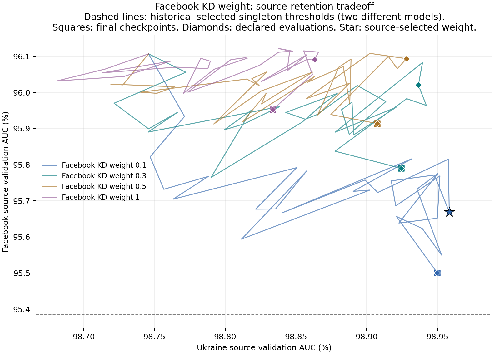
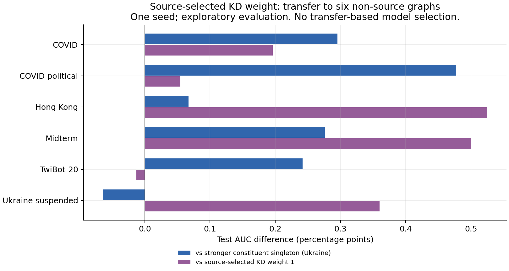

# Lower Facebook KD weights

Completed 2026-09-12. **Weight 0.1 improves exploratory transfer beyond the stronger constituent singleton, while nearly recovering Ukraine's source-validation AUC. It does not preserve either source's separate test AUC.** These are different outcomes; the result is a transfer improvement candidate, not simultaneous retention and synergy demonstrated across seeds.

## Controlled change and source-only decision

We tested Facebook soft-label BCE coefficients 0.1, 0.3 and 0.5 against the completed 1.0 extension. Every model continues the same original KD checkpoint at 20k Ukraine supervision updates, with the same restored AdamW state, teacher, temperature, LR, clipping, probes, and alternating source batches. Each weight reaches 50k Ukraine updates after 60k additional optimizer updates. Only Facebook's soft-loss coefficient changes; Ukraine hard BCE is unchanged. Adam and clipping mean a smaller coefficient is not a proportionally smaller parameter update.

Before downstream evaluation, the declared source-validation rule selected **weight 0.1 at 38k cumulative Ukraine updates** (`kd_w010_selected`, 36k added optimizer updates). It maximizes Ukraine validation AUC subject to Facebook meeting its selected-singleton validation AUC. All weights use the same 16-point Ukraine-exposure grid, maximum exposure and start fallback. The weight-one model remains an eligible fallback.

| KD coefficient | Selected Ukraine updates | Ukraine validation AUC (%) | Facebook validation AUC (%) |
|---:|---:|---:|---:|
| **0.1** | **38k** | **98.9584** | **95.6694** |
| 0.3 | 46k | 98.9366 | 96.0206 |
| 0.5 | 46k | 98.9282 | 96.0934 |
| 1.0 | 46k | 98.8633 | 96.0908 |
| Respective singleton references | 44k / 6k | 98.9744 | 95.3845 |

The selected 0.1 model is **-0.0160 pp** below Ukraine singleton validation AUC and **+0.2848 pp** above Facebook singleton validation AUC. No logged checkpoint, including those outside the selection grid, meets both exact singleton thresholds. The 0.016 pp residual is near parity in this one-seed observation; it is not evidence of a statistically meaningful loss.

The fixed 50k-Ukraine endpoints show a clear directional tradeoff across the tested coefficients: Ukraine AUC increases from 98.8336% at weight1 to 98.9499% at weight0.1, while Facebook decreases from 95.9527% to 95.5011%. The latter remains above its source-validation threshold. This is stronger evidence for the effect of the loss coefficient than a comparison of differently selected durations alone.

## Transfer result

Six-target means exclude both training graphs. The weight and checkpoints were fixed from source validation before new test evaluations. These targets have repeatedly been inspected in earlier development, so this is exploratory evidence rather than untouched confirmation.

| Source-selected procedure/model | Mean transfer test AUC (%) |
|---|---:|
| **KD weight 0.1, selected** | **95.9797** |
| KD weight 0.5, selected | 95.9040 |
| KD weight 0.3, selected | 95.8209 |
| Stronger constituent singleton: Ukraine | 95.7642 |
| KD weight 1.0, selected | 95.7093 |
| Ukraine-only continuation, selected | 95.6923 |

The declared 0.1 selection improves by **+0.2155 pp over Ukraine singleton (5/6 targets)**, **+0.2705 pp over selected weight1 (5/6)**, and **+0.2874 pp over selected Ukraine-only (6/6)**. It loses 0.0644 pp to Ukraine singleton on Ukraine suspended; the other five target differences are positive. These selected procedures use different durations: 38k Ukraine updates for weight0.1 versus 22k for selected Ukraine-only. Their difference is not a matched-budget causal contrast.

For the matched-Ukraine-exposure control, fixed weight0.1 at 50k Ukraine updates reaches 95.6935% versus 95.6089% for Ukraine-only at the same Ukraine exposure: **+0.0846 pp**, with 5/6 target wins. This matches Ukraine exposure, not compute or total source inputs. The weight0.1 fixed endpoint is below Ukraine singleton by 0.0707 pp; the better transfer mean above belongs to the predeclared source-selected checkpoint, not to arbitrary longer training. All fixed and selected scores remain in `data/transfer_means.csv`.

## Source validation is not source-test retention

The selected model's independent test pairs on the two training graphs give:

| Source graph test | Selected KD0.1 AUC (%) | Own singleton test AUC (%) | Difference (pp) |
|---|---:|---:|---:|
| Ukraine | 99.1209 | 99.2742 | **-0.1533** |
| Facebook | 94.9511 | 95.2039 | **-0.2528** |

Thus the Facebook validation constraint did not ensure Facebook test retention, and near-parity Ukraine validation did not ensure Ukraine test retention. Do not label this model as preserving both sources or use validation thresholds as a generalization guarantee. The six-target transfer gain and the two source-test losses coexist. Reproducible per-model source-test comparisons are in `data/source_test_retention.csv`.

## What follows

Keep weight0.1 and this source-only selection rule fixed for replication before chasing smaller validation gaps with further coefficient tuning. Additional training seeds can test stability; genuinely untouched confirmation also requires newly reserved evaluation data or graphs. If source-test retention is a hard requirement, it remains unmet and calls for an explicit retention study rather than declaring the transfer gain sufficient. No further training was launched in this task.

## Verification and provenance

- **10 tests passed**, including scalar KD gradients, unchanged Ukraine BCE, frozen teachers, exact Adam/sampler continuation, partial batches/reshuffling, invalid-weight rejection, and source-only selection behavior.
- New arms start from identical hashed model/teacher/probe inputs and share the same source data, optimizer policy, LR, seed, schedule, and budget. Both source endpoint sampler states and all exposure counters match weight1 exactly.
- Weight1 training is reused from the completed extension. Its fixed and selected AUC evaluations replay exactly (maximum difference0.0); it is not an independent training replication.
- All eight declared fixed/selected checkpoints were evaluated on eight graph targets: **64 cells, no missing selections**. See `data/completion.json`.
- Each new arm adds30k Facebook teacher batch forwards and60k student optimizer updates. Training/validation/checkpoint wall times were135.55s,138.93s,135.94s for weights0.1,0.3,0.5; these concurrent timings exclude setup/evaluation and are not a controlled compute benchmark.
- Training code: `affc132`; branch: `codex/mlp-async-kd-weights`; local worktree: `/tmp/mlp-pair-error-code`; Tucker worktree: `/dataMeR1/phil/gfm/mixture-scaling-async-kd-weights`.
- Tucker state root: `/dataMeR1/phil/gfm/mixture-scaling/state/async_kd_weights_s0`. Parent and weight1-reference state roots remain unchanged.
- `data/aggregate.json` contains source histories, verified singleton references, run summaries and the frozen manifest; `data/matrix.csv` contains test evaluations. Full model/optimizer checkpoints remain on Tucker.

See [the prespecified protocol](../../docs/async_kd_weights_plan.md). Regenerate with `MPLCONFIGDIR=/tmp/mlp-mpl-cache /opt/homebrew/bin/python3.11 results/async_kd_weights/analyze.py` from the repository root. [Exposure curves](figures/ukraine_exposure.png) and [hard-label training-loss diagnostics](figures/source_training_loss.png) complement the figures above. No new general mechanism or preservation guarantee is established.
