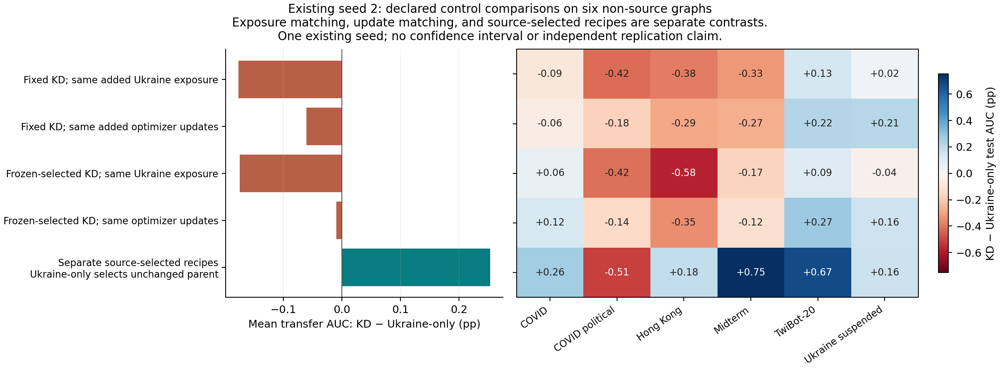
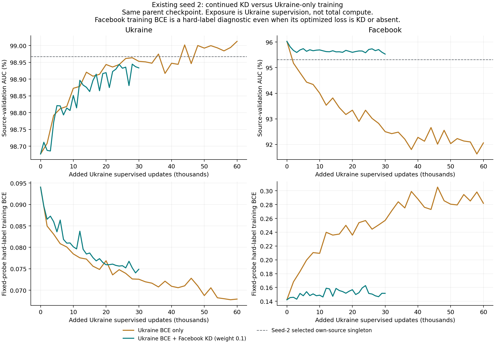

# Existing seed 2: Facebook KD trades transfer performance for retention

Removing Facebook KD from the existing joint parent improves mean transfer and Ukraine test performance at the prescribed matched checkpoints, while substantially worsening Facebook test performance. At matched Ukraine exposure, continued weight-0.1 KD costs **0.1767 AUC percentage points of mean transfer** and **0.0753 pp on Ukraine test**, while retaining **2.9728 pp more Facebook test AUC** than Ukraine-only continuation. This is controlled evidence of a retention/transfer tradeoff in this continuation, rather than another random-seed replication.

We trained one Ukraine-only branch for 60k added updates from seed 2's exact parent model, Adam, RNGs, samplers and counts. The existing KD branch and checkpoint choices stayed frozen. All 40 new and 32 reused evaluation cells completed. The diagnostic was motivated by the observed seed-2 failure, so it is not untouched confirmation.

## Matched controls

Transfer is mean test AUC over the six original non-source graphs. Source test outcomes are reported separately. Differences below are **KD minus Ukraine-only**, in AUC percentage points; positive means KD performs better.

| Prescribed comparison | Added updates KD / Ukraine-only | KD transfer AUC (%) | Ukraine-only transfer AUC (%) | Transfer delta (pp) | Ukraine-test delta (pp) | Facebook-test delta (pp) |
|---|---:|---:|---:|---:|---:|---:|
| Fixed endpoint, same Ukraine exposure | 60k / 30k | 95.8240 | 96.0007 | -0.1767 | -0.0753 | +2.9728 |
| Fixed endpoint, same optimizer updates | 60k / 60k | 95.8240 | 95.8844 | -0.0604 | -0.1191 | +3.2747 |
| Previously selected KD, same Ukraine exposure | 56k / 28k | 95.6935 | 95.8680 | -0.1745 | -0.0758 | +2.8002 |
| Previously selected KD, same optimizer updates | 56k / 56k | 95.6935 | 95.7031 | -0.0096 | -0.1326 | +3.4763 |

The exposure comparisons have identical Ukraine pairs and cumulative supervised exposure (46k or 44k updates respectively). They differ in the additional Facebook updates and their effect on the shared parameters and Adam state. The optimizer-update comparisons instead give Ukraine-only twice the added Ukraine exposure. Equal optimizer updates are not equal compute: KD also performs teacher forwards.

KD improves 2/6 transfer targets in each fixed-endpoint comparison and in the frozen-selected exposure comparison, and 3/6 in the frozen-selected optimizer-update comparison. The last mean gap is small (-0.0096 pp); a single observed seed does not establish its statistical reliability. The two matched-Ukraine-exposure comparisons agree closely at approximately -0.175 pp. These endpoints were prescribed before reading the new test results, not chosen for their observed scores.

## Removing KD is not a preservation solution

At the primary matched-exposure checkpoint, Ukraine-only achieves 96.0007% transfer versus its frozen Ukraine singleton's 95.9111% (+0.0896 pp). Its Ukraine source test also exceeds that singleton by +0.0556 pp. But Facebook source test falls to 92.0094%, **3.4386 pp below** its own frozen singleton (95.4480%). Keeping KD limits the Facebook loss at the corresponding fixed endpoint to -0.4658 pp; it does not eliminate it.

Thus these runs provide two incomplete outcomes: stronger Ukraine/transfer with forgetting, or better Facebook retention with some loss in Ukraine/transfer. The control isolates the contribution of continued Facebook KD after the common parent. It does not establish a new general mechanism, architectural impossibility, or that the same tradeoff must hold on other seeds or graphs.

## The preservation constraint rejects every trained Ukraine-only checkpoint

The unchanged source-only rule selects **+0**, the common parent, for Ukraine-only. Of the 16 eligible grid points (0 through 30k added Ukraine updates by 2k), only the start meets the Facebook validation floor of 95.31495%. At +2k, Facebook validation is already 95.17670%. Every later logged control checkpoint also fails that floor. This is an explicit initialization fallback, not a successful trained preservation checkpoint.

The separately source-selected recipe comparison consequently gives KD a +0.2533 pp transfer advantage, but compares KD +56k against the unchanged parent. It must not be substituted for the matched training-budget comparisons above. The positive bottom row in the comparison figure is labelled with this fallback.

The validation/probe trajectories show the local tradeoff directly. Ukraine-only lowers the fixed Ukraine hard-label training loss and ultimately improves Ukraine validation, while Facebook hard-label probe loss rises and validation AUC falls. The KD arm keeps Facebook behavior much steadier, with slower Ukraine improvement. These are measured outcomes of the intervention; they do not identify gradient conflict as a generalization mechanism.

## What this explains and what remains open

The common parent already averages **95.4402% transfer**, versus 95.9111% for the frozen Ukraine singleton (-0.4709 pp). Both the fixed KD endpoint (+0.3837 pp) and the matched-exposure Ukraine-only endpoint (+0.5605 pp) improve that parent. The previously selected KD checkpoint improves it by +0.2533 pp. Therefore the entire earlier singleton deficit cannot be attributed to these continued Facebook KD updates: part of that deficit existed before the intervention.

Within the observed continuation, adding Facebook KD at matched Ukraine exposure has a measurable transfer cost and a large Facebook retention benefit. Removing KD recovers transfer, but loses the behavior we wanted to preserve. A useful next intervention should try to retain Facebook behavior without imposing this same transfer cost. No additional intervention or new-seed run was launched here.

## Integrity and reproduction

- Exact initialization audit passed for model weights, Adam moments/counters, Python/NumPy/CPU/CUDA RNGs, and both source samplers.
- The control performs zero added Facebook training updates or teacher forwards. Facebook cumulative counts and sampler state remain unchanged; historical prefix exposure is preserved in the accounting.
- At both matched-Ukraine-exposure comparisons, full Ukraine counts and sampler states match the existing KD branch. Learning rate, weight decay, optimizer policy, validation cadence, graph receipts and probe identities match.
- Existing KD selections are tied to their old manifest by step, validation, counts and checkpoint SHA. New selections were frozen before new test evaluation. Checkpoint SHA/identity and common evaluation-pair/split provenance were verified before aggregation. No reused model was re-evaluated.
- Two existing engine tests and three new control-audit/selection tests passed before launch. Actual training took about 123 seconds, excluding loading and evaluation. The 60k fixed horizon is not a convergence claim.
- Training revision: `97db93f`, branch `codex/mlp-async-seed2-control`. Local worktree: `/tmp/mlp-pair-error-code`. Tucker worktree: `/dataMeR1/phil/gfm/mixture-scaling-async-seed2-control`. Output root: `/dataMeR1/phil/gfm/mixture-scaling/state/async_seed2_control_s2`. Training used GPU 0; evaluation used GPUs 0–3.

See the [prespecified protocol](../../docs/async_seed2_control_plan.md), [raw matrix](data/matrix.csv), [frozen histories and manifest](data/aggregate.json), [completion receipt](data/completion.json), [transfer comparisons](data/transfer_comparisons.csv), [source-test comparisons](data/source_test_comparisons.csv), and [source-test retention](data/source_test_retention.csv). Rebuild with `MPLCONFIGDIR=/tmp/mlp-mpl-cache /opt/homebrew/bin/python3.11 results/async_seed2_control/analyze.py`.
