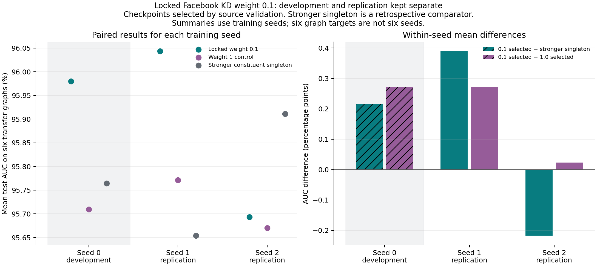
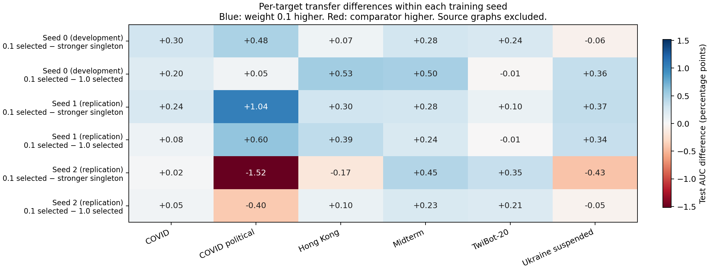

# Locked KD weight 0.1: mixed replication across training seeds

The fixed weight-0.1 recipe improves six-graph mean transfer relative to weight 1 in both new training seeds. It exceeds the stronger constituent singleton in only **one of the two**. Seed 1 also improves both source-test AUCs; seed 2 decreases both. These results support reducing the KD coefficient relative to weight 1 in this setup, but do not establish reliable synergy or preservation.

All 96 prescribed evaluation cells completed, with no unavailable checkpoint selections. Model initialization and training sampling vary across seeds; graph splits, context features, validation pairs, probes, and test pairs remain fixed. Seed 0 is development evidence and is excluded from the replication summaries.

## Primary source-selected comparison

Mean test AUC on the six non-source graphs, in percent. Checkpoints are selected exclusively using source validation. Ukraine is the stronger constituent singleton by mean transfer in each seed; that identification is a retrospective comparator, not a checkpoint-selection input.

| Training seed | Ukraine singleton | Facebook singleton | Weight 1 | Locked weight 0.1 | 0.1 minus stronger singleton (pp) | 0.1 minus weight 1 (pp) |
|---|---:|---:|---:|---:|---:|---:|
| 0, development only | 95.7642 | 88.0123 | 95.7093 | 95.9797 | +0.2155 | +0.2705 |
| 1, replication | 95.6538 | 88.2975 | 95.7714 | 96.0434 | +0.3896 | +0.2720 |
| 2, replication | 95.9111 | 87.7345 | 95.6702 | 95.6935 | -0.2176 | +0.0234 |

Across seeds 1 and 2, the descriptive mean difference is **+0.0860 pp versus the stronger singleton** and **+0.1477 pp versus weight 1**. The former changes sign across seeds. Two training seeds do not support a strong significance claim; six graph targets are not six independent training seeds. These repeatedly inspected graph targets are not untouched-data confirmation.

Seed 1 improves all 6 transfer targets relative to its Ukraine singleton; seed 2 improves 3 of 6. Seed 2's largest loss is COVID political (-1.5193 pp). Relative to weight 1, weight 0.1 improves 5 of 6 targets in seed 1 and 4 of 6 in seed 2.

## Fixed-horizon control

Both coefficient arms receive exactly 60k additional alternating optimizer updates from identical full starting states: 30k Ukraine supervised updates and 30k Facebook KD updates. Each pair has identical sample sequences and teachers. The final cumulative Ukraine exposure is 53k updates in seed 1 and 46k in seed 2 because their parents converged at different times.

| Training seed | Weight 0.1 fixed AUC (%) | Delta versus stronger singleton (pp) | Delta versus weight 1 fixed (pp) |
|---|---:|---:|---:|
| 1 | 96.0434 | +0.3896 | +0.2720 |
| 2 | 95.8240 | -0.0871 | +0.1167 |

Replication-only fixed-horizon mean differences are +0.1512 pp versus the stronger singleton and +0.1943 pp versus weight 1. Thus the direction of the coefficient comparison repeats without checkpoint selection, while superiority to the singleton still does not repeat in both seeds.

Source selection chooses the +60k endpoint in seed 1 and +56k in seed 2 for **both** weights. Selected coefficient comparisons therefore happen to have matched exposure within each new seed. In seed 2, source selection lowers transfer mean by 0.1304 pp relative to its fixed endpoint; the fixed endpoint still trails the singleton. Selection contributes to the measured deficit but does not account for all of it. This is a post-evaluation observation, not permission to select on transfer tests.

## Source validation and source test are different outcomes

Deltas below compare weight 0.1's source-selected checkpoint with the corresponding seed's own source singleton. All values are AUC percentage points.

| Training seed | Ukraine validation | Facebook validation | Ukraine test | Facebook test |
|---|---:|---:|---:|---:|
| 1 | -0.0444 | +0.6729 | +0.0904 | +0.5366 |
| 2 | -0.0230 | +0.3931 | -0.0899 | -0.2223 |

Both source-selected checkpoints satisfy the Facebook validation floor and narrowly miss Ukraine's singleton validation AUC. No saved continuation checkpoint, including those outside the selection grid, meets both exact source-validation floors. Nevertheless, seed 1 improves both source tests and seed 2 decreases both: a validation retention constraint is not a test-retention guarantee.

Weight 1 retains Facebook source-test performance in both replications (+0.7429 / +0.2438 pp), while its Ukraine source-test deltas are +0.0112 / -0.1063 pp. Lowering KD therefore changes a retention/transfer tradeoff; it does not uniformly improve every outcome.

## Training and audit

| Seed | Parent physical updates | Parent surviving logical updates | Ukraine singleton selected / terminal | Facebook singleton selected / terminal | Selected added updates, both weights |
|---|---:|---:|---:|---:|---:|
| 1 | 54k | 46k | 70k / 76k | 6k / 12k | 60k |
| 2 | 44k | 32k | 38k / 40k | 6k / 12k | 56k |

Both parents declared both tasks converged; all four singletons stopped on validation plateaus, with no safety caps. Facebook converged first in both seeds. The parent restores full model/Adam/sampler/RNG states on rewind. The continuation uses the all-converged endpoint, reactivates Ukraine BCE, and preserves the frozen Facebook teacher with Adam state intact.

The selection audit reproduced each seed's minimum-BCE singleton choices and the full 16-point source-only constrained selection. Graph/split receipts and probe tensors match between singletons, joint arms, new seeds and development seed 0. Paired continuations have matching starts, teachers, probes, counts, and final sampler states. Applicable weight-1 tail replay matches exactly (maximum parameter difference 0.0 and identical measurements): one validation point in seed 1 and three in seed 2. Eighteen focused unit tests passed before launch.

The remaining claim to test is reliable benefit from adding Facebook over additional Ukraine-only training. This replication compares against frozen singleton checkpoints and a matched coefficient control; it does not add new-seed matched-exposure Ukraine-only continuations. The previous seed-0 Ukraine-only control cannot establish that comparison for seeds 1 and 2. Retain weight 0.1 as a candidate, rather than treating the positive two-seed mean as a preservation guarantee.

## Reproduction and evidence

- Protocol and command: [replication plan](../../docs/async_seed_replication_plan.md).
- Training revision: `650a57f0c89dc51586dfdea85e8915e17fb585cf`, branch `codex/mlp-async-seed-replication`.
- Local worktree: `/tmp/mlp-pair-error-code`; isolated Tucker worktree: `/dataMeR1/phil/gfm/mixture-scaling-async-seed-replication`.
- Tucker output root: `/dataMeR1/phil/gfm/mixture-scaling/state/async_seed_replication_s12`; tmux session: `mlp-async-seed-replication`; only GPUs 0–3 used.
- Frozen histories/manifests: [aggregate.json](data/aggregate.json). Test results: [matrix.csv](data/matrix.csv). Coverage: [completion.json](data/completion.json).
- Derived tables: [per-seed comparisons](data/per_seed_comparisons.csv), [replication summary](data/replication_summary.csv), [source validation](data/source_validation_checkpoints.csv), [source-test retention](data/source_test_retention.csv), [target deltas](data/target_deltas.csv).
- Rebuild tables and figures: `MPLCONFIGDIR=/tmp/mlp-mpl-cache /opt/homebrew/bin/python3.11 results/async_seed_replication/analyze.py`.
