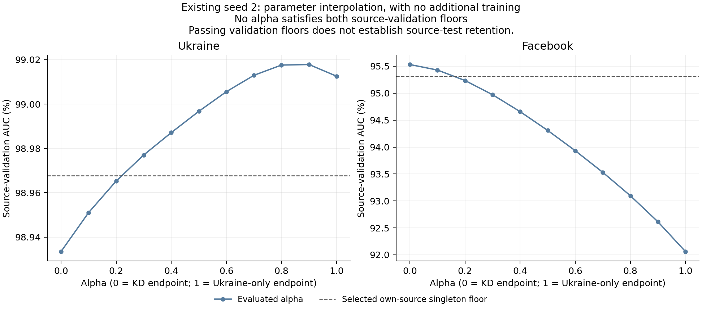

# Eleven endpoint weight mixtures do not preserve both source-validation baselines

None of the 11 prescribed mixtures meets both seed-2 singleton source-validation AUC floors. No merge was selected, no new training was performed, and **no downstream test evaluation was run**. The observed grid retains the tradeoff between Ukraine and Facebook instead of producing a point that clears both baselines.

Alpha is the Ukraine-only weight in `theta = (1-alpha) * theta_KD + alpha * theta_Ukraine_only`. The endpoints are the existing KD weight-0.1 and Ukraine-only branches, each after 60k added optimizer updates from the same parent. Their cumulative Ukraine exposure differs (46k versus 76k updates). Every floating model tensor, including decoder bias, is interpolated; optimizer state is not merged.

## Source-validation results

The required floors are **98.96764586% Ukraine AUC** and **95.31494825% Facebook AUC**. The table shows deltas from those floors in AUC percentage points; both must be nonnegative to qualify.

| Ukraine-only weight alpha | Ukraine delta (pp) | Facebook delta (pp) | Qualifies both? |
|---:|---:|---:|---|
| 0.0 | -0.034191 | +0.216444 | No |
| 0.1 | -0.016623 | +0.114069 | No |
| 0.2 | -0.002402 | -0.080234 | No |
| 0.3 | +0.009375 | -0.343565 | No |
| 0.4 | +0.019458 | -0.657896 | No |
| 0.5 | +0.029065 | -1.006360 | No |
| 0.6 | +0.037927 | -1.382422 | No |
| 0.7 | +0.045309 | -1.784643 | No |
| 0.8 | +0.049940 | -2.218441 | No |
| 0.9 | +0.050169 | -2.701467 | No |
| 1.0 | +0.044907 | -3.254951 | No |

Facebook passes at alpha 0 and 0.1. Ukraine passes at alpha 0.3 through 1.0. Alpha 0.2 misses both. There is no overlap among evaluated points.

By maximum minimum margin alone, alpha 0.1 is the closest grid point, but it still misses Ukraine by 0.016623 pp. This is a descriptive near miss, not a selected model or a relaxed success criterion. Alpha 0.2 is closer on Ukraine but already loses 0.080234 pp on Facebook.

## Interpretation and limits

This particular endpoint-averaging test did not resolve source-validation preservation. Increasing the Ukraine-only contribution improves Ukraine validation over most of the evaluated grid while progressively reducing Facebook validation. A higher Ukraine AUC alone is not the requested both-source outcome.

The result applies to these two endpoints and these 11 mixing weights. It does not test intermediate unmeasured alphas, other checkpoint pairs, layer-specific merging, iterative short-branch merging, or the general capacity of a shared model. Neither the grid nor the floors were changed after seeing measurements. There are no new transfer or source-test claims because no candidate qualified for test evaluation.

## Integrity and evidence

Both endpoint source-validation and original fixed hard-label probe measurements reproduced exactly. Endpoint checkpoint hashes, shared parent hash/counts, seed-0 data/probe identities and seed-2 singleton floors were checked. Three focused tests passed for exact nonmutating endpoint blending, compatibility/selection checks, and skipping downstream evaluation on a no-feasible outcome. The resulting weight artifacts are explicitly inference-only, with zero new optimizer updates and no resumable optimizer state.

Evaluation revision: `e550945`. Branch: `codex/mlp-async-weight-merge`. Local worktree: `/tmp/mlp-pair-error-code`; Tucker worktree: `/dataMeR1/phil/gfm/mixture-scaling-async-weight-merge`. Cluster output: `/dataMeR1/phil/gfm/mixture-scaling/state/async_weight_merge_s2`. Source validation used GPU 0; conditional transfer evaluation was skipped.

- [Prespecified protocol](../../docs/async_weight_merge_plan.md)
- [All measured source results and frozen no-feasible selection](data/aggregate.json)
- [All-alpha metrics and margins](data/all_alpha_source_metrics.csv)
- [Completion receipt: 11 source candidates, zero training updates, zero test cells](data/completion.json)

Rebuild the table and figure with `MPLCONFIGDIR=/tmp/mlp-mpl-cache /opt/homebrew/bin/python3.11 results/async_weight_merge/analyze.py`.
