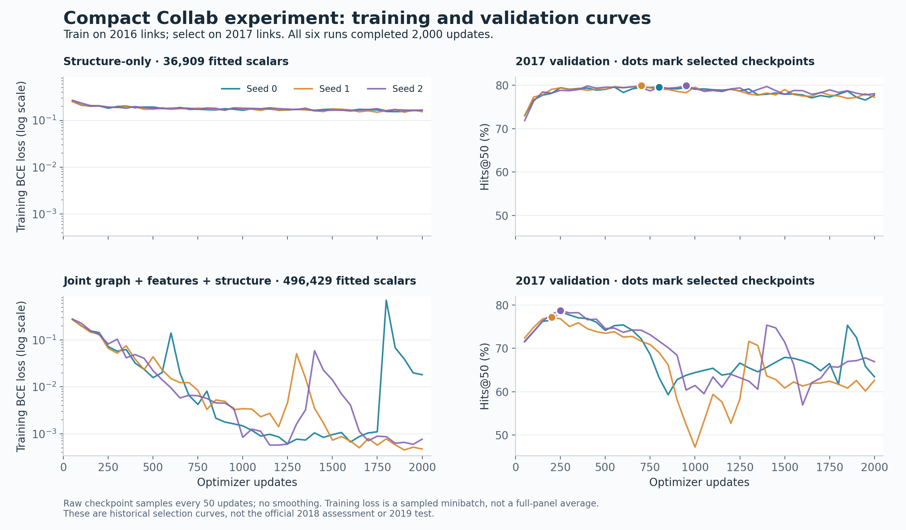

# Compact joint scorer: experiment history and test-exposure findings

##2018 training:82.54% test mean, with near-complete test-negative exposure

The user-authorized2018 training run numerically exceeds the71.29% target with
496,448 total inference scalars. However,99,984 of the100,000 official2019 negative
pairs also occur in the official2018 training-negative panel. This provides a
direct way to fit nearly the entire test-negative set. It is NOT a clean win on
unseen test examples, nor evidence that calendar recency alone caused the jump.
This overlap was discovered during the run and disclosed before final reporting;
the fixed run completed without changing its protocol.

| Seed | Test-selected step | Fusion test Hits@50 (%) | Standalone joint at same step (%) |
| --- | ---: | ---: | ---: |
| 0 | 1450 | 82.5099 | 82.5034 |
| 1 | 1800 | 82.8876 | 82.8854 |
| 2 | 1850 | 82.2206 | 82.2185 |

Per-seed-selected mean82.5394%, sample SD0.3345 points. Best individual82.8876%.
All select the frozen2015 AA base and alpha100, the grid's upper boundary; no grid
extension followed. Fusion adds only1–3 positive hits beyond standalone joint at
these checkpoints. The large score increase is in the learned scorer, not AA
mixing. No ensemble is involved. Do not compare the per-seed-selected mean as if
it used one common hyperparameter configuration across seeds.

Compared with the previous69.5590% best, best single rises13.3286 points. But the
comparison changes training cohort/graph AND checkpoint selection: old weights
were2017-selected, while new checkpoints are selected using2019. Training2018 also
uses the official all-endpoint panel, unlike the older warm-positive-filtered
historical training panel. The near-complete negative reuse is a major validity
threat that remains even if checkpoint selection were moved off test. No matched
fresh-negative control was run, so its causal contribution is not quantified.

### Exactly what was trained and selected

Three fresh joint models, seeds0/1/2, exactly2000 updates each. Same architecture,
balanced BCE, Adam lr.001/wd.0001, clipping5,2048 positives+1024 uniform negatives+
1024 mined negatives/update, mining from top2048 of the fixed training-negative
pool refreshed every10 steps. Retained2015 AA feature calibration and2016
standardization. Training2018 uses graph≤2017. Scoring2019 uses train+2018 graph,
with no2019 events added. Static supplied128-D node inputs unchanged.

Official2019 selected checkpoints and fusion weights every50 updates. Two AA
bases ×20 weights ×40 checkpoints ×3 seeds =4800 evaluated fusion cells. Earliest
step, then declared base/alpha order breaks ties. All checkpoints, predictions,
curves, grids, source hashes and offline W&B records retained. Selected-checkpoint
replay on Tucker reproduced saved predictions exactly.

Independent undirected pair audit finds12100 train-positive/test-positive pairs,
99984 train-negative/test-negative pairs, and zero cross-label overlaps. It also
verifies test adjacency is exactly training adjacency plus2018 positive edges:
repeated historical pairs are allowed; no2019 target event was inserted. The
negative identities are the exposure route, not an accidental test-edge adjacency.

Measured60.68–61.44 seconds per seed,2.52GB peak allocated GPU memory; ran on
GPUs0–2 concurrently. All sessions exited and owned GPUs were released. No retry,
extension, additional model or external leaderboard submission occurred.
Producing revision `42946edccb964eaee09ed70e706e5f389ea07f9d`, branch
`codex/collab-compact-joint`; same local/Tucker worktrees as below. Runtime:
`/dataMeR1/phil/gfm/ogbl_collab_compact_joint/train2018_v1`.

Evidence: [independent full-grid audit and summary](data/train2018_v1/audit_summary.json),
[seed0 result](data/train2018_v1/seed0/results.json),
[seed1 result](data/train2018_v1/seed1/results.json),
[seed2 result](data/train2018_v1/seed2/results.json). Each seed directory contains
protocol, source hashes and full training/grid history. Reproduce with setup
`train2018.py`/`launch_train2018.sh`. Audit with `audit_train2018.py --runtime
<private score directories> --train-panel <year2018.npz> --test-panel <year2019.npz>
--evidence data/train2018_v1`. Private raw score copies:
`/private/tmp/collab-train2018.QyGqnT`.

Decision: the user's literal numerical target is exceeded under the disclosed
test-exposed protocol. Do not describe this as a clean benchmark/generalization
advance. Determining what remains without shared-negative exposure requires a
separate control; none was automatically launched.

## Official2019 opened: test-tuned fusion69.43%, target not reached

The user explicitly authorized official-test scoring and selection, superseding
the previous follow-up's no-test restriction for this new run. All120 cells
(two AA calibrations ×20 mixing weights ×three saved joint seeds) completed.
No training, checkpoint search or multi-seed ensemble was performed.

| Scorer | Official2019 test Hits@50 (%) |
| --- | ---: |
| Reproduced official AA-DC,2018 calibration | 68.0243 |
| AA-DC with frozen2015 calibration | 68.3049 |
| Best common test-selected fusion:2018 AA, alpha0.3 | **69.4288 ±0.0563** |
| Best individual test-selected seed/weight:seed0, alpha0.5 | **69.5590** |
| HyperFusion reported target | 71.29 ±0.18 |

HyperFusion target verified against the [OGB leaderboard](https://ogb.stanford.edu/docs/leader_linkprop/).
The best common setting scores69.4101/69.4921/69.3842% across seeds0/1/2.
It recovers943/1045/1031 AA-missed positives and loses301/365/401 previous AA hits:
net642/680/630. The single best recovers1191 and loses480, net711. It remains
1.7310 points below71.29;802 additional positive hits are needed to exceed that
rounded target on46,329 positives, after accounting for any cutoff movement.
Standalone joint scores60.7654/62.6001/61.9914%. The independent-seed mean is not
an ensemble prediction; its SD describes optimization variation on one fixed panel.

This is explicitly **test-tuned development evidence**: both negative-cutoff
normalizers and the common/individual winning alpha use2019. It is not an
untouched-test generalization result, nor a leaderboard submission. AA's two
calibrations themselves remain fitted on2015 or2018, not2019 positives. The
complete fixed alpha grid includes0 through100; the winner is not a boundary.
Within this tested family, scalar fusion improves AA but does not meet the goal.
No additional sweep or training followed. The prior historical-frozen2018 result
below remains a separate experiment and is not replaced by these selections.

### Protocol and verification

Exactly496,448 conservatively counted scalars for the full candidate:496,385
neural weights +44 original calibration/standardization entries +16 reference
AA entries +2 normalizers +1 mixing coefficient. No node-ID table or hidden
learned component. Static supplied128-D benchmark vectors and graph are inputs.

Graph input is train+2018 validation, no2019 events. Repeated pairs observed before
2019 legitimately remain. GNN uses unique unweighted undirected adjacency. AA
matches upstream's training coauthorship lookup,0.95 decay with reference2018,
and unit2018 validation weights. Feature age is evaluated at2019; the14-input
decoder retains2015 AA calibration and2016 standardization. Official validation
AA67.3557% and test AA68.0243% replay checks passed. This matches OGB's documented
[validation-edge inference option](https://raw.githubusercontent.com/snap-stanford/ogb/master/examples/linkproppred/collab/README.md).

All original official pairs retained:46,329 positives,100,000 negatives including
one negative self-pair. Pair fingerprint
`bed5ff18c888b502ff2a2fbe990519fe05afa08d2291a67d42db047f5deb1874`.
Full dataset fingerprint, checkpoint hashes/steps/producing revision, upstream
source identity, and unchanged node features were verified. Every grid metric
matches OGB Hits@50, with strict positive >50th negative. Independent local NumPy
audit reproduces all120 grid scores, recoveries/losses, winner selection, summary
statistics, score hashes and self-pair handling. Twelve focused tests and eight
legacy tests passed locally, including test-graph exclusion and historical parity.

Producing evaluator revision `bd2cf0806285b5a9f0a71cffa5ea421762f5e07f`;
saved model producer `be46110e`. Branch `codex/collab-compact-joint`, local
`/Users/philipp/projects/gfm/prodigy-collab-joint`, Tucker
`/dataMeR1/phil/gfm/prodigy-collab-joint`. Runtime
`/dataMeR1/phil/gfm/ogbl_collab_compact_joint/official_test_fusion_v1`.
Measured65.23 seconds for calibration, features, inference and grid, plus startup;
offline W&B recorded in results. Dedicated session `collab-official-test` exited
and GPU0 was released; unrelated jobs were not modified.

Evidence: [protocol](data/official_test_fusion_v1/protocol.json),
[checkpoint sources](data/official_test_fusion_v1/sources.json),
[panel provenance](data/official_test_fusion_v1/panel.json),
[full grid](data/official_test_fusion_v1/results.json),
[independent audit](data/official_test_fusion_v1/audit.json).
Reproduce with setup `official_test.py`; audit with `audit_official_test.py
--runtime <private year2019.npz/scores.npz directory> --evidence
data/official_test_fusion_v1`. Private local score copy:
`/private/tmp/collab-official-test.96UfTc`.

## Follow-up: frozen fusion retains a real development gain

The original standalone-model result below remains negative. A subsequent,
user-authorized no-training fusion check reaches **68.2433 ±0.7134%**2018 Hits@50
with all normalization and the common mixing coefficient frozen on2017. It beats
the identically2015-calibrated AA-DC baseline66.8398% in all three seeds, by
0.7140/2.1387/1.3581 points (mean1.4036). Scores are67.5538/68.9784/68.1979%.
It also exceeds the separately2018-calibrated AA reference67.3557% in all seeds;
that contextual mean gap is0.8876 points, not the matched calibration comparison.

The coefficient grid selected alpha1.0, its upper boundary, on mean2017 Hits.
The grid was not extended after assessment. Both the AA scale and joint logit
offset use2017's50th negative and remain fixed in2018; AA calibration itself is
frozen from2015. The score is max(normalized AA, alpha*exp(clipped centered joint
logit)); the fused negative cutoff is recomputed for Hits, not used to renormalize
the model.2018 recoveries/losses versus matched AA are2026/1597,2503/1218,
2377/1561: positive net429/1285/816. This closes the narrow question of whether
complementarity survives moving selection AND normalization off2018. It does.
It does not establish a HyperFusion win or guarantee2019 transfer.2018 remains a
previously inspected development panel;2017 also selected these checkpoints.

The two-base HyperFusion-style construction gives all-zero H and weights for every
seed, whether built on2017 alone or2017 plus labeled2018 partitions. With no
fallback, all predictions tie and Hits is0. This is a degenerate diagnostic,
NOT evidence against the published three-base system or a measurement of its
test-adaptation advantage. Our transformed score basis also differs from its
original base predictions. No third scorer or threshold change was added to rescue
the diagnostic. For two bases the rule can only produce equal or zero weights.

Conservative total inference scalar bound496,434 (including all base calibration,
normalization, alpha and diagnostic weights); optimization seeds are replications,
not an ensemble. No training and no official2019 test access. The prior68.9463%
exploration used2018 calibration, normalization AND alpha selection, so the
0.703-point difference cannot be attributed solely to freezing alpha.

All three checkpoint replays exactly matched original2017 Hits and verified saved
checkpoint hashes/steps/producing revision. Independent local NumPy audit verified
panel and score hashes, the full selection grid, frozen normalization,2018 scores,
recoveries/losses, and H/weights using a separate cosine implementation. Three
synthetic tests passed. Source revision `d41e0d6f`; original model `be46110e`.
Same dedicated local/Tucker worktrees and branch as below. Runtime on Tucker:
`/dataMeR1/phil/gfm/ogbl_collab_compact_joint/fusion_frozen_v1`; offline W&B path
recorded in results. One bounded GPU0 inference pass, no retries or new training.

Evidence: [contract](data/fusion_frozen_v1/protocol.json),
[frozen selection](data/fusion_frozen_v1/selection.json),
[results](data/fusion_frozen_v1/results.json), [independent audit](data/fusion_frozen_v1/audit.json).
Reproduce using setup `fusion.py`; audit using `audit_fusion.py --runtime
<private score/panel directory> --evidence data/fusion_frozen_v1`.
Decision: retain frozen max fusion as the compact candidate; do not claim the
leaderboard goal achieved or automatically open the official test.

## Outcome

All six predeclared cells completed. The496,429-scalar joint model loses to its
36,909-scalar structure-only control in every seed on official2018 validation.
Neither arm beats the reproduced AA-DC reference. The frozen advancement rule
fails, and no additional training, tuning, ensemble, or2019 test scoring followed.

| Model | Official2018 Hits@50, mean ± sample SD (%) | Difference vs AA-DC (points) |
| --- | ---: | ---: |
| AA-DC, separately calibrated on2018 | 67.3557 | — |
| Structure-only | 65.2564 ±0.7333 | -2.0993 |
| Joint graph + author vectors + structure | 63.6831 ±0.6934 | -3.6726 |

Joint-minus-control is **-1.5734 percentage points** on average; paired differences
are -3.0407, -0.2846, and -1.3947 points for seeds0/1/2. These are optimization
seeds on one fixed panel, not independent dataset replications. This does not
establish anything about HyperFusion's test result: no test score was computed.

| Seed | Structure selected step | Structure2018 (%) | Joint selected step | Joint2018 (%) | Joint recovered / lost vs AA-DC |
| --- | ---: | ---: | ---: | ---: | ---: |
| 0 | 800 | 65.9344 | 250 | 62.8936 | 2879 /5560 |
| 1 | 700 | 64.4781 | 200 | 64.1935 | 3037 /4937 |
| 2 | 950 | 65.3568 | 250 | 63.9621 | 2997 /5036 |

## What the curves show

The joint model's2017 validation scores peak at200–250 updates, then deteriorate
while sampled training BCE generally falls by orders of magnitude. This is
consistent with overfitting the training panel. Mining makes minibatch loss
nonstationary, so the late loss spikes alone do not establish optimizer divergence.
The structure-only control is much steadier and selects at700–950 updates.
All arms still completed the fixed2000 updates;2018 evaluates the EARLY selected
checkpoints, not the worse final joint checkpoints. Thus the failure cannot be
attributed simply to accidentally evaluating the last checkpoint.

The figure shows raw records every50 updates, no smoothing. The loss is the sampled
training minibatch BCE; the right panels are full2017 selection Hits@50. They are
not2018 assessment or2019 test curves. The historical and official panels differ;
their raw score gap is not a matched within-panel effect.

## Does the joint representation add useful recoveries?

It recovers467/482/593 of the12,185 positives with zero frozen AA-DC base, versus
405/292/355 for the controls. But overall, it gains only24/610/484 additional
AA-DC-missed hits over the controls while losing1851/781/1322 additional existing
AA-DC hits. Every joint seed loses net hits on BOTH repeat and previously unseen
pairs. Richer input did not solve the extreme-negative-tail discrimination problem
under this recipe. A higher count of rescued positives alone is not progress.

The finding rejects this particular graph/author-input bundle, objective, and
training protocol as an improvement over the matched structure-only control. It
does not prove that all compact graph models or the supplied features lack useful
signal. Do not automatically expand the run based on the training curves.

## Contract and admissibility

- Producing revision: `be46110e774938c6b567a5340395ea363535ae24`.
- Branch: `codex/collab-compact-joint`; local worktree:
  `/Users/philipp/projects/gfm/prodigy-collab-joint`; Tucker worktree:
  `/dataMeR1/phil/gfm/prodigy-collab-joint`.
- Runtime: `/dataMeR1/phil/gfm/ogbl_collab_compact_joint/joint_v1` on Tucker.
- Exactly496,385 neural weights plus44 conservatively counted calibration and
  standardization constants for joint;36,865+44 for control. No node-ID table,
  hidden frozen learned module, or ensemble. Supplied128-D benchmark node features
  and graph memory are separately treated as inputs.
- Frozen2015 AA calibration,2016 training,2017 checkpoint selection,2018 assessment.
  Warm-positive historical panels match the previous gate caches exactly, including
  all original pairs, features, and baseline scores. Unique undirected historical
  graphs exclude target-year events. New14-input structural vectors average both
  endpoint orientations; the old comparator remains unchanged.
- Two arms ×three seeds, identical2000-update budget, Adam/BCE/mining policy and
  decoder hidden widths. The isolated random-draw streams match across paired arms;
  the mined identities are intentionally model-specific. This is a representation
  bundle ablation, not an equal-parameter or separate graph-versus-vector ablation.
- All six checkpoint selections froze before2018 feature construction. Earliest
  full2017 Hits@50 maximum selected; no fallback, retry, or sweep expansion.
- The preregistered practical advancement bar required all three joint-control
  differences positive AND joint mean at least1 point above AA-DC. It fails.
- Official2018 panel:60,084 positives and100,000 negatives, unchanged self-pair.
  Pair fingerprint `248062f7572741743e3d6148503d5f743d09bc0e0ca220528aa0440cd4f23762`.
  All metrics use each scorer's recomputed50th-negative threshold and strict `>`.
- Official2018 has been repeatedly inspected in earlier work; this is development
  evidence, not a pristine holdout. Provided node features are not guaranteed
  historical snapshots. The standard audit reads full-split metadata to verify
  identity then discards test arrays; no2019 predictions were produced.

Eight focused tests and eight legacy regression tests passed locally and on Tucker.
The producer audit verifies checkpoint hashes, six-cell completeness, exact selection
rules, cached-input hashes and paired uniform sampling streams. An independent
local NumPy audit verifies the raw score archives, original official pair/feature
fingerprints, all hit/recovery/loss counts, summary statistics, self-pair rule and
advancement decision. No metric or tolerance was changed to admit the outcome.

## Runtime and artifacts

The separate50-update training-only profile used2.46GB peak allocated GPU memory
and0.0275 seconds/update. Production joint cells took about57–59 seconds each and
used2.50GB peak allocated memory. Seeds ran concurrently on GPUs0–2; each session
executed its control then joint arm once and exited. Offline W&B locations are in
the receipts. No production GPU jobs remain from this campaign. Runtime includes
additional preparation and assessment work; the profile is smoke evidence only.

Evidence: [protocol](data/joint_v1/protocol.json), [prepared inputs](data/joint_v1/prepared.json),
[frozen selections and curves](data/joint_v1/selection_frozen.json),
[results](data/joint_v1/results.json), [producer audit](data/joint_v1/audit.json),
[independent score audit](data/joint_v1/independent_score_audit.json),
[profile](data/joint_v1/profile.json).

Reproduce the figure with `plot_curves.py`. Reproduce the independent audit with
`audit_scores.py --runtime <directory containing scores.npz and year2018.npz>
--evidence data/joint_v1 --out <new audit.json>`. Raw archives/checkpoints remain on
Tucker; the local private score-audit copy is `/private/tmp/collab-joint-audit.z0oBTp`.

## Post-hoc failure-case diagnosis

The saved2018 scores show that the failed joint model contains complementary signal,
but uses it too aggressively. Across seeds it recovers2,879--3,037 AA-DC misses while
losing4,937--5,560 AA-DC hits. The consistent subsets make the distinction clearer:
2,170 AA-DC misses are recovered by every joint seed, but4,021 AA-DC hits are lost by
every joint seed. The model is not merely noisy around a few cutoff ties.

The scalar inputs do not cleanly separate the desired and dangerous tail. Of the
consistently recovered positives,95.2% have zero AA,83.8% have a nonzero length-3
signal,78.7% have both endpoints recently active,70.6% have cosine at least0.96,
and66.5% have minimum degree at least10. The16 negatives newly entering every
joint seed's top50 are also all zero-AA:75.0% have nonzero length-3 signal,81.2%
have cosine at least0.96, and68.8% have minimum degree at least10. Mutual recent
activity is the clearest observed difference (43.8% for those promoted negatives),
but this is descriptive evidence from only16 negatives, not an identified cause.

There is still substantial hard positive headroom:15,764 AA-DC misses remain missed
by every joint seed. Their median cosine is0.909 and median minimum degree is5, so a
method that only boosts high-cosine, well-connected pairs cannot close the full gap.

A post-hoc max-score diagnostic preserves AA-DC while admitting sufficiently strong
joint evidence. Scores are normalized at each model's own50th negative, the combined
negative cutoff is recomputed, and a common inspected alpha of0.5 gives68.9463%
mean Hits@50 (69.1299/68.8403/68.8686), versus67.3557% for AA-DC. This is the
largest gain observed in the fixed diagnostic grid, but alpha was inspected on the
repeatedly used2018 panel. It is hypothesis-generating, not a selected validation
result or test estimate. The label-aware union of separate AA-DC and joint hit masks
contains43,349/43,507/43,467 positives (72.15--72.41%); it is not a realizable score
or a formal ceiling.

The evidence supports a narrower next hypothesis: keep AA-DC as an explicit anchor;
learn a conditional correction with a tail-ranking loss that pairs AA-DC-missed
positives against the highest-scoring negatives; penalize loss of high-confidence
AA-DC hits; and add pair/path information that can distinguish equally high-cosine,
high-degree zero-AA pairs. Because the joint model's2017 selection peaked at
77.17--78.73% but transferred to only62.89--64.19% in2018, selection must also test
rolling-year robustness rather than reward one historical panel. Do not rerun the
same direct BCE model with more steps: its selected checkpoints were already early,
and later training degraded2017 ranking.

Evidence: [failure-case receipt](data/joint_v1/failure_cases.json). Reproduce with
`failure_cases.py --runtime <assessment directory> --evidence data/joint_v1
--out <new receipt.json>`. The diagnostic verifies the saved score and panel hashes
and never reads2019 test data.

## Matched path and timing diagnosis

**Outcome: no clean separating rule emerged. Path-formation age is a modest
remaining lead; raw path count and hub dependence are not supported as missing
features by this diagnostic.** No model was trained or rescored, no threshold was
fitted, and no test split was read. This is a post-hoc analysis of selected2018
errors, not evidence that a proposed feature improves full-panel Hits@50.

First, match each promoted negative to up to five recovered positives, using exact
AA-zero and recurrence strata and fixed calipers on cosine, both endpoint degrees,
pair count/age, and both recent activity summaries. The consistent cohort comprises
16 negatives promoted into every joint seed's top50 and positives recovered by
every seed. All16 obtain five matches (80 assignments,76 distinct positives).
The broader sensitivity cohort uses64 negatives promoted in any seed and positives
recovered in any seed: all64 match, with309 assignments and285 distinct positives.
Positive controls can be reused across negative cases; observations are not
independent. Full calipers and matching assignments are in the receipts.

The first pass suggested more paths in positives: their matched average has more
three-hop paths in14/16 persistent cases. However, the model already receives an
L3 summary. We therefore ran a disclosed SECOND, stricter sensitivity analysis,
additionally requiring every one of the14 actual symmetric model inputs to be
within0.75 training-set standard deviations. This was added to address that
confound after inspecting the first result, not presented as a preregistered test.

The stricter pass retains13/16 consistent negatives (62 assignments,55 unique
positives) and55/64 broader negatives (236 assignments,223 unique positives).
Unmatched cases remain explicitly listed rather than silently dropping them.

### What survives the stricter comparison?

| Quantity | Consistent cohort | Broader cohort | Interpretation |
| --- | --- | --- | --- |
| Positive has more length-three paths, pairwise probability with half credit for ties | 41.2% (13 groups) | 46.9% (55 groups) | No positive advantage after matching existing inputs |
| Positive has more independent length-three paths, same statistic | 53.5% (13) | 49.9% (55) | No robust remaining distinction |
| Positive has a younger path-formation age, same statistic | 72.5% (10) | 67.3% (33) | Modest directional lead, on a smaller subset |

These probabilities equally weight each negative group and then its positive
matches. They are descriptive pairwise contrasts, NOT classifier accuracy, a
causal effect, or confidence estimates. They also avoid interpreting one negative
versus the mean of five positives as five independent wins. Recent-path presence
is mostly tied; largest-bridge concentration is not a reliable separator, and
higher bridge-author cosine is not positively associated with the desired label.

For each simple path `u-a-b-v`, formation year is the maximum of the three edges'
first-observed years: when all three links had first appeared. The per-pair summary
is the median age of its length-three paths at2018. In the broader matched subset
where both sides have such paths (33 negative groups), mean negative summary age
is3.86 years; the equally group-weighted positive summary is2.64 years. In the
consistent subset (10 groups), the corresponding means are4.80 and2.91 years.
This measures static path formation, not a time-respecting walk. It differs from
the existing direct-pair recency and endpoint-activity features, and from simply
decaying edge weights. Pairs without length-three paths have undefined path age,
not age zero; they are not covered by the timing comparison.

The initial path-count advantage largely disappears after conditioning on L3 and
the other existing summaries. That is the main closed evidence gap. The remaining
timing association is too limited to justify a new architecture or a2018-fitted
rejection threshold. If pursued, the next decision should be whether this SAME
path-age definition separates future positives from hard negatives on earlier
year panels, before training another model. No historical-transfer claim is made
here, and no further run was launched.

### Validation and reproduction

CPU-only diagnostics on Tucker, GPUs disabled, offline W&B; roughly2 seconds of
measured analysis each, plus startup. Raw edge/year files contain no year after2017;
their unique undirected graph exactly matches the frozen2018 input graph. Score,
panel, and supplied node-feature hashes were verified. Five synthetic tests cover
path independence, symmetry, event first/last dates, future-edge rejection, and
matching, including the additional L3 caliper. Local audits exactly recompute both
matching assignments and independently recount simple paths for ten negative and
ten positive cases per pass. Date logic is covered by synthetic tests and producer
graph checks; dates were not independently reloaded on the laptop.

Analysis source commits: `6180d0ff` (initial) and `a2f80341` (all-input sensitivity).
The producing model revision remains `be46110e`; no checkpoint was changed.
Branch/worktrees remain `codex/collab-compact-joint`,
`/Users/philipp/projects/gfm/prodigy-collab-joint` and
`/dataMeR1/phil/gfm/prodigy-collab-joint`. Tucker runtime roots are
`/dataMeR1/phil/gfm/ogbl_collab_compact_joint/matched_paths_v1` and
`/dataMeR1/phil/gfm/ogbl_collab_compact_joint/matched_paths_all14`.

Evidence: [initial matching](data/matched_paths_v1/results.json),
[initial audit](data/matched_paths_v1/audit.json),
[all-input matching](data/matched_paths_all14/results.json),
[all-input audit](data/matched_paths_all14/audit.json).
Run `path_diagnosis.py --runtime <joint_v1/assessment> --evidence data/joint_v1
--out <new runtime>`; append `--match-all-inputs` for the sensitivity pass. The
script reads only pre2018 raw graph events and the saved2018 assessment arrays.
Run `audit_paths.py --runtime <local score/panel/standardization archive directory>
--diagnostic <diagnostic results.json> --out <new audit.json>` for the local audit.
