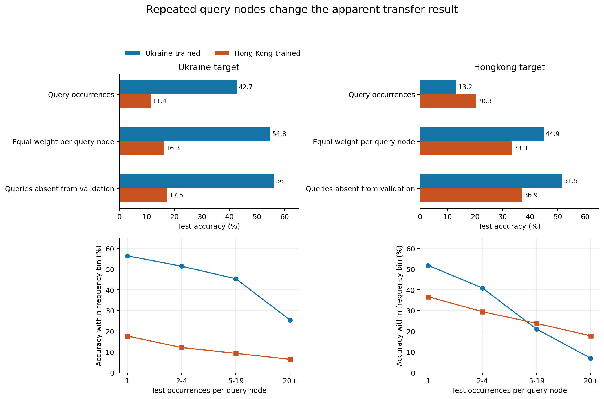
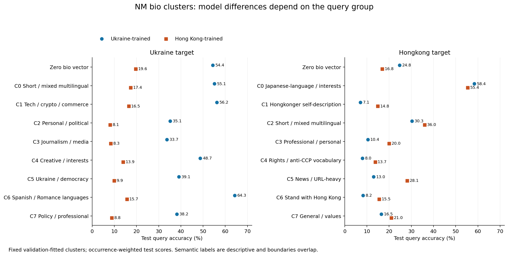
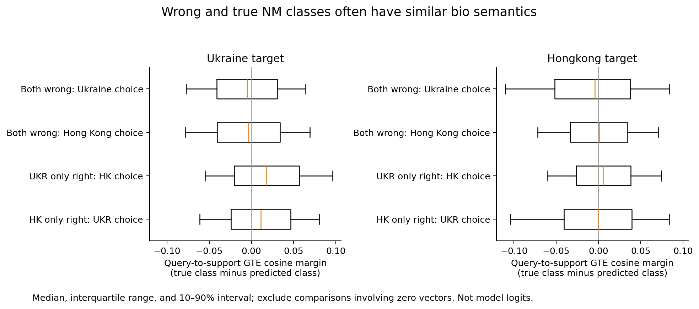

# NM bio clusters, repeated queries, and anchor ambiguity

> **Protocol correction:** these bios/clusters describe the original full-graph
> NM draws, whose evaluator had edge splitting disabled. They are not evidence
> of held-out-edge generalization. A canonical-split replacement is in progress.

8 September 2026. Analysis of existing Ukraine- and Hong Kong-trained
PRODIGY NM specialists on **ukraine** and **hongkong**. These are NM anchor
matching results, not conservative/non-conservative classification.

## Main findings

The bio clusters reveal language/topic-dependent performance, but the larger
finding is that **Hong Kong's native advantage depends on query-occurrence
weighting**. It is driven by frequently repeated, high-degree query nodes.
Ukraine wins when each observed query node gets equal weight, and also on
test queries absent from the validation stream. Ukraine's advantage on its
own graph persists under all three comparisons.

Many repeated Hong Kong queries receive multiple anchor labels within a
single episode. These instances are particularly difficult for both models.
Together with the small GTE similarity margins between true and predicted
support classes, this points toward anchor-neighborhood overlap and episode
construction as useful next diagnostic targets, beyond query bio topic alone.

## Protocol

- Reuse both models' existing validation and test JSONL exports. Recheck every
  paired query id, true anchor, 30-anchor episode map, and the three true-class
  support ids. Both targets have 500 episodes per split. Ukraine uses 12
  queries per class (180,000 occurrences/split); Hong Kong uses four
  (60,000/split). No new model inference or pretraining was run.
- Extract original 768-dimensional GTE node features from the catalogued
  graphs. Separate zero feature vectors into their own group; normalize
  nonzero vectors to unit length.
- Fit MiniBatchKMeans on validation unique queries, excluding zero vectors:
  all 5,088 eligible Hong Kong nodes and a seeded sample of 20,000 Ukraine
  nodes. Use eight clusters as the primary analysis and four/twelve as
  sensitivity checks; ten initializations and a second clustering seed.
  Assign all test queries with frozen validation centroids. Neither labels
  nor model errors enter clustering.
- Inspect nearest-centroid and deterministic random validation bios. Recover
  Hong Kong text from the graph's staged, row-aligned `user_bios.parquet` and
  Ukraine text with the graph's latest-observed-bio policy. Cluster names are
  descriptions of text, not personal attributes or ground-truth classes.
- Compute query-to-anchor and mean query-to-three-support GTE cosine
  similarities. Exclude zero-vector comparisons; require all three support
  vectors to be nonzero for support means. Public summaries include valid
  sample counts and distribution quantiles.

There are 123,624 distinct Ukraine queries across the two splits and 9,213
Hong Kong queries. Test contains 72,435 and 6,297 distinct query nodes,
respectively. Of those, 51,072 Ukraine and 2,953 Hong Kong nodes are absent
from validation. Absence from validation does **not** establish absence from
pretraining.

## 1. Query weighting changes the Hong Kong result

| Test metric | Ukraine target: UKR / HK | Hong Kong target: UKR / HK |
|---|---:|---:|
| Existing query-occurrence accuracy | 42.68% / 11.36% | 13.20% / 20.26% |
| Equal weight per observed query node | 54.82% / 16.30% | **44.95% / 33.28%** |
| Query occurrences whose nodes are absent from validation | 56.15% / 17.53% | **51.53% / 36.94%** |

Node-weighted accuracy first averages a node's correctness over its observed
episode contexts, then averages equally across observed query nodes. It
answers a different question from occurrence-weighted accuracy; neither
estimates a uniform average over all graph nodes. Validation shows the same
Hong Kong reversal: 13.38% / 19.95% occurrence-weighted versus 45.25% / 32.47%
node-weighted.

The top 1% of observed query nodes produce **54.16%** of Hong Kong test
occurrences and **31.66%** of Ukraine occurrences. Hong Kong's most repeated
query appears 4,560 times; Ukraine's appears 997 times. A query can appear
under multiple anchors in the same episode, so these counts can exceed 500.

| Hong Kong query frequency within test | Occurrences / distinct nodes | UKR accuracy | HK accuracy | Median full-graph degree |
|---|---:|---:|---:|---:|
| Once | 3,761 / 3,761 | 51.82% | 36.69% | 4 |
| 2–4 times | 4,187 / 1,711 | 40.94% | 29.47% | 29 |
| 5–19 times | 4,657 / 523 | 21.04% | 23.81% | 259 |
| 20+ times | 47,395 / 302 | 6.92% | 17.79% | 4,149 |

Thus 302 distinct Hong Kong queries supply 79.0% of its test occurrences.
The native model is substantially better on that heavily weighted group;
Ukraine is better on sparsely repeated queries. This qualifies the earlier
claim of native-source specialization: on Hong Kong it is a strength under
the existing sampler's query distribution, not uniformly across observed
nodes. This audit does not change or invalidate the historical metric.

## 2. Interpretable clusters have different failure rates

On Ukraine, the native model wins in every primary semantic cluster and in
the zero-vector group. Some representative test results:

| Ukraine cluster | Query occurrences | UKR accuracy | HK accuracy | Both wrong |
|---|---:|---:|---:|---:|
| Journalism/media | 44,311 | 33.68% | 8.35% | 62.25% |
| Personal/political self-description | 25,177 | 35.13% | 8.10% | 61.03% |
| Ukraine/democracy vocabulary | 20,609 | 39.11% | 9.88% | 57.11% |
| Tech/crypto/commerce | 12,465 | 56.21% | 16.46% | 40.50% |
| Spanish/Romance-language bios | 11,186 | 64.27% | 15.65% | 32.84% |
| Zero bio vector | 10,289 | 54.39% | 19.64% | 40.95% |

Actual representatives include journalist/editor descriptions, crypto and
freelance work, personal interests, explicit support for Ukraine, and Spanish
political/personal statements. Cluster membership is mixed: a Spanish-heavy
cluster also contains English bios, and the short/multilingual cluster's
nearest examples include punctuation-only text.

Subtracting each full-graph degree-bin baseline from the paired accuracy gap
leaves an extra **+17.8 / +16.8 percentage points** of Ukraine advantage in the
Spanish/Romance cluster (validation/test), and **+5.6 / +7.0** in tech/crypto.
These are descriptive residuals from coarse degree strata, not proof that
language or topic causes the gap. They motivate language- and support-level
checks beyond degree alone.

Hong Kong has two primary groups where Ukraine wins even under the existing
occurrence weighting:

| Hong Kong cluster | Test occurrences | UKR accuracy | HK accuracy | Both wrong |
|---|---:|---:|---:|---:|
| Zero bio vector | 3,575 | **24.76%** | 16.84% | 67.64% |
| Japanese-language/interests | 1,534 | **58.41%** | 55.41% | 29.20% |
| Hongkonger self-description | 10,138 | 7.08% | **14.85%** | 80.26% |
| Rights/anti-CCP vocabulary | 9,129 | 7.97% | **13.70%** | 82.20% |
| News/URL-heavy bios | 7,691 | 13.02% | **28.14%** | 67.27% |
| Stand-with-Hong-Kong vocabulary | 8,532 | 8.24% | **15.48%** | 77.95% |

Nearest examples in the identity cluster are very short self-descriptions
such as identifying as a Hongkonger; protest-related clusters contain calls
for freedom and support for Hong Kong. The Japanese-language cluster includes
Japanese cultural/political descriptions and some Chinese descriptions of
Japanese interests. The short/multilingual group includes punctuation-only
bios as well as fandom and other multilingual text. No formal language
detector was used, so names are representative descriptions.

The news/URL-heavy group's extra HK advantage survives the coarse degree
adjustment (+6.0 / +6.2 points beyond baseline). However, node weighting is
still consequential: Ukraine's average gap is positive in all primary
clusters under equal weight per observed query node, with the news cluster
almost tied. Query frequency and degree are related but not interchangeable.

### A measured, small routing gain

Choose the higher-accuracy model per primary cluster using **validation only**.
This selects Ukraine for Hong Kong's zero-vector and Japanese-language groups,
and Hong Kong otherwise. Applied unchanged to test, the offline router scores
**20.80%**, versus Hong Kong alone at **20.26%** (+0.55 points). The oracle
that knows which model is correct scores 26.99%, so this simple rule captures
only a small fraction of the available complementarity. This is a retrospective
paired-prediction diagnostic, not a deployed router or independent new trial.
On Ukraine the rule chooses Ukraine everywhere and gives no gain.

## 3. Within-episode anchor ambiguity is frequent and difficult

NM targets identify the anchor that generated a sampled query membership.
They are graph-sampling labels, not annotations of the bio's semantic topic.
The same query node can occur under different anchors within one episode.

| Test statistic | Ukraine | Hong Kong |
|---|---:|---:|
| Occurrences involving a query with multiple true anchors in its episode | 8.31% | **42.27%** |
| Maximum distinct true anchors for one query in an episode | 8 | 17 |
| Shared-error rate on those occurrences | 78.69% | **83.90%** |
| Shared-error rate on single-anchor query occurrences | 51.29% | 65.04% |

The multi-anchor Hong Kong group contains 25,360 occurrences from only 289
distinct nodes. Validation reproduces its prevalence (42.24%) and shared-error
rate (83.87%). Repeated-node label ambiguity therefore tracks a large part of
the difficult evaluation distribution.

If a predictor must give the **same class for every occurrence of a given
query node within the same episode**, choosing its most frequent true anchor
provides an empirical oracle of 71.98% on Hong Kong and 95.48% on Ukraine.
This bound applies only to that consistency restriction. Actual sampled query
contexts may differ between occurrences; it is **not** an architecture-wide
performance ceiling, nor does it prove current errors are unavoidable.

The concrete follow-up is to inspect overlapping memberships and identical
realized query inputs, then compare collision-aware or multi-positive NM
evaluation with the current single-target construction. No labels or sampler
behavior were changed in this analysis.

## 4. GTE query/anchor/support geometry is often ambiguous

On Hong Kong shared failures, the true and predicted classes have nearly
identical mean query-to-support similarity on complete-vector comparisons.
The paired true-minus-predicted support margin is −0.0086 for Ukraine's
choice and +0.0001 for Hong Kong's choice; their medians are −0.0044 and
+0.0008. True-minus-predicted anchor margins are similarly close to zero
(means −0.0045 and +0.0034). All distributions are broad across individual
queries, as the figure shows.

On Ukraine-only wins on the Ukraine target, the true anchor is more similar
to the query than Hong Kong's wrong anchor by **0.030 mean cosine**, and the
true support class is more similar by **0.019**. This is a useful association,
but not a universal explanation: some correct matches have a semantically
closer wrong anchor.

Examples from deterministic random paired cases, paraphrased:

- A German human-rights institution query matches a public-international-law
  professor's anchor under Ukraine; Hong Kong chooses a writer/professor/
  philosopher/theologian anchor. Query cosine is .637 to the true anchor and
  .440 to Hong Kong's choice. Here topical proximity agrees with the correct
  graph membership.
- An antiques-expert query is correctly matched by Ukraine to an anchor whose
  bio is a short surreal phrase. Hong Kong's wrong anchor has generic advice
  about judging people by their actions. Cosine is .425 to the true anchor
  and .578 to the wrong one. Text closeness alone does not determine NM truth.
- Sampled zero-vector queries can still be solved by Ukraine. Their own bio
  supplies no embedding signal, so other episode inputs must provide the
  discrimination; this analysis does not isolate whether that comes from
  sampled graph context, supports, or other interactions.

Anchor bio similarity is an external diagnostic: these NM runs use zero
initial label embeddings, and the anchor bio itself is not automatically
fed to the model as a textual class description. Support bio embeddings are
closer to the actual episode input, but the full model also processes their
sampled subgraphs. These cosine distributions are not learned-model logits.

## Stability, limits, and what to act on

The fixed eight-cluster validation/test gap correlations are .995 on Ukraine
and .988 on Hong Kong. However, silhouette scores are only .018 and .031,
and agreement between clustering seeds is modest (ARI .338 and .493).
Four/twelve-cluster runs also show strong fixed-partition stream replication,
but do not make individual cluster boundaries stable. Treat topics as
overlapping descriptive groups, not a discovered discrete ontology.

Repeated nodes also link validation and test: high replication partly reflects
revisiting the same nodes. Fresh-to-validation node subsets are reported
separately. Node absence from validation is not pretraining exposure evidence.
Episode-bootstrap intervals condition on these graph nodes and fitted
clusters, and do not include training-seed uncertainty.

The actionable priorities are now:

1. Report occurrence-weighted and node-weighted NM metrics together, including
   frequency/degree strata. The existing Hong Kong source ranking alone is
   insufficient evidence for uniformly better transfer.
2. Audit overlapping anchor membership and actual repeated query inputs;
   test whether collision-aware episodes or multi-positive scoring change the
   observed difficulty and source ranking.
3. Inspect full support and neighborhood semantics in the difficult hub/news
   groups and the language groups with residual differences. Topic-only routing
   recovers a measurable but small gain; broader semantic guarantees are not
   established.

No training-node exposure analysis, full-neighborhood bio clustering,
independent training replication, or sampler intervention was performed.

## Evidence and reproduction

Public aggregate evidence under `data/`:

- `nm_bio_clusters_ukraine.json` and `nm_bio_clusters_hongkong.json`: baseline,
  every cluster count/error rate, k/seed checks, cosine quantiles and valid
  counts, degree residuals, unseen-in-validation subsets, and source paths.
- `nm_query_weighting_ukraine.json` and `nm_query_weighting_hongkong.json`:
  node-weighted scores, frequency bins, routing, and anchor-ambiguity summaries.

Reproduce `cluster_nm_bios.py` for each target with `--audit-dir
/dataMeR1/phil/gfm/error_audit/nm_source_pair_20260907`, `--out-dir
/dataMeR1/phil/gfm/error_audit/nm_bio_clusters_20260908`, `--threads 4`, then
rerun with `--summarize-weighting`. It uses the existing `bio-embeddings-v001`
environment for CPU graph/text analysis. No GPU work was performed.
`plot_nm_bio_clusters.py` renders all three report figures from aggregate JSON.

Private paired rows, representative bios, example cards, and centroids live
under that output directory, in `ukr_rus_twitter/` and `cp_hk_twitter/`.
The main analysis ran in isolated Tucker worktree
`/dataMeR1/phil/gfm/prodigy-nm-bio-clusters-20260908` at `942c8c4f`; weighting
and ambiguity were added at `5364c729` after the job finished. The code was
transported through branch `codex/nm-bio-clusters-20260908`. Local report work
used `main` at `/Users/philipp/projects/gfm/prodigy`.
