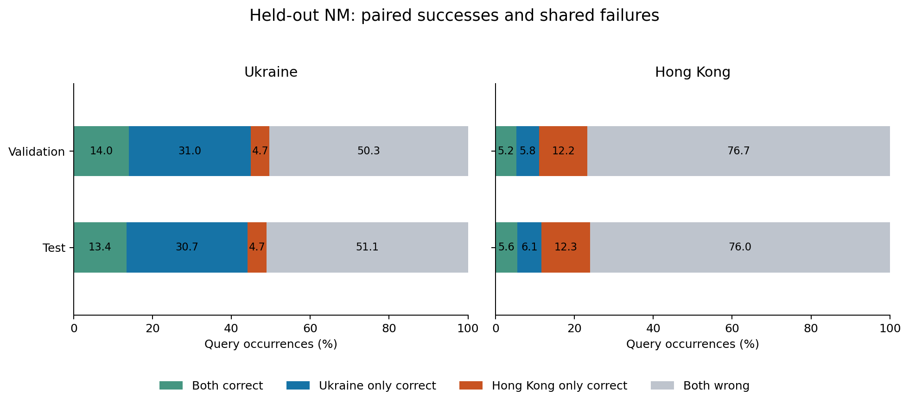
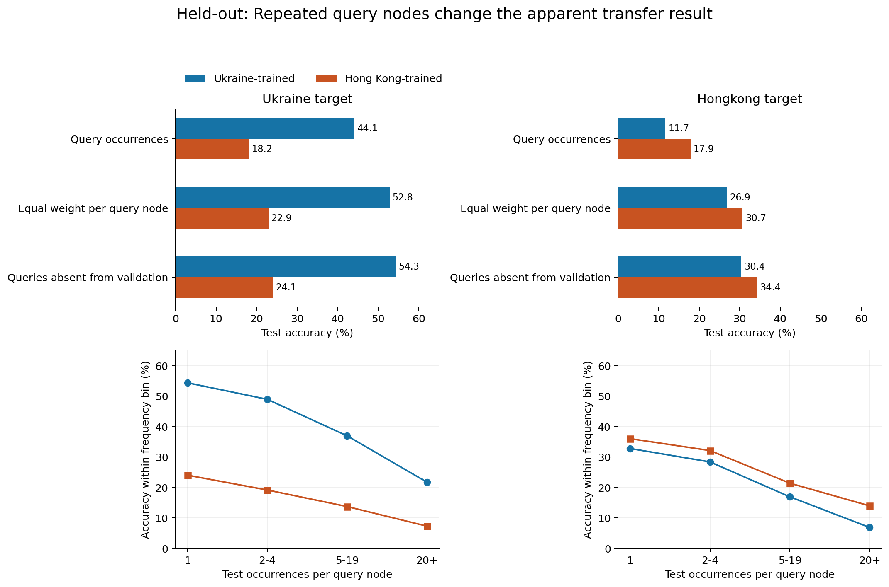
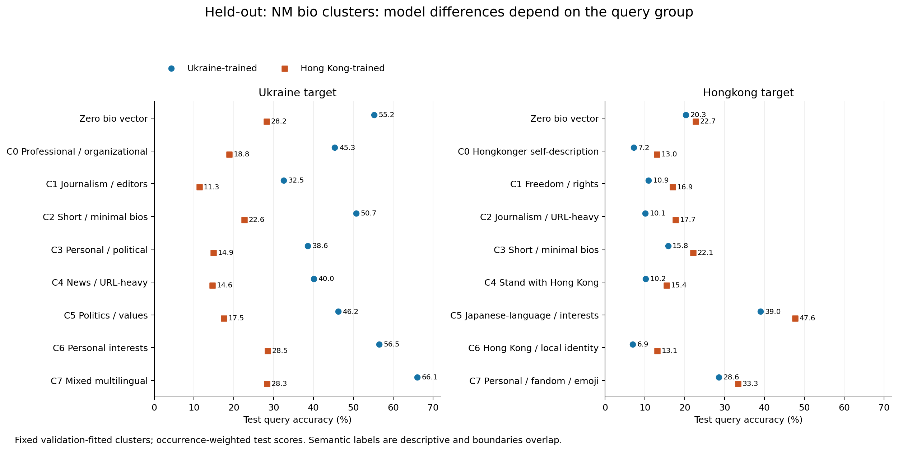
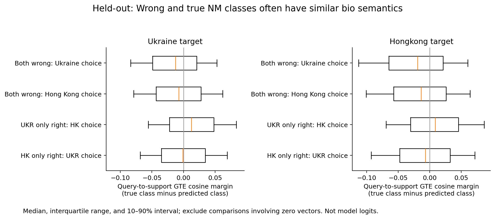

# Canonical-split NM error audit

8 September 2026. **Completed canonical-split rerun and bio analysis.**
This is neighbor matching (NM), not binary political classification.

## Main conclusions

1. Both checkpoints trained on the correct training-edge split; the **original
   diagnostic evaluator**, not HK training alone, failed to enforce held-out edges.
2. Native-source advantage survives on both targets, including node weighting.
   **The historical HK node-weighted ranking reversal does not survive.**
3. Shared failures remain large: 51.12% on Ukraine and 76.01% on HK. Frequent
   queries and overlapping anchor memberships are especially difficult.
4. Broad bio groups identify difficulty patterns, but validation-selected routing
   picks the native model everywhere on both targets: **no routing gain**.
5. Raw bio similarity frequently favors a wrong class. Ranking/support/context
   diagnostics are more promising next steps than topic-only routing.

## Why the original NM audit needed replacement

The September 7 diagnostic launcher used `neighbor_matching_edge_split=False`
and `edge_view=default` on the standalone source graphs. Its validation/test names
identified episode streams, not held-out-edge pools. Those results remain useful
descriptions of those particular full-graph draws, but cannot establish
held-out-edge generalization. The original reports and images are retained and
marked as historical.

Both seed-0, step-2500 checkpoints were actually trained on `static_train` in the
same merged, source-disjoint 70/15/15 artifact. This was verified in each run's
archived effective training configuration, not inferred from today's YAML.
Checkpoint hashes and source configs are in
[checkpoint provenance](data/canonical_split/checkpoint_provenance.json).

This correction does not establish leakage in the separate CLS audit or in the
archived final-core fixed-test benchmark. Nor does it measure the exact overlap
between the old diagnostic pairs and the episodes consumed during training.

## Protocol and checks

- Use the exact training artifact
  `/dataMeR1/phil/data/merged/graphs/ukr_rus_covid_midterm_all9_facebook_final_core_split_seed0.pt`.
  Message passing uses `static_train`; validation and test positives use
  `static_validation` and `static_test`, respectively.
- Both targets use 512 episodes per split, 30 anchors, 3 supports and 4 queries
  per anchor: 61,440 query occurrences per target/split. The old Ukraine audit
  used 12 queries per anchor, so old/new differences are not a leakage-only
  controlled intervention. The rerun also pins the checkpoint's context settings.
- Pin the historical `lowest_sorted` member policy on the **constructed sampler**.
  The current loader forces `randomized` at evaluation even when another training
  policy is configured. Shared defaults were not changed. Sorted-ID retention and
  support/query role bias remain limitations of this historical benchmark.
- Match test episode-plan and observed identity fingerprints against the archived
  final-core benchmark. Materialize each input stream once, replay cloned tensors
  through both models, and hash every cached input tensor before/after each pass.
  This is stronger pairing than the original audit's matched center IDs.
- Check every sampled anchor–member pair, including support and query pairs,
  against all three actual sampler adjacencies. Membership checks are undirected,
  as in the model sampler. Counts below are distinct ordered anchor/member pairs,
  not a count of all graph edges.
- Preserve core graph IDs and reversible source-local IDs in private JSONL files.
  The source-feature joins check source node counts and 256 deterministic GTE
  feature probes per target against the actual inference graph.
- Fit outcome-blind K-means on nonzero, normalized validation-query GTE vectors.
  Assign test with frozen centroids. Use eight clusters, with four/twelve-cluster
  and second-initialization sensitivity checks. Zero vectors are a separate group.

### Verified pair membership

| Target / split | Distinct sampled pairs | In training | In validation | In test |
|---|---:|---:|---:|---:|
| Ukraine test | 105,899 | 0 | 0 | 105,899 |
| Ukraine validation | 105,806 | 0 | 105,806 | 0 |
| Hong Kong test | 42,023 | 0 | 0 | 42,023 |
| Hong Kong validation | 41,725 | 0 | 41,725 | 0 |

The test streams reproduce the published raw-plan and observed-identity
fingerprints. Both Ukraine test scores and the Ukraine model's HK test score
match the archived benchmark exactly. The HK model scores 10,976/61,440 on HK,
versus 10,975/61,440 archived: one decision (0.00163 percentage points) differs.
Identity equality does not guarantee bitwise numerical equivalence to the old
run; the cause of this one-decision discrepancy has not been isolated.

## Ukraine: corrected results

| Metric | Ukraine model | Hong Kong model |
|---|---:|---:|
| Test query-occurrence accuracy | 44.15% | 18.15% |
| Validation query-occurrence accuracy | 44.98% | 18.67% |
| Test, equal weight per observed query node | 52.84% | 22.90% |
| Test occurrences whose query node is absent from validation | 54.30% | 24.06% |

Ukraine's advantage survives all three weightings. Both models are wrong on
51.12% of test occurrences. Wrong-set Jaccard is 0.590; an either-model oracle
reaches 48.88%, adding 4.74 percentage points over Ukraine alone. This is oracle
headroom, not a demonstrated trainable improvement.

On shared failures, the true anchor's median rank is 4 under Ukraine and 10
under Hong Kong (means 6.41 and 11.00). Thus the native model often retains useful
ranking information even when its top choice is wrong.

There are 33,981 distinct test queries. The top 1% account for 21.02% of test
occurrences; the most repeated query appears 272 times. Among queries occurring
once, accuracy is 54.32% / 23.99%; among those occurring 20+ times, it falls to
21.70% / 7.26%. Those frequent nodes have much higher full-graph incident-edge
counts. These degree measurements are offline descriptors, not extra model inputs.

### Bio groups

These descriptions come from representative validation bios and discriminative
terms. They are overlapping text themes, not definitive personal attributes or
NM ground-truth classes. Cluster IDs are specific to this corrected fit and must
not be matched numerically to the original fit.

| Group | Test occurrences | Ukraine accuracy | HK accuracy | Both wrong |
|---|---:|---:|---:|---:|
| Zero bio vector | 4,528 | 55.19% | 28.16% | 39.36% |
| C0 Professional / organizational | 5,568 | 45.35% | 18.80% | 49.68% |
| C1 Journalism / editors | 15,662 | 32.51% | 11.29% | 63.04% |
| C2 Short / minimal bios | 4,414 | 50.68% | 22.61% | 44.00% |
| C3 Personal / political | 7,179 | 38.58% | 14.88% | 56.28% |
| C4 News / URL-heavy | 8,315 | 40.05% | 14.56% | 55.50% |
| C5 Politics / values | 6,353 | 46.20% | 17.47% | 49.50% |
| C6 Personal interests | 5,077 | 56.45% | 28.48% | 38.27% |
| C7 Mixed multilingual | 4,344 | 66.07% | 28.27% | 29.93% |

The native model wins every group. The multilingual group's advantage remains
11.20 points above its coarse degree-bin baseline, while journalism is 4.44 points
below its baseline. This is descriptive adjustment, not causal isolation.

The eight-cluster solution has cosine silhouette 0.0145 and between-initialization
adjusted Rand index 0.428: boundaries are not sharply separated. Nevertheless,
validation/test cluster accuracy gaps correlate at 0.992. Four/twelve-cluster
fits give correlations of 0.983/0.991. A validation-selected cluster router picks
Ukraine for every group and therefore adds no gain over Ukraine alone.

### Repeated anchors and validation-node reuse

2.51% of test query occurrences (1,541) assign a query to multiple anchors within
its episode. Shared failures rise to 76.96% on these occurrences, versus 50.45%
on single-anchor occurrences. The empirical center-consistent oracle is 98.71%:
this only constrains a predictor forced to give each query node one answer per
episode. Independently sampled neighborhoods can differ, so it is not a universal
bound on the actual model.

7,852 test query nodes also occur in validation: 23.11% of distinct test queries,
but 53.43% of occurrences. **The positive edges are still split-disjoint.** Node
reuse is expected under transductive evaluation and is not, by itself, leakage.
Absence from validation does not establish absence from pretraining.

## Hong Kong: corrected results

| Metric | Ukraine model | Hong Kong model |
|---|---:|---:|
| Test query-occurrence accuracy | 11.68% | 17.86% |
| Validation query-occurrence accuracy | 11.08% | 17.47% |
| Test, equal weight per observed query node | 26.85% | 30.71% |
| Test occurrences whose query node is absent from validation | 30.38% | 34.36% |

**HK now wins under every aggregate weighting above.** Validation node-weighted
scores also favor HK (31.50% versus 25.77%). This withdraws the old ranking
reversal; it must not be cited as a held-out-edge finding. Several protocol
settings changed together, so this does not isolate which change removed it.

On test, both models are wrong on 46,698 occurrences (76.01%) and correct on
3,411 (5.55%). Ukraine alone solves 3,766 (6.13%); HK alone solves 7,565 (12.31%).
Wrong-set Jaccard is 0.805. The either-model oracle is 23.99%, a 6.13-point
headroom above HK alone. On shared failures, HK ranks the true anchor median 7
(mean 8.65), versus Ukraine median 11 (mean 11.71).

### Repetition and ambiguity remain, but are smaller than the old diagnostic

There are 6,233 distinct test queries. Their top 1% supply **34.70%** of
occurrences; the maximum is 895 repeats. The 429 nodes repeated 20+ times supply
43,360 occurrences (70.57%). HK wins every frequency bin, not only frequent nodes:

| Occurrences per query | Occurrences | Ukraine accuracy | HK accuracy |
|---|---:|---:|---:|
| 1 | 2,137 | 32.76% | 35.99% |
| 2–4 | 7,128 | 28.35% | 32.08% |
| 5–19 | 8,815 | 16.90% | 21.37% |
| 20+ | 43,360 | 6.84% | 13.92% |

The incident-edge median rises from 6 in the singleton bin to 2,489 in the
20+ bin. **23.12%** of query occurrences (14,203; 393 distinct nodes) have
multiple true anchors within their episode, up to nine anchors for a query.
Both models fail on 84.08% of these occurrences versus 73.58% of single-anchor
occurrences. The center-consistent oracle is 87.19%, with the same caveat about
independently sampled contexts as for Ukraine—not a universal model ceiling.

2,208 test query nodes also occur in validation: **35.42% of distinct nodes,
84.63% of occurrences**. This does not invalidate the verified edge holdout,
but validation/test cluster agreement is not independent-node replication.

### Hong Kong bio groups

| Group | Test occurrences | Ukraine accuracy | HK accuracy | Both wrong |
|---|---:|---:|---:|---:|
| Zero bio vector | 4,727 | 20.29% | 22.70% | 67.78% |
| C0 Hongkonger self-description | 9,390 | 7.19% | 12.97% | 82.02% |
| C1 Freedom / rights | 5,534 | 10.91% | 16.95% | 76.62% |
| C2 Journalism / URL-heavy | 18,481 | 10.06% | 17.67% | 76.72% |
| C3 Short / minimal bios | 3,692 | 15.82% | 22.07% | 70.42% |
| C4 Stand with Hong Kong | 6,203 | 10.19% | 15.38% | 78.08% |
| C5 Japanese-language / interests | 1,828 | 39.00% | 47.65% | 44.26% |
| C6 Hong Kong / local identity | 9,972 | 6.92% | 13.08% | 82.18% |
| C7 Personal / fandom / emoji | 1,613 | 28.58% | 33.29% | 57.41% |

HK wins all groups, including the zero-vector and Japanese-language groups that
favored Ukraine in the old analysis. It also wins every group's node-weighted
average. C0/C6 are overlapping Hong Kong self-description themes, not distinct
social categories; C3's nearest bios are punctuation, and C7 mixes emoji-only
bios with personal/fandom terms. Labels describe text, not inferred attributes.

HK's largest cluster advantage is 8.64 points in C5, retaining 3.35 points beyond
the coarse degree-bin baseline. K=8 silhouette is 0.0164 and initialization ARI
0.406; validation/test gap correlation is 0.897. Sensitivity is material:
K=4/12 correlations are 0.338/0.636. Treat the fine topic boundaries as exploratory.
Validation chooses HK for every group, yielding exactly HK's 17.86% test score.
**The old +0.55-point cluster-routing result is superseded, not reproduced.**

## What the actual bios and GTE similarities show

On shared Ukraine failures, mean true-minus-predicted support cosine margins are
−0.0147 for Ukraine's choices and −0.0083 for Hong Kong's. Their interquartile
intervals are [−0.0490, 0.0208] and [−0.0433, 0.0277]. The wrong support class is
often at least as similar in raw bio space as the true class. These are GTE cosine
comparisons, not model logits. Comparisons involving zero vectors are excluded;
support means require all three support comparisons to be present.

On shared HK failures, mean support margins are **−0.0232** for Ukraine's
choices and **−0.0162** for HK's, with interquartile intervals
[−0.0648, 0.0211] / [−0.0569, 0.0259]. True-versus-wrong anchor means are
slightly positive (+0.0035 / +0.0049), illustrating why anchor and support
comparisons should not be conflated.

Two paraphrased examples from the corrected Ukraine test exports illustrate the
limits of interpreting NM as text classification:

- An alternative-news profile has a true anchor consisting of social-platform
  links. Ukraine gets it right; HK instead picks a recruitment/HR profile. Query
  cosine is 0.551 to the true anchor versus 0.507 to HK's choice.
- A profile quoting education as a means of improving the world has a true anchor
  with no bio vector. Ukraine gets it right; HK picks a textually plausible
  social-improvement profile (cosine 0.564). The missing true-anchor cosine is
  unavailable, not zero. Textual plausibility does not determine graph membership.

Two paraphrased Hong Kong examples:

- A democracy-themed query is correctly matched by Ukraine to a Hongkonger
  profile criticizing local authorities (cosine 0.631). HK instead selects a
  generic independence/truth profile with **higher** cosine, 0.693.
- A human-rights organization query is correctly matched by HK to a generic
  motivational-quote anchor (cosine 0.500); Ukraine chooses a missing-bio
  anchor. A correct NM match need not be a strong textual match.

NM truth is anchor adjacency, not political stance or semantic equivalence.
These examples do not establish mislabeled political bios. The earlier
stance-confusion/text-label-conflict candidates belong to **CLS**.

## Scope and remaining work

### Paired support intervention (8 September)

The [bounded support-resampling test](FINDINGS_NM_SUPPORT_RESAMPLING.md) is now
complete. Among 100 selected native-model failures per target, at least one of
five alternative valid support triples rescues 38 Ukraine and 27 HK cases,
versus 19 and 5 under same-support-ID context resampling. Average failed-case
accuracy is 21.6%/12.2% with alternatives versus 8.4%/1.8% with fresh contexts.
However, alternatives retain only 64.0%/32.6% accuracy on matched originally
correct controls. This establishes support-set dependence on selected fixed
query–anchor cases, not a successful random-replacement rule or an explanation
of how source training creates that dependence. Original inputs and label vectors
are preserved; all four model–target cells and 8,000 trial rows pass verification.

### Query/support/episode follow-up (8 September)

The [difficulty audit](FINDINGS_NM_DIFFICULTY.md) finds persistent query difficulty
and excess all-four-query failures within anchor classes on both targets, relative
to within-query outcome permutations. Support identities selected on validation
retain test error associations, but matching both query and anchor is too sparse
on Ukraine and substantially weakens the native-HK contrast. Harmful supports
are not causally established. Extra full-episode error dispersion is clearer on
Ukraine than HK. That audit uses saved predictions only; the separate bounded
support/context intervention is reported above.

### Degree follow-up (8 September)

The [degree audit](FINDINGS_NM_DEGREE.md) now reports correctness by full-source
incident degree, with occurrence and node weighting and separate single-anchor
strata. The degree association survives removal of within-episode multiple-anchor
occurrences, but is not monotonic in every bin. In particular, the highest HK
degree bin contains only 12 observed query nodes and changes substantially under
node weighting. These descriptive results do not isolate degree from repetition
or explain the source-training mechanism.

This is one checkpoint seed per source, not training-seed replication. Clustering
and validation-selected routing are exploratory and need independent confirmation.
Sorted-ID membership biases remain. Node-weighted scores average observed queries,
not all graph nodes. The fraction of query/anchor/support/context nodes actually
consumed during pretraining remains unmeasured.

We inspect query, anchor and support-center bios/GTE relationships. We have not
clustered the complete sampled neighborhoods' text or causally isolated query
features versus graph context versus support aggregation.

### Actionable next inquiry

For the existing shared-failure TSV cohorts, compare the true class's support
dispersion and sampled context with those of the chosen wrong class, stratifying
by repeated-query frequency and within-episode anchor ambiguity. Keep the same
realized episodes for paired context/support ablations. This can distinguish
recoverable ranking/support failures from ambiguous memberships before changing
training or adding a router. Separately, audit actual pretraining node exposure;
validation-node reuse is not a substitute for that measurement. The bounded
support-resampling follow-up above tests intervention sensitivity; systematic
support-dispersion/context explanation and pretraining exposure remain open.

### Verification and reproducibility

The public [protocol summary](data/canonical_split/protocol_summary.json) records
all four edge checks, fingerprints, per-model row counts and realized-input
hashes. `validate_nm_split.py` reconciles these with every aggregate split,
cluster total, frequency bin and weighting subset. All checks pass. Three unit
tests cover export support ordering/limits, cross-task isolation, batched episode
identity, mismatched pairing, and edge-split guard rejection. All four corrected
figures were rendered and visually checked.

Evaluation ran from Tucker worktree
`/dataMeR1/phil/gfm/prodigy-nm-error-audit-split-20260908` at `0baaace4`;
CPU bio analysis used `prodigy-nm-error-audit-analysis-20260908` at `0867b67d`.
Both completed with exit 0. Report/figure work used local branch `main` in
`/Users/philipp/projects/gfm/prodigy`; runtime commits were published on
`codex/nm-error-audit-split-20260908`, without changing the running worktrees.

Private corrected exports live under
`/dataMeR1/phil/gfm/error_audit/nm_canonical_split_20260908/`.
Private paired TSVs, centroids, representative bios and examples live under
`/dataMeR1/phil/gfm/error_audit/nm_canonical_split_bios_20260908/`.
Each target's `paired_cluster_queries_private.tsv` has 122,880 data rows:
61,440 validation and 61,440 test paired predictions. It retains query/anchor/
support node IDs, both models' outcomes, true ranks/probabilities, clusters,
degree descriptors and GTE relationships; raw bios are in the companion private
example/representative files. Neither raw bios nor per-node prediction rows are
committed to the public aggregate evidence folder.
Both paths are **Tucker-only**. Reproduction instructions are in
[the split-audit setup](../../../setup/nm_error_audit_split/README.md).
