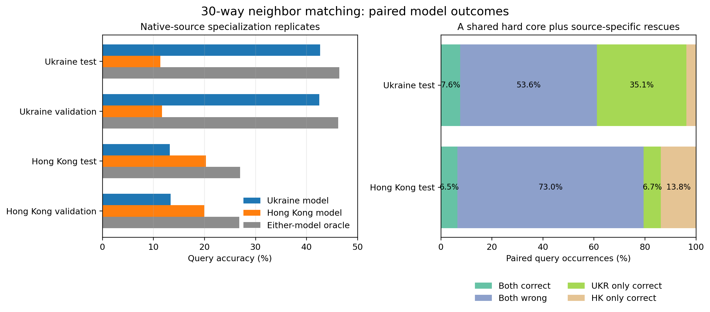

# Source-paired neighbor-matching error audit

> **Protocol invalid for held-out claims:** these original diagnostic exports
> disabled edge splitting and sampled the full standalone graphs. The findings
> below describe those draws only. A canonical-split replacement is in progress.

7 September 2026. **Exploratory fixed-checkpoint diagnosis of two seed-0,
step-2,500 specialists; not a training-seed replication or causal source-data
intervention.**

**8 September follow-up:** the [bio/weighting audit](FINDINGS_NM_BIO_CLUSTERS.md)
qualifies the native-source interpretation below. Hong Kong's top 1% of
observed query nodes supply 54% of occurrences. Giving each observed query
equal weight reverses its ranking: UKR 44.95% versus HK 33.28%. The original
occurrence-weighted numbers remain unchanged. The follow-up also covers
semantic clusters, GTE anchor/support geometry, and multiple anchor labels
for repeated query nodes within the same episode.

## Question and protocol

Do models pretrained on Ukraine and Hong Kong fail on the same neighbor-matching
queries, especially on their own source graphs? Both frozen PRODIGY specialists
were evaluated on the exact same 30-way, 3-shot episodes on
`ukr_rus_twitter` and `cp_hk_twitter`. Test and validation each contain 500
episodes per target.

Pairing was verified row by row using target, split, episode/batch index, task,
sample index, query node id, true anchor, local class, complete 30-anchor episode
map, and the three true-class support center-node ids. The models therefore see
the same classification problem and center nodes. Sampled neighborhood context
inside the separately materialized model inputs is not assumed byte-identical.

The test TSV has one row per paired query occurrence: 180,000 on Ukraine and
60,000 on Hong Kong. It retains the query id, true anchor id, both predicted
anchor ids, correctness, confidence, true-class probability/rank/margin, all
episode anchor ids, and true/predicted support node ids. It remains private on
Tucker because it contains raw graph identifiers.

## Main result: native-source specialization is large and reproducible

| Target / split | Ukraine model | Hong Kong model | Either-model oracle |
|---|---:|---:|---:|
| Ukraine test | 42.68% | 11.36% | 46.43% |
| Ukraine validation | 42.51% | 11.65% | 46.21% |
| Hong Kong test | 13.20% | 20.26% | 26.99% |
| Hong Kong validation | 13.38% | 19.95% | 26.79% |

This is not a small mean effect driven by a few episodes. On Ukraine test, the
Ukraine specialist beats the Hong Kong specialist on all 500 episodes. On Hong
Kong test, the Hong Kong specialist wins 464 episodes, ties 10, and loses 26.
Validation reproduces both counts almost exactly: 500/500 Ukraine wins, and
464 Hong Kong wins, 9 ties, and 27 losses on Hong Kong.

## Failure overlap distributions

### Ukraine target

| Paired outcome | Test count | Test fraction | Validation count |
|---|---:|---:|---:|
| Both correct | 13,686 | 7.60% | 14,309 |
| Both wrong | 96,422 | 53.57% | 96,817 |
| Ukraine only correct | 63,135 | 35.08% | 62,207 |
| Hong Kong only correct | 6,757 | 3.75% | 6,667 |

The test wrong-set Jaccard is 0.580 (validation 0.584). Nearly every Ukraine
model error is also a Hong Kong error: 96,422 of 103,179, or 93.5%. The converse
is not true: only 60.4% of Hong Kong errors are shared, because the native model
rescues 63,135 occurrences. A perfect selector between these two models would
gain only 3.75 accuracy points over the native Ukraine specialist.

When both models are wrong, the true anchor is still much closer to the top for
the native model: median rank 5 (mean 6.87) for Ukraine versus median rank 12
(mean 13.30) for Hong Kong. On Hong-Kong-only wins, the Ukraine model's true
anchor has median rank 3, so many of its failures are near misses rather than
wholly unrelated predictions.

### Hong Kong target

| Paired outcome | Test count | Test fraction | Validation count |
|---|---:|---:|---:|
| Both correct | 3,882 | 6.47% | 3,921 |
| Both wrong | 43,807 | 73.01% | 43,929 |
| Ukraine only correct | 4,040 | 6.73% | 4,104 |
| Hong Kong only correct | 8,271 | 13.79% | 8,046 |

The test wrong-set Jaccard is higher at 0.781 (validation 0.783). Shared errors
account for 84.1% of Ukraine-model errors and 91.6% of Hong-Kong-model errors.
Despite this large common hard core, complementarity is useful: an oracle gains
6.73 accuracy points over the native Hong Kong specialist.

On shared failures, the native Hong Kong model puts the true anchor at median
rank 7 (mean 8.26), versus median rank 13 (mean 13.55) for Ukraine. On
Ukraine-only wins, Hong Kong's median true rank is 5; on Hong-Kong-only wins,
Ukraine's median true rank is 9. The off-source model's mistakes are therefore
more severe in the dominant direction of specialization.

## Representative failure types

The paired rows expose three qualitatively different cases for follow-up:

- **Common hard cases:** both models miss, but the native model usually ranks the
  correct anchor substantially higher. These are candidates for improving the
  shared architecture, episode construction, or support aggregation.
- **Native-source rescues:** 63,135 Ukraine queries and 8,271 Hong Kong queries
  are corrected only by their native specialist. These dominate the source
  effect and are the best cohort for identifying source-specific graph motifs or
  representation geometry.
- **Counter-source rescues:** 6,757 Ukraine queries and 4,040 Hong Kong queries
  are solved only by the other specialist. These are not negligible; they define
  the attainable gain for mixtures, routing, or lightweight adaptation.

The current `context_node_ids` field is only a capped three-neighbor diagnostic
preview, not full sampled-subgraph size. Its distribution is consequently too
truncated to explain the cohorts. Exact center/support ids make the next analysis
possible, but graph joins or saved embeddings are required to identify whether
the cohorts differ in degree, directionality, community, anchor-query distance,
feature similarity, or support-set heterogeneity.

## Interpretation and actionable next analysis

Two conclusions are already hard enough to act on. First, source matching has a
large episode-level effect that reproduces on validation. Second, the models are
neither redundant nor freely interchangeable: Ukraine has one dominant native
specialist, while Hong Kong has a large shared-error core plus a larger potential
oracle gain.

The most informative next inquiry is to contrast **native-only rescues against
shared failures**, separately per target, using the saved ids to join:

1. query/anchor degree, directed role, connectedness, and shortest-path status;
2. query-to-true-anchor versus query-to-predicted-anchor feature similarity;
3. within-class support dispersion and query-to-support similarity; and
4. whether each model had seen the query, anchor, or support nodes during
   pretraining.

That decomposition directly separates a coverage/memorization account from a
transferable motif or representation account. It also suggests concrete
interventions: role-balanced pretraining, harder cross-source episodes,
source-diverse support construction, learned routing/ensembling, or a compact
adapter trained specifically on the counter-source-rescue boundary.

## Private evidence and provenance

- Paired test rows:
  `/dataMeR1/phil/gfm/error_audit/nm_source_pair_20260907/nm_ukr_vs_cp_hk_test_query_occurrences.tsv`
- Test summary:
  `/dataMeR1/phil/gfm/error_audit/nm_source_pair_20260907/nm_ukr_vs_cp_hk_test_summary.json`
- Validation summary:
  `/dataMeR1/phil/gfm/error_audit/nm_source_pair_20260907/nm_ukr_vs_cp_hk_val_summary.json`
- Evaluation log:
  `/dataMeR1/phil/gfm/error_audit/nm_source_pair_20260907/eval.log`

The TSV contains 240,001 lines including its header, occupies approximately
113 MiB, and has SHA-256
`a8d53f5c75c39628d52ea27682cd2154af39d58db78946bd3c898343c9c5ab92`.
Evaluation ran in Tucker worktree
`/dataMeR1/phil/gfm/prodigy-mechanisms-crossmatch` on branch
`codex/target-mechanisms-crossmatch-runtime` at revision `992354e9`.
