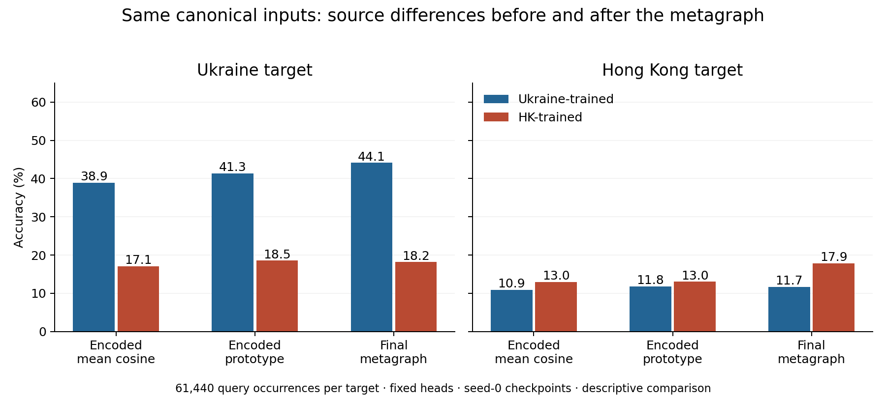

# Canonical NM: where native and foreign models diverge

8 September 2026. All 512 original canonical test episodes per target, 61,440
query occurrences each; both seed-0, step-2500 Ukraine/Hong Kong checkpoints.
This is a full-stream comparison, not the selected support-replacement cohort.
No training, new sampling, support replacement or head fitting.

## Main finding

**Ukraine specialization is already large before the metagraph. HK specialization
is smaller under the common pre-metagraph head, and its larger final advantage
is concentrated on frequently repeated queries.** The metagraph adds useful
decisions as well as losing some cosine-solvable ones. Neither a universal encoder
failure account nor a universal harmful-readout account fits both targets.

This localizes observable source differences, not their training cause. Source
training changes both representations and their coadapted readout; these are
not independently randomized components.

## 1. Same inputs, common heads, different checkpoints

The primary common head scores each query against all 30 classes by the mean
cosine to the three individually normalized support embeddings. It uses the
actual representation immediately before the metagraph. A secondary head takes
cosine to the normalized mean support embedding. Neither head is fitted or chosen
using query outcomes. The final head is each checkpoint's own metagraph/decoder.

| Target | Head | Ukraine-trained accuracy | HK-trained accuracy | Native minus foreign |
|---|---|---:|---:|---:|
| Ukraine | Encoded mean cosine | 38.89% | 17.05% | +21.84 pp |
| Ukraine | Encoded prototype | 41.33% | 18.55% | +22.78 pp |
| Ukraine | Final metagraph | 44.15% | 18.15% | +25.99 pp |
| HK | Encoded mean cosine | 10.88% | 12.98% | +2.09 pp |
| HK | Encoded prototype | 11.83% | 13.04% | +1.22 pp |
| HK | Final metagraph | 11.68% | 17.86% | +6.18 pp |

The final source gap exceeds the common-cosine gap by 4.16 pp on Ukraine and
4.09 pp on HK. Those subtractions are descriptive. Do not call their ratios
percentages of the source effect causally mediated by the encoder or readout.
The prototype sensitivity retains the contrast between the two targets.

## 2. Input evidence helps distinguish the two source effects

The test inputs are identical between models, so different realized test inputs
cannot explain their gap. Their source-trained transformations can nevertheless
use the same evidence differently. Reuse the existing raw neighborhood-mean
diagnostic, using the same mean-of-three-cosines rule against all rivals.

| Target and raw geometry | Occurrences | Ukraine encoded / final | HK encoded / final |
|---|---:|---:|---:|
| Ukraine: true class closest | 13,948 | 81.76% / 82.35% | 30.86% / 33.08% |
| Ukraine: rival closer | 28,463 | 17.58% / 25.39% | 9.95% / 10.68% |
| HK: true class closest | 2,525 | 38.34% / 37.03% | 32.91% / 37.70% |
| HK: rival closer | 27,183 | 7.57% / 8.10% | 10.30% / 15.22% |

Ukraine's native model preserves strong common-head separation on favorable raw
inputs, whereas the foreign HK model often does not. On HK's favorable raw inputs,
the foreign model actually has higher common-head accuracy; final accuracies are
almost equal. HK's overall native advantage therefore does not mean its encoder
uniformly preserves raw cosine geometry better.

Strict raw coverage remains 42,411/61,440 Ukraine (69.03%) and 29,710/61,440 HK
(48.36%, including two ties). Undefined rows are retained separately in all-model
totals. Raw neighborhood means discard topology and multimodality; they are not
an oracle of all available input information. Favorable raw geometry followed by
a learned-head error does not prove irreversible information loss.

## 3. Query weighting changes the HK readout interpretation

Equal weighting over observed query nodes gives:

| Target | Common cosine: Ukraine / HK | Final: Ukraine / HK |
|---|---:|---:|
| Ukraine, 33,981 nodes | 47.30% / 21.05% | 52.84% / 22.90% |
| HK, 6,233 nodes | 24.48% / 29.64% | 26.85% / 30.71% |

On HK the native gap **narrows from 5.16 to 3.86 pp** under node weighting,
although it widens from 2.09 to 6.18 pp under occurrence weighting. This is not
the withdrawn historical model-ranking reversal: HK remains the stronger model
under both weights and both stages.

| HK query frequency in test | Occurrences | Ukraine encoded → final | HK encoded → final |
|---|---:|---:|---:|
| Once | 2,137 | 29.85% → 32.76% | 36.31% → 35.99% |
| 2–4 | 7,128 | 25.29% → 28.35% | 31.50% → 32.08% |
| 5–19 | 8,815 | 15.77% → 16.90% | 18.24% → 21.37% |
| 20+ | 43,360 | 6.58% → 6.84% | 7.71% → 13.92% |

The last bin supplies 70.57% of HK query occurrences. Native readout gain is
6.21 pp there, versus a 0.32-pp loss on once-observed queries. Frequency is an
offline descriptor, correlated with degree and overlapping memberships, not an
explicit input to the network or an isolated causal factor.

Restricting to single-anchor occurrences retains the stage-gap pattern:
Ukraine native-minus-foreign is 22.21 pp encoded and 26.37 pp final; HK is
2.72 pp encoded and 6.44 pp final. Observed multi-anchor ambiguity alone does
not produce the result. These are restricted populations, not causal adjustments.

## 4. How many failures are demonstrably accessible to a different readout?

On the full canonical population, compare each native model's common cosine
head and its final head on exactly the same encoded inputs:

| Native target | Cosine wrong, final correct | Cosine correct, final wrong | Both wrong | Both correct |
|---|---:|---:|---:|---:|
| Ukraine | 6,714 | 3,485 | 30,832 | 20,409 |
| HK | 6,139 | 3,135 | 47,329 | 4,837 |

The common head can solve **3,485/34,317 = 10.16%** of Ukraine final errors and
**3,135/50,464 = 6.21%** of HK final errors. These are observable readout-substitution
recoveries over all canonical query occurrences. They are not fractions of
failures whose training cause is explained. The opposing losses are larger,
so replacing the native readout with this fixed head lowers aggregate accuracy.
The prototype produces similar accessible-error fractions: 9.77% and 5.84%.

Of the errors shared by both final models, **27,102/31,407 (86.29%)** on Ukraine
and **42,518/46,698 (91.05%)** on HK are also wrong under both encoded cosine heads.
This establishes a large residual under these particular rules. It cannot
distinguish intrinsically inadequate episode evidence from encoder limitations
or a more capable untested decision rule.

Native-only final successes also differ between targets. On Ukraine,
10,683/18,881 already favor only the native source under the common head. On HK,
4,684/7,565 native-only final successes occur where **both** common heads fail.
These are outcome-conditioned descriptions, not separate experimental groups.

## 5. Mechanistic implication and boundary

The working framework should distinguish source-conditioned encoding of
query/support neighborhoods from source-conditioned conversion of those
representations into class decisions. The Ukraine gap strongly motivates the
first component; HK's occurrence-weighted advantage makes the second particularly
important for repeated queries. The raw-favorable HK counterexample and the
node-weighted result prevent turning this into a universal stage ranking.

This also reconciles the earlier selected HK intervention: the native readout
is useful on original benchmark supports while becoming fragile under replacement.
Robustness to support changes should preserve this useful native behavior.
Simply choosing nearer supports or removing the metagraph is not supported.

The next discriminating question is which support-conditioned class-reference
operations produce the native HK gain on frequent queries, and whether those
same operations account for replacement breakage. The new caches allow this
to be studied against Ukraine and foreign-model controls without re-encoding.
Cross-model weight swaps alone would mix coadapted coordinate systems and are
not automatically a causal component test. No further intervention was run here.

Nothing here yet identifies why a particular training source learns the observed
encoding or decision behavior. Training exposure, pseudo-label conflicts,
normalization and optimization remain candidates. This is one seed per source,
two targets, the historical lowest-sorted member protocol, and transductive
node reuse. It does not replace the broader three-seed singleton/ladder or
pair/LOO evidence, and makes no classification claim.

## Verification, numerical limits, and reusable artifacts

- Both full input hashes match the original canonical audit exactly. Every
  query/anchor row joins one-to-one to both the original predictions and the
  existing geometry table. All four accuracy totals and all class counts reconcile.
- Both checkpoint file hashes match the independently archived provenance;
  model-state hashes are unchanged. All 32 new cache files pass a separate SHA-256
  check. Each model/target has 107,520 finite, nonzero pre-metagraph embeddings.
- The completed replay matches **all 245,760 original correctness outcomes**.
  Two Ukraine-model-on-HK wrong-class choices differ; the maximum old-winner
  logit shortfall is 1.91e-6. All true-probability differences are below 1.85e-6.
  Primary final decisions/probabilities/ranks use the unchanged canonical exports;
  replay accuracy is separately retained and is identical in every cell.
- Three earlier attempts stopped on strict parity gates: one chunked-encoder
  difference of 1.14e-5, an episode-wise wrong-class tie, and one near-tied HK
  correctness change even after restoring full batching. Those attempts are not
  extra results. Completed embedding caches were retained and revalidated.
  The exact-argmax requirement was replaced by the explicit archived-reference
  policy before aggregate stage effects were examined. Probability (1e-5) and
  logit (1e-4) tolerances were not enlarged. Current results must not be described
  as bit-exact numerical replication of every historical logit or argmax.
- The successful pass reused 24 completed batch caches and encoded only missing
  representations: 53,760 Ukraine-model and 37,590 HK-model subgraphs on HK.
  Existing selected HK episode embeddings were also reused. Full feature/graph
  loading was avoided using a read-only memory map of the exact feature tensor.
- Successful runtime: **143.89 seconds**, excluding Python imports, plus the
  stopped attempts. GPU 0, four CPU threads, no training. Runtime revision
  `c36a94ba`, branch `codex/nm-source-stage-audit-20260908`, Tucker worktree
  `/dataMeR1/phil/gfm/prodigy-nm-source-stage-audit-20260908`; local runtime worktree
  `/private/tmp/prodigy-nm-source-stage-audit`. Code moved privately through git.
  Reports/helper copies are in `/Users/philipp/projects/gfm/prodigy` on `main`.

[Aggregate accounting and receipt](data/canonical_split/nm_source_stages.json) ·
[independent cache checks](data/canonical_split/nm_source_stages_cache_verification.json) ·
[analysis helper](summarize_nm_source_stages.py) ·
[runtime protocol](../../../setup/nm_source_stage_audit/README.md).

Private complete output:
`/dataMeR1/phil/gfm/error_audit/nm_source_stage_20260908_v4/`.
Each target has a prediction CSV and 16 batch archives containing both models'
complete pre-metagraph episodes, learned label vectors, edges/roles and three
heads' scores. Original compact graph inputs remain in
`/dataMeR1/phil/gfm/error_audit/nm_complete_inputs_20260908_v2/`.
Local temporary tables are under `/private/tmp/nm_source_stage/`. No private
node-level rows, features, embeddings or logits are placed in git.
