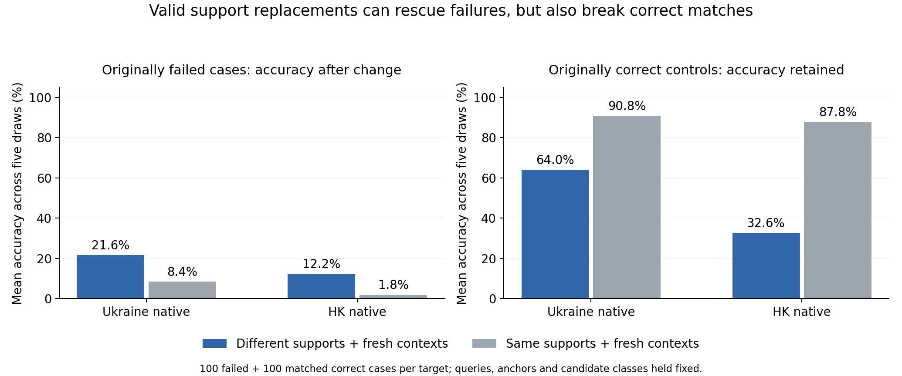

# Canonical NM: paired support resampling

8 September 2026. Completed bounded inference test: two targets × two frozen checkpoints × 200 selected cases × two conditions × five draws = **8,000 trial predictions**. No retraining.

## Main result

**Some fixed query–anchor failures become solvable with different valid supports, beyond same-identity context resampling. Random support replacement also destroys many originally correct decisions.** This establishes conditional support-set dependence for the selected cases, not a successful selector or an intrinsic property of an individual support account.

| Native model / target | Failed cases rescued by at least one alternative draw | Rescued by at least one same-ID context draw | Alternative-only rescue | Context-only rescue |
|---|---:|---:|---:|---:|
| Ukraine | 38/100 | 19/100 | 28/100 | 9/100 |
| Hong Kong | 27/100 | 5/100 | 24/100 | 2/100 |

These are oracle-style any-of-five rates, not average deployment improvements. The average effects are:

| Native model / target | Intervention | Accuracy on 100 originally failed cases | Accuracy retained on 100 originally correct cases | Correct cases broken at least once |
|---|---|---:|---:|---:|
| Ukraine | Alternative support identities + fresh contexts | 21.6% | 64.0% | 53% |
| Ukraine | Original support identities + fresh contexts | 8.4% | 90.8% | 21% |
| Hong Kong | Alternative support identities + fresh contexts | 12.2% | 32.6% | 84% |
| Hong Kong | Original support identities + fresh contexts | 1.8% | 87.8% | 24% |

Each average pools five draws per case, with equal case weighting. Replacement therefore yields 13.2/10.4 additional accuracy points on the selected failed cohorts relative to the context control, but loses 26.8/55.2 points on the selected correct controls. Do not extrapolate a net benchmark effect from this deliberately balanced, eligible-case sample.

Rank changes reinforce the caution. On native-model failures, mean true rank changes from 5.37 to 6.87 under alternative Ukraine supports and from 8.14 to 13.44 on HK, despite some rescues. Context-only means are 5.14 and 8.13. Some alternatives help, while others produce much worse matches.

## What this answers

- The same query representation and true anchor can produce a correct decision under a different valid support triple. Those recovered examples are not unsolvable under every support configuration.
- Support identity/composition changes produce more rescues than resampling neighborhoods around the original identities, but the intervention changes identities and their associated contexts jointly. It does not isolate support-center features from context.
- Context-only variation can itself change outcomes. Original correctness/failure is outcome-conditioned, so regression toward typical performance under resampling is expected; the paired context control is essential.
- The results motivate identifying useful support sets or more robust aggregation. They do not justify uniform random replacement as a fix, demonstrate an operational selector, or identify why source training learned the sensitivity.
- The alternative triples are valid under the known true anchor. Using that truth makes this a diagnostic intervention, not a deployable query-specific selection algorithm.

## Frozen design and selection

Start from the seed-0, step-2500 Ukraine/HK specialists and the canonical static-train / static-test artifact. Restore the exact saved 512-episode test plans and require each target’s complete input tensor hash to reproduce the original audit. Preserve the original within-batch learned label embeddings rather than resetting their indices when extracting an episode.

Per target, select 100 native-model failed occurrences and 100 native-model correct controls, all with single-anchor membership within their episode and distinct query identities. Controls match the failed case’s incident-degree bin and query-frequency bin exactly. Selection seed is 90831. Candidates must admit three replacement neighbors after excluding the anchor itself, its original support triple and ALL query identities in the episode. The selection rejected 54 Ukraine and 36 HK candidate failures while finding the matched samples; these are scan rejections, not full-population eligibility rates.

Draw five uniform triples from each eligible static-test pool, without replacement within a triple. Verify every chosen anchor–support pair belongs to test and neither training nor validation. All other class supports, all query graphs, candidate anchors, labels and role tensors remain fixed. New support neighborhoods come from static_train using the historical two-hop 9,9 sampler and 101-node cap.

The context control keeps the original three support identities and draws fresh neighborhoods, using matched per-slot random seeds. Both models consume the same support draws. Five draws need not produce five different unordered triples: 143/200 Ukraine and 149/200 HK cases have five unique triples; 14/200 and 16/200 have just one. Median available alternative pool sizes are 11 and 10.

This deliberately moves away from the benchmark’s lowest-ID support policy. It tests sensitivity to that change, not sampling-policy-invariant behavior. Other classes’ supports may overlap newly drawn support identities; only episode queries and the original true-class triple are excluded.

## Both models on the same native-selected cases

Cohort names refer to the native model. Foreign models need not start at 0%/100%; avoid comparing their conditional sensitivity as if baseline outcomes were matched across models.

| Target | Model | Native-selected cohort | Original accuracy | Alternative average | Same-ID context average |
|---|---|---|---:|---:|---:|
| ukr_rus | ukr | native_failed | 0.0% | 21.6% | 8.4% |
| ukr_rus | ukr | native_correct | 100.0% | 64.0% | 90.8% |
| ukr_rus | hk | native_failed | 10.0% | 10.4% | 8.6% |
| ukr_rus | hk | native_correct | 29.0% | 30.8% | 29.4% |
| cp_hk | ukr | native_failed | 5.0% | 9.8% | 4.8% |
| cp_hk | ukr | native_correct | 26.0% | 24.2% | 26.2% |
| cp_hk | hk | native_failed | 0.0% | 12.2% | 1.8% |
| cp_hk | hk | native_correct | 100.0% | 32.6% | 87.8% |

## Verification, limitations, and artifacts

- All four model–target cells reproduced all 200 selected historical baseline decisions. Both full original input hashes match the canonical audit.
- Whole-model witnesses for both interventions and both models match cached-embedding replay within a maximum 5.25e-6 logit difference, below the predeclared 1e-4 tolerance, with identical witness decisions. Manual encoder parity uses 1e-5. No tolerance was relaxed.
- All nonselected pre-metagraph rows, including every query, stay bit-exact. Model-state and original-input hashes remain unchanged after each model.
- Independent aggregation verifies all 8,000 unique rows, 16 complete 100-case condition cells, five draws per case, baseline cohort identities, average and any/all-draw correctness, and mean ranks.
- Independent context-tensor hashing finds variation across the five same-ID draws in 97.5% of Ukraine and 95.67% of HK support slots. The runtime’s older graph-change-versus-original field is NOT interpreted: scalar metadata changes type during PyG unbatching and contaminate that hash. The saved aggregate labels it legacy/not-used; the follow-up code uses explicit context tensors. This affects a manipulation descriptor, not predictions or parity gates.
- The first attempt stopped on that scalar-type mismatch during whole-batch reconstruction. Its outputs/logs are preserved and excluded. A focused batching regression passed before rerun; the failed attempt’s Ukraine case manifest is byte-identical to the completed run. The final context-hash cleanup is separately tested.
- One training seed per model, 100 cases per outcome per target, shared episodes/anchors and selected eligibility. No independent-domain, seed-robustness, or significance claim.

[Aggregate results and receipts](data/canonical_split/nm_support_resampling.json) · [Reproduction setup](../../../setup/nm_support_resampling/README.md)

Completed runtime revision `769e598e`; metadata-only hashing cleanup `8aa159da`. Successful runtime was 486.4 seconds and exit 0. Private output: `/dataMeR1/phil/gfm/error_audit/nm_support_resampling_20260908_v2/`. All case IDs, sampled support graphs and per-case rows remain on Tucker.

Runtime branch `codex/nm-support-resampling-20260908`, local worktree `/private/tmp/prodigy-nm-support-resampling`, Tucker worktree `/dataMeR1/phil/gfm/prodigy-nm-support-resampling-20260908`. Code moved through private Git transport; nothing was published to GitHub. Findings and a copy of the reproduction helper are in local `main`, `/Users/philipp/projects/gfm/prodigy`.
