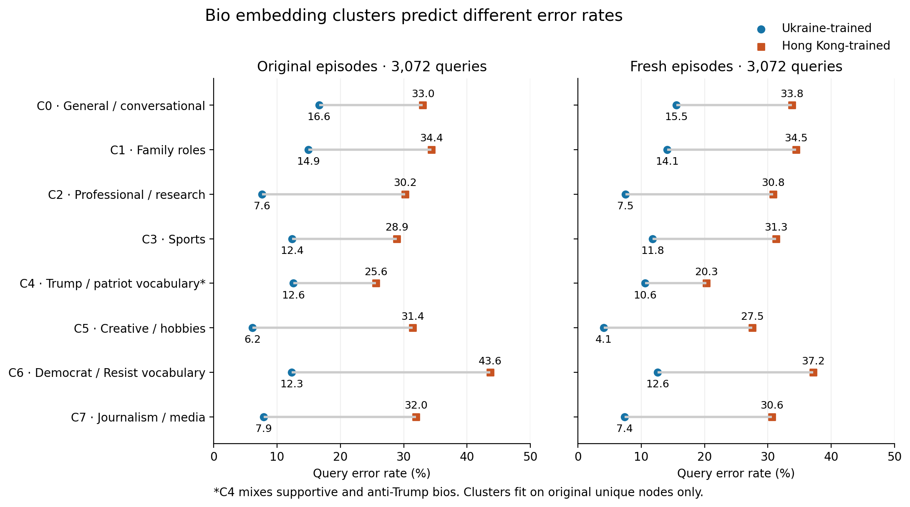

# Query bio embedding clusters and classification errors

8 September 2026. First semantic clustering pass on **covid-political** query
bios, using the already evaluated Ukraine- and Hong Kong-trained specialists.
This is downstream binary classification; NM bio clustering and neighborhood
embedding analysis have not been run in this pass.

## Method and validation

Use the graph's row-aligned, 768-dimensional, mean-pooled GTE multilingual bio
embeddings. Verify all saved query labels against the graph. Normalize vectors
to unit length, fit KMeans on the **2,805 unique original-stream query nodes**,
then assign fresh queries to the frozen centroids. Neither labels nor model
outcomes enter clustering. The eight-cluster primary partition was specified
before results; four and twelve clusters are sensitivity checks. Each fit uses
20 initializations, with a second seed to assess partition stability.

There are 6,144 query occurrences and 5,113 distinct query nodes in total.
The fresh stream contains 2,792 distinct nodes, including 484 also present in
the original and 2,308 absent from the fitting set. Summaries also restrict
fresh results to those previously absent nodes. Their direction of model
advantage agrees with the full fresh stream in all eight clusters.

Cluster names below are human descriptions of representative bios and
distinctive TF-IDF terms, not additional ground-truth categories. Inspect
three nearest-centroid and two deterministic random examples per cluster;
the private export retains six nearest and four random bios per cluster.
The named categories describe text, not inferred personal attributes.



## Main findings

### 1. Interpretable groups exist, with reproducible error differences

The embeddings separate broad topics and self-description styles: family
roles, sports, research/professional work, creative interests, media work, and
political vocabulary. Percentages below are query error rates, not shares of
all errors. The baseline is UKR 11.4% / HK 32.8% original and UKR 10.4% / HK
30.4% fresh.

| Cluster description | N original / fresh | UKR error original / fresh | HK error original / fresh |
|---|---:|---:|---:|
| C0 General / conversational | 433 / 438 | 16.6% / 15.5% | 33.0% / 33.8% |
| C1 Family roles | 355 / 354 | 14.9% / 14.1% | 34.4% / 34.5% |
| C2 Professional / research | 341 / 360 | 7.6% / 7.5% | 30.2% / 30.8% |
| C3 Sports | 218 / 195 | 12.4% / 11.8% | 28.9% / 31.3% |
| C4 Trump / patriot vocabulary (mixed stance) | 484 / 508 | 12.6% / 10.6% | 25.6% / 20.3% |
| C5 Creative / hobbies | 455 / 465 | 6.2% / 4.1% | 31.4% / 27.5% |
| C6 Democrat / Resist vocabulary | 495 / 468 | 12.3% / 12.6% | 43.6% / 37.2% |
| C7 Journalism / media | 291 / 284 | 7.9% / 7.4% | 32.0% / 30.6% |

The correlation of the eight cluster-specific paired accuracy gaps across
streams is **0.846**. Ukraine is better on average in every cluster, including
fresh nodes absent from fitting. Broad semantic cluster routing therefore
does not identify a group where switching wholesale to Hong Kong improves
accuracy. It may still help finer-grained calibration or adaptation.

### 2. Topic and stance are conflated in an informative shared-failure group

C4's typical bios use terms such as MAGA, Trump, patriot, conservative, NRA,
and QAnon. Actual text inspection also reveals explicit anti-Trump and
anti-GOP bios in the same cluster. This partition captures shared political
vocabulary more cleanly than it separates stance.

The approximately 19% of C4 query occurrences carrying the supplied negative
(`not_conservative`) label are unusually difficult:

| Dataset-negative queries within C4 | Original | Fresh |
|---|---:|---:|
| Query occurrences | 92 | 94 |
| Ukraine false-positive rate | 63.0% | 56.4% |
| Hong Kong false-positive rate | 68.5% | 62.8% |
| Both models wrong | 48.9% (45) | 40.4% (38) |

This subgroup represents only **3.0% / 3.1% of all queries**, but accounts for
**22.5% / 22.1% of shared errors**. Conversely, Ukraine almost always succeeds
on supplied-positive C4 queries: FN rates 0.8% / 0.2% versus Hong Kong's
15.6% / 10.6%.

A deterministic random sample of eight distinct C4 negative-labelled nodes
contains both explicitly anti-Trump bios and bios that explicitly endorse
Trump/MAGA. Examples, paraphrased from inspected text:

- A bio lists support for God, liberty, small government, Trump, and the NRA;
  the supplied label is negative and both models predict positive.
- A bio lists resistance, voting out the GOP, gun control, and closing camps;
  the supplied label is negative and both models still predict positive.
- A bio describes leaving the GOP, supporting Klobuchar, and resisting Trump;
  Hong Kong is correct while Ukraine predicts positive.

These cases motivate two distinct checks: stance confusion among semantically
nearby texts, and label-definition/provenance issues. The graph builder copies
`label_conservative` from the source CSV; this pass has not traced how that
source label was established. Explicit text/label disagreement is not proof of
misannotation, nor do cluster membership and errors prove which features the
model used. No individual labels were changed.

### 3. Some semantic differences remain after a coarse structural adjustment

For each stream, subtract the stream-wide paired accuracy gap in each
true-label × isolation stratum from each query's paired correctness difference.
Average these residuals within clusters. This is a descriptive comparison to
equivalent label/isolation mixtures, not a causal estimate or full degree
adjustment.

The creative/hobby cluster retains a **+4.5 / +4.6 percentage-point** excess
Ukraine advantage relative to its stratum baseline. The Trump/patriot
vocabulary cluster retains a **−5.5 / −4.3 point** relative gap. The general
conversational cluster also has a smaller gap than expected (−4.4 / −3.1).

By contrast, the conspicuous raw gap in C6 (Democrat/Resist) has residuals
**+5.6 / +0.3 points**. Its extra disadvantage for Hong Kong beyond the coarse
class/isolation baseline does not reproduce strongly in fresh episodes.
Raw semantic error contrasts therefore partly reflect the structural regimes
already identified.

### 4. These are overlapping semantic groups, not discrete natural classes

| Clusters | Cosine silhouette | Agreement across clustering seeds (ARI) | Original/fresh gap correlation |
|---|---:|---:|---:|
| 4 | 0.025 | 0.940 | 0.952 |
| 8 (primary) | 0.031 | 0.798 | 0.846 |
| 12 | 0.026 | 0.644 | 0.778 |

Low silhouette scores mean substantial overlap in embedding space. Coarse
partitions are more stable than fine ones. The broadly repeatable error
pattern is useful, but exact cluster boundaries and labels should not be
treated as a discovered ontology. Bootstrap intervals for each paired gap
are included in the aggregate JSON; they resample whole episodes and are
conditional on the fitted partition, not training-seed uncertainty or
simultaneous multiple-comparison intervals.

## Implications and next boundary

The most actionable case list is now the supplied-negative, Trump/patriot
vocabulary group: a small fraction of queries explains over one-fifth of
shared errors in both episode draws. Inspecting exact query/support texts and
similarities there can distinguish failure to resolve stance from conflicting
label provenance. For the creative/hobby group, the consistently larger
Ukraine advantage after class/isolation adjustment warrants a query-to-support
and neighborhood-semantic comparison.

No neighborhoods, support embeddings, learned model embeddings, or NM anchors
were clustered in this first step. Training-node exposure is still unknown.
Fresh-stream consistency is evaluation replication with some overlapping
nodes; the additional fresh-only-node summaries reduce that concern but do
not establish generalization across training seeds or targets.

## Reproduction and evidence

Code: `cluster_query_bios.py`; plots: `plot_query_bio_clusters.py`.
Aggregate evidence: [query_bio_cluster_summary.json](data/query_bio_cluster_summary.json).
The JSON includes all k values, per-cluster label distributions, paired
outcomes, fresh-only-node results, episode-bootstrap intervals, and provenance.

Tucker command (activate `prodigy` first):

```bash
python scripts/experiments/analysis/evaluation/error_audit/cluster_query_bios.py \
  --rows /dataMeR1/phil/gfm/error_audit/source_pair_fpfn_20260907/covid_political_ukr_vs_cp_hk_enriched_private.tsv \
  --graph /dataMeR1/phil/data/covid_political/graphs/retweet_graph.pt \
  --out-dir /dataMeR1/phil/gfm/error_audit/query_bio_clusters_20260908 \
  --threads 4 --k 8 --seed 7
```

Private query assignments/bios, representative examples, and centroids remain
under `/dataMeR1/phil/gfm/error_audit/query_bio_clusters_20260908/`. No raw bio
or node-level assignment file is committed. The isolated Tucker worktree is
`/dataMeR1/phil/gfm/prodigy-query-bio-clusters-20260908`, detached at `f4ad6359`,
fetched from `codex/query-bio-clusters-20260908`. Local report work used `main`
in `/Users/philipp/projects/gfm/prodigy`.
