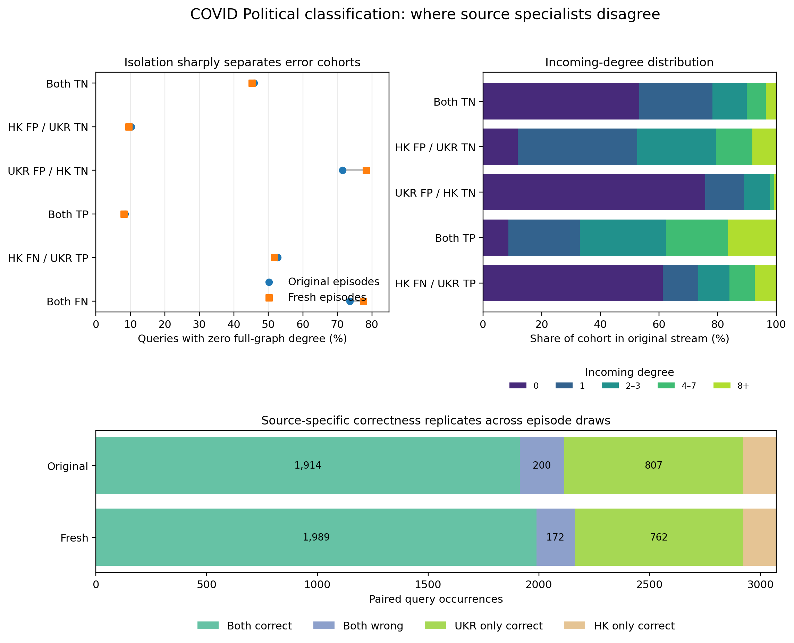

# Source-paired episode error audit

> **NM protocol correction (8 September):** the original NM exports below used
> `neighbor_matching_edge_split=False` and `edge_view=default`. They are descriptive
> full-graph episode results, **not held-out-edge generalization evidence**.
> The [canonical-split, identical-input rerun](FINDINGS_NM_CANONICAL_SPLIT.md)
> supersedes those NM numbers. This issue does not
> establish leakage in the classification audit or the separate final-core benchmark.

Updated 8 September 2026. This report consolidates the Ukraine-versus-Hong Kong
specialist analyses for downstream COVID Political classification and native
30-way neighbor matching (NM).

## Executive findings

1. **The source graph changes which episodes a model can solve, not only its
   aggregate accuracy.** NM shows native-source specialization under the
   corrected occurrence-weighted sampler **and** with equal weight per
   observed query node. The old HK reversal is superseded. Classification shows different structural
   false-positive and false-negative regimes.
2. **A substantial shared hard core remains.** On corrected Ukraine test
   episodes, both models miss 51.12% of queries (wrong-set Jaccard 0.590);
   on HK they miss 76.01% (Jaccard 0.805).
   Source selection alone cannot remove these shared failures.
3. **The specialists are still complementary.** The corrected Ukraine
   either-model oracle adds 4.74 accuracy points; on HK it adds 6.13 points.
   Validation-selected bio-cluster routing adds nothing on either target.
   Oracle headroom is not an achieved improvement.
4. **Off-source mistakes are usually more severe.** Even when both models are
   wrong, the native model ranks the true NM anchor substantially higher.
5. **Downstream classification failures expose opposite structural biases.**
   The Hong Kong specialist overcalls connected negatives and misses isolated
   positives; the Ukraine specialist overcalls many isolated negatives.
6. **These results replicate across evaluation samples, not training seeds.**
   NM test/validation results nearly coincide. The classification “original”
   and “fresh” streams use identical checkpoint weights with different episode
   draws. Independent training-seed replication remains outstanding.
7. **The evaluation protocol matters.** The original NM diagnostic disabled
   edge splitting. Its replacement verifies zero training-edge overlap for
   every sampled support/query positive and replays identical input tensors.
   Repetition and anchor ambiguity must be measured under this corrected
   protocol; the historical magnitudes below must not be mixed with it.

## 1. Downstream binary classification

Both frozen specialists were evaluated on exactly paired binary 10-shot COVID
Political episodes. Positive means conservative and negative means
non-conservative. Each of the original and fresh streams contains 3,072 query
occurrences.

### Paired outcomes

| Outcome | Original | Fresh |
|---|---:|---:|
| Both correct | 1,914 | 1,989 |
| Both wrong | 200 | 172 |
| Ukraine only correct | 807 | 762 |
| Hong Kong only correct | 151 | 149 |

The disagreement is asymmetric and stable across episode draws. Most
Ukraine-only wins are negative queries that Hong Kong calls positive: 657 in
the original stream and 652 in the fresh stream. Most Hong-Kong-only wins are
negative queries that Ukraine calls positive: 144 and 138. Positive-class
disagreements are smaller: Hong Kong FN/Ukraine TP occurs 150/110 times, while
Ukraine FN/Hong Kong TP occurs only 7/11 times.

### Structural failure regimes

- **Hong Kong FP / Ukraine TN:** only 10.2%/9.5% are isolated, versus
  45.8%/45.2% of shared true negatives. Mean incoming degree is 3.00/2.80,
  versus 1.49/1.25. Hong Kong therefore tends to overcall connected negatives.
- **Ukraine FP / Hong Kong TN:** 71.5%/78.3% are isolated. Among the small
  connected subset, the positive-neighbor fraction is .446/.378, versus
  .005/.004 for shared true negatives. Ukraine's dominant error regime is
  instead isolated negatives.
- **Hong Kong FN / Ukraine TP:** 52.7%/51.8% are isolated, versus 8.4%/8.1% of
  shared true positives. Mean incoming degree is 1.76/1.75, versus 4.45/4.37.
  Hong Kong disproportionately misses isolated positives.
- **Shared false negatives:** 73.6%/77.5% are isolated, although the cohorts
  are small (53 and 40 occurrences).

Profile availability and profile length do not explain these large cohorts.
All audited rows have row-aligned profile text, and the relevant profile-length
distributions are nearly identical. The evidence instead points toward
different reliance on graph role, query context, or support-derived class
representations.

### Controlled examples

- COVID row 60,598 is a connected non-conservative query with uniformly
  non-conservative sampled neighbors. Ukraine is correct at 84.21%, whereas
  Hong Kong assigns 7.43% to the target. Removing only Hong Kong's query
  background edges makes it correct at 99.41%.
- Row 34,409 is an isolated non-conservative query whose profile explicitly
  supports Biden. Hong Kong is correct at 93.37%; Ukraine assigns 14.91%.
  Zeroing the Hong Kong query bio does not remove its confidence, while changing
  support context flips it. Correctness therefore does not establish direct
  semantic use of the apparently relevant text.
- Row 7,229 is a conservative query with a vague profile but sampled neighbors
  containing conservative cues. Ukraine is correct at 99.65%; replacing only
  its context features drops the target score to 22.20%.

These examples show that both query processing and the support-derived class
representation can mediate the structural associations. Full-graph degree is a
correlate, not yet an established cause.

## Update: first query bio clustering pass

The [query bio clustering report](FINDINGS_QUERY_BIO_CLUSTERS.md) now adds
actual-text interpretation and GTE geometry to the classification audit.
Eight clusters fit without labels/outcomes on original unique queries yield
repeatable error differences in the fresh stream (paired-gap correlation
0.846), although embedding clusters overlap substantially (silhouette 0.031).

The clearest shared-failure concentration is supplied-negative queries in a
cluster mixing pro- and anti-Trump vocabulary: roughly 3% of query occurrences
account for 22% of shared errors in each stream. Inspected bios include both
stance confusion candidates and apparent text/label conflicts, requiring
label-provenance checks before calling these annotation errors. A creative/
hobby cluster retains an additional 4.5/4.6-point Ukraine advantage after a
coarse true-label × isolation adjustment. Ukraine is better in all eight
broad clusters; wholesale routing by bio topic alone is not supported.

The classification clustering pass covers query bios only. The subsequent NM
query/anchor/support analysis appears below; training-node exposure and full
neighborhood-semantic analysis remain outstanding.

## 2. Native neighbor matching: corrected held-out-edge protocol

The [complete corrected NM report](FINDINGS_NM_CANONICAL_SPLIT.md) contains
the current distributions, bio examples, provenance and limitations. Both
seed-0, step-2500 checkpoints were verified to have trained on `static_train`.
We evaluate 512 episodes per target/split (30-way, 3-shot, 4-query), sharing
all realized model inputs and checking every positive against all edge splits.
The historical sorted-ID member policy is retained to reproduce the benchmark;
this remains a sampler-conditioned rather than uniformly node-sampled result.

| Held-out test target | Ukraine model | Hong Kong model |
|---|---:|---:|
| Ukraine | 44.15% | 18.15% |
| Hong Kong | 11.68% | 17.86% |

Ukraine remains better on Ukraine with equal weight per observed query node
(52.84% / 22.90%). Journalism/editor bios are a concentrated shared-error group
(63.04% both wrong); the native model wins all eight nonzero bio groups.
These are broad overlapping clusters, not cleanly separated semantic classes.

HK also remains better on HK under node weighting (UKR 26.85% / HK 30.71%),
and wins all eight bio groups plus the zero-vector group. Its top 1% of observed
queries supply 34.70% of occurrences; 23.12% of occurrences have multiple anchors
within the episode. Shared errors exceed 82% in two overlapping Hong Kong
self-description groups. The Japanese-language/interests group is substantially
easier (44.26% shared errors). The earlier ranking reversal and +0.55-point
topic-routing gain **do not reproduce** and are withdrawn as current conclusions.

Raw query-to-support bio similarities often favor an incorrect NM anchor class.
The actual-text examples include plausible wrong text matches and correct graph
matches with missing anchor bios. NM labels are graph adjacency, **not stance**;
the earlier text/label-conflict candidates concern classification only.

### Historical full-graph NM results (superseded)

Everything from here through the old routing result below describes the
September 7 full-graph diagnostic only. Its original images and findings are
retained for traceability, not as current held-out-edge evidence.

Both seed-0, step-2,500 specialists were evaluated on exactly paired 30-way,
3-shot NM episodes on `ukr_rus_twitter` and `cp_hk_twitter`. Test and
validation each contain 500 episodes per target. Pairing was verified with the
query node, true anchor, complete episode-anchor map, and true-label support
center-node ids.

### Accuracy and reproducibility

| Target / split | Ukraine model | Hong Kong model | Either-model oracle |
|---|---:|---:|---:|
| Ukraine test | 42.68% | 11.36% | 46.43% |
| Ukraine validation | 42.51% | 11.65% | 46.21% |
| Hong Kong test | 13.20% | 20.26% | 26.99% |
| Hong Kong validation | 13.38% | 19.95% | 26.79% |

Ukraine wins all 500 Ukraine test episodes. Hong Kong wins 464 of 500 Hong
Kong test episodes, ties 10, and loses 26. Validation reproduces those counts
almost exactly: 500 Ukraine wins; 464 Hong Kong wins, 9 ties, and 27 losses.

### Failure overlap

| Target | Both correct | Both wrong | Ukraine only | Hong Kong only | Wrong Jaccard |
|---|---:|---:|---:|---:|---:|
| Ukraine test | 7.60% | 53.57% | 35.08% | 3.75% | 0.580 |
| Hong Kong test | 6.47% | 73.01% | 6.73% | 13.79% | 0.781 |

On Ukraine, 93.5% of Ukraine-model errors are shared, but only 60.4% of Hong
Kong-model errors are shared because Ukraine rescues 63,135 query occurrences.
On Hong Kong, shared failures account for 84.1% of Ukraine-model errors and
91.6% of Hong-Kong-model errors. The Hong Kong target therefore has both a
larger common hard core and more oracle headroom.

### Error severity

On shared Ukraine failures, the native Ukraine model gives the true anchor
median rank 5 (mean 6.87), compared with median rank 12 (mean 13.30) under Hong
Kong. On shared Hong Kong failures, the native model's median rank is 7 (mean
8.26), compared with 13 (mean 13.55) under Ukraine.

Thus top-1 accuracy understates useful native-model signal. Rank-aware training,
reranking, or improved support aggregation may recover some shared failures.
The counter-source rescues are also non-negligible—6,757 Ukraine queries and
4,040 Hong Kong queries—providing concrete cases for routing or adaptation.

### NM bio clusters and query weighting: follow-up findings

The [NM bio clustering report](FINDINGS_NM_BIO_CLUSTERS.md) adds validation-fitted
query clusters, actual bio examples, GTE anchor/support similarity distributions,
and an audit of repeated queries and within-episode anchor overlap.

On Hong Kong, Ukraine wins in the zero-vector group (24.76% versus 16.84%) and
a predominantly Japanese-language/interests cluster (58.41% versus 55.41%).
Hong Kong wins in most other occurrence-weighted clusters, especially news/
URL-heavy bios. On Ukraine, the native model wins throughout; its margin is
particularly large in the Spanish/Romance-language cluster. These are broad,
overlapping partitions with modest stability across clustering seeds.

The larger finding is a **model-ranking reversal under query-node weighting**:
Hong Kong's occurrence-weighted scores are UKR 13.20% / HK 20.26%, but equal
weight per observed query node gives **UKR 44.95% / HK 33.28%**. The top 1% of
observed Hong Kong queries produce 54.16% of test occurrences. Nodes repeated
20+ times account for 79% of occurrences; Hong Kong is better on those, while
Ukraine is better on sparse queries. Validation reproduces this reversal.
These metrics answer different questions; the historical aggregate is unchanged.

Within-episode ambiguity is also common: 42.27% of Hong Kong and 8.31% of
Ukraine test occurrences involve query nodes assigned more than one true
anchor within their episode. Shared-error rates rise to 83.90% / 78.69% on
these groups. This identifies overlapping NM memberships, not political label
conflicts. Sampled contexts may differ, so it does not establish a universal
performance ceiling.

True and predicted support classes often have similar query-bio cosine scores.
In Hong Kong shared failures, mean true-minus-predicted support margins are
−.0086 for Ukraine's predictions and +.0001 for Hong Kong's. Selected actual
query/anchor bios show both semantically sensible rescues and correct graph
matches whose wrong alternative is closer in text space. Bio similarity alone
does not define NM truth.

A routing rule chosen on validation clusters selects Ukraine for Hong Kong's
zero-vector/Japanese groups and Hong Kong otherwise. It reaches **20.80% test
accuracy**, versus 20.26% for Hong Kong alone: a measured +0.55-point gain,
well below the 6.73-point oracle gain. No model or sampler was changed.

## 3. Combined interpretation

The corrected evidence is consistent with source-specific graph-role and
matching behavior, although two checkpoints cannot causally isolate source
composition from all other training variation:

- source matching supplies an advantage under corrected NM occurrence and
  node weighting on both targets;
- native representations remain better aligned even on many shared mistakes;
- the specialists preserve complementary decision boundaries; and
- downstream transfer exposes opposing sensitivity to connectedness and
  isolation.

This supports two improvement tracks. A **generalization track** should reduce
source-specific reliance through source-diverse/harder episodes, role-balanced
sampling, context dropout, or invariant structural features. A
**specialization track** should exploit complementarity through routing,
ensembling, rank-aware reranking, or small downstream adapters. However, the
tested broad bio-cluster router adds zero on both targets. Smaller models and
label-efficient adaptation remain possible future experiments, not findings.

## 4. What is established versus unresolved

Established:

- identical realized input tensors between models in the corrected NM audit,
  with sampled positive edges disjoint from training;
- native-source specialization under corrected query-occurrence and
  node weighting on both targets;
- stable test/validation and original/fresh evaluation patterns;
- target-dependent shared-error overlap and oracle headroom; and
- robust structural associations in binary-classification FP/FN cohorts.

Not yet established:

- robustness across independently trained model seeds;
- the fraction of evaluation query, anchor, and support nodes seen during
  pretraining;
- whether node exposure explains source specialization;
- whether degree/connectedness remains predictive after conditioning on the
  exact sampled subgraph; or
- whether query features, graph context, and support aggregation are causal at
  the cohort level.

## 5. Highest-value next analysis

First audit or reconstruct pretraining node exposure; no complete exposure ledger
has yet been established here. Join it to saved episode IDs and graph structure.
Compare shared failures, native-only rescues, and
counter-source rescues on:

1. query/true-anchor/support-node exposure;
2. degree, directionality, connectedness, and shortest-path status;
3. query-to-true versus query-to-predicted anchor similarity (first NM pass
   completed above); and
4. within-class support dispersion and query-to-support similarity (first NM
   mean-similarity pass completed above).

The repeated-query findings add an immediate evaluation priority: report both
node- and occurrence-weighted metrics, and audit multi-anchor memberships and
identical realized query inputs before interpreting all shared NM errors as
representation limitations.

This directly distinguishes coverage or memorization from transferable motif
learning. It also determines whether the next intervention should be broader
pretraining data, structural regularization, mixture/routing machinery, or a
label-efficient adapter.

## Evidence and provenance

Detailed reports:

- [COVID Political classification](FINDINGS_COVID_POLITICAL_SOURCE_PAIR.md)
- [Current canonical-split neighbor matching](FINDINGS_NM_CANONICAL_SPLIT.md)
- [Historical full-graph neighbor matching](FINDINGS_NM_SOURCE_PAIR.md)
- [Classification query bio clusters](FINDINGS_QUERY_BIO_CLUSTERS.md)
- [Historical full-graph NM bio clusters](FINDINGS_NM_BIO_CLUSTERS.md)

Private raw evidence remains under:

- `/dataMeR1/phil/gfm/error_audit/source_pair_fpfn_20260907/`
- `/dataMeR1/phil/gfm/error_audit/nm_source_pair_20260907/`
- `/dataMeR1/phil/gfm/error_audit/nm_bio_clusters_20260908/`
- `/dataMeR1/phil/gfm/error_audit/nm_canonical_split_20260908/`
- `/dataMeR1/phil/gfm/error_audit/nm_canonical_split_bios_20260908/`

The classification analysis uses two evaluation episode draws with identical
weights. The NM analysis uses seed-0 specialists and fixed test/validation
episodes. Neither substitutes for independent training-seed replication.
