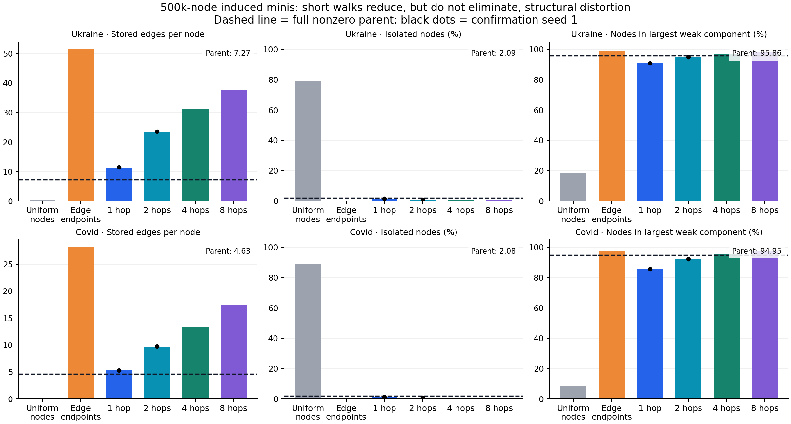
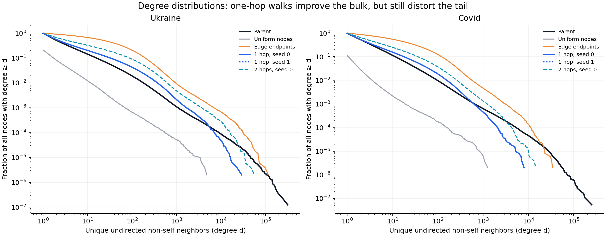

# Short-walk mini sampling pilot

**One-hop uniformly restarted walks are the closest tested compromise on both
graphs. They are not density-matched or representative miniature graphs.** The
same ordering holds for a second seed. Longer walks increasingly concentrate
edges; uniform-node sampling creates isolates, while edge-endpoint sampling
concentrates high-degree nodes much more strongly.

All candidates contain exactly 500,000 nonzero-feature nodes. Their topology is
the complete induced subgraph of the selection. These are structural screening
results, not trained models or new canonical graph objects. Candidate row IDs
are saved on Tucker for reuse; the previous mini graph artifacts are unchanged.

## Main comparison

Seed 0; stored edges are directed rows in the original full graph. Degree is the
number of distinct undirected non-self neighbors. Components are weakly connected
components, including isolates.

| Graph / selection | Edges | Edges/node | Isolates | Degree KS vs parent | Largest component |
|---|---:|---:|---:|---:|---:|
| Ukraine parent (7,973,536 nodes) | 57,964,016 | 7.27 | 2.09% | 0.000 | 95.86% |
| Ukraine uniform nodes | 218,163 | 0.44 | 79.13% | 0.770 | 18.63% |
| Ukraine edge endpoints | 25,710,237 | 51.42 | 0.00% | 0.538 | 98.80% |
| **Ukraine 1 hop** | **5,653,956** | **11.31** | **1.57%** | **0.059** | **91.02%** |
| Ukraine 2 hops | 11,759,945 | 23.52 | 0.97% | 0.189 | 94.98% |
| Ukraine 4 hops | 15,538,818 | 31.08 | 0.68% | 0.273 | 96.69% |
| Ukraine 8 hops | 18,903,150 | 37.81 | 0.44% | 0.352 | 97.96% |
| COVID parent (18,493,966 nodes) | 85,719,134 | 4.63 | 2.08% | 0.000 | 94.95% |
| COVID uniform nodes | 63,956 | 0.13 | 88.88% | 0.868 | 8.43% |
| COVID edge endpoints | 14,072,647 | 28.15 | 0.00% | 0.468 | 97.35% |
| **COVID 1 hop** | **2,647,100** | **5.29** | **1.42%** | **0.041** | **85.86%** |
| COVID 2 hops | 4,835,739 | 9.67 | 0.90% | 0.152 | 92.19% |
| COVID 4 hops | 6,709,199 | 13.42 | 0.62% | 0.238 | 95.38% |
| COVID 8 hops | 8,695,861 | 17.39 | 0.35% | 0.318 | 97.51% |

Exact machine-readable numbers are in [comparison.csv](data/comparison.csv).

## Repeatability and remaining distortions

- Across seeds 0 and 1, Ukraine one-hop density is 11.31–11.46 edges/node
  versus parent 7.27 (56–58% higher); isolate rate is 1.57–1.62%; degree KS is
  0.059–0.060; largest-component share is 90.96–91.02% versus 95.86%.
- COVID one-hop density is 5.288–5.294 versus parent 4.635 (about 14% higher);
  isolate rate is 1.41–1.42%; degree KS is 0.041–0.042; largest-component share
  is 85.82–85.86% versus 94.95%.
- These are ranges across **two graph selections**, not confidence intervals.
  Only the best two lengths from seed-0 screening were repeated.
- Matching the bulk of the degree CDF does not match the high-degree tail.
  Ukraine one-hop median/p90/p99 are 2/32/371 versus parent 2/15/179.
  COVID one-hop median/p90/p99 are 2/17/158 versus parent 2/11/97.
- Component-size distortion persists: 7.37% of Ukraine one-hop nodes and 12.65%
  of COVID one-hop nodes occupy components of 2–10 nodes, versus 2.00% and
  2.95% in their parents. Longer walks improve connectivity at the cost of
  markedly higher density and worse degree-distribution matching.
- Selected nodes are still degree-biased in the parent: selection-only parent
  degree KS is 0.137 (Ukraine) and 0.176 (COVID). Inducing removes some of their
  neighbors, partly offsetting selection bias in the resulting degree CDF.
  A close induced-degree CDF therefore does not establish representative nodes
  or features. Feature distributions and task performance were not measured.

## Decision

For a compute-limited, explicitly sampled-graph ladder, prefer the **one-hop
uniform-restart family** over either earlier sampler. Use the same method on
both graphs, not different methods chosen from training or held-out performance.
The saved seed-0 selections are the natural pilot choices; seed 1 is a robustness
selection. See [preferred_selections.json](data/preferred_selections.json).

Do **not** describe the resulting ladder as representative of the full parents
or claim density is controlled. None of these tested methods reproduces all
parent statistics. For such a claim, retain full graphs with a fixed training
budget, or do further sampling-method work before drawing that conclusion.
No full candidate feature artifacts, canonical replacements, or ladders were
launched in this pilot.

## Figures

The CCDF denominator includes all nodes, including isolates. Degree-zero points
are omitted on the logarithmic x-axis. Full parents have many more nodes, so
finite-sample tail resolution differs; the plotted two seed curves are not
confidence bands. Median and upper quantiles are reported above to make the
remaining distortions explicit.

## Protocol and provenance

Setup: [README](../../../../setup/nonzero_mini_sampling_pilot/README.md).
Code revision: `22af309b`. Branch: `codex/walk-mini-pilot`.
Local worktree: `/tmp/prodigy-walk-mini-pilot`.
Tucker worktree: `/dataMeR1/phil/gfm/prodigy-walk-mini-pilot`.
Raw reports include input path, byte size and mtime, selection hashes, exact
histograms, sampling details, timings, and unchanged-parent checks.

Uniform roots are sampled from the entire nonzero parent, including isolates.
At each step a distinct undirected non-self neighbor is chosen uniformly; at an
isolate the walker stays put. Nodes are accumulated in walk-major order until
500k distinct nodes are reached. Only the final walk can be cut short. The
candidate includes **all** original edges within that selection, not just the
walk edges. No labels or held-out performance enter selection.

Screening criterion (declared in the runner): absolute log density ratio + degree
KS + absolute isolate-fraction error + absolute largest-component-fraction error.
This is a diagnostic heuristic, not a sampling-theory guarantee. Full component
size bins and log-degree Wasserstein distances are retained in JSON.

The two pilots ran concurrently in the mapped CPU environment: **24.0 seconds
for Ukraine, 38.4 seconds for COVID**, including parent loading, CSR creation,
parent statistics, two baselines, four seed-0 walk lengths and two seed-1 repeats.
Filesystem caches were warm. Code preparation, plotting and subsequent
publication are excluded. Synthetic tests passed locally and on Tucker.
