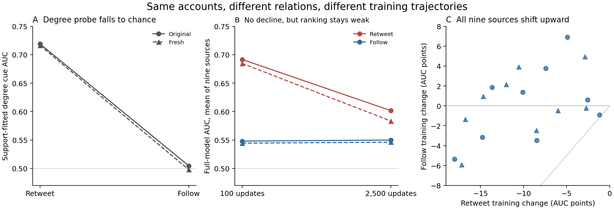

# When training stops exploiting what the target rewards

**Newer decision:** the completed fixed-neighborhood direction-reversal test
is recorded in `FINDINGS_TRAJECTORY_DECISION.md` and the one-page
`output/pdf/directed_context_decision.pdf` at the worktree root. It shows
source-broad orientation-alignment sensitivity and its attenuation, but fails
the predeclared half-advantage recovery gate. The cue-accounting argument below
is preserved; it does not establish the proposed signed-role mechanism.

Private contribution argument, 7 September 2026. Candidate, not a completed
mechanism claim. No manuscript expansion or public artifact release.

**Explanation supported now.** On the reconstructed TwiBot20 retweet target,
continued pretraining weakens the early model's advantage on comparisons aligned
with a support-fitted incoming-degree cue. The decline is not uniform: all nine
sources lose on cue-correct pairs; eight gain on cue-wrong pairs in both streams.
Equal-degree pairs comprise 23–24% of comparisons and improve slightly on
average. Their mass is large enough to make this a substantive contrast.

**Pair accounting:** the weighted contributions reproduce the full-model decline exactly:
−12.62/−13.99 points on cue-correct pairs, +3.11/+3.65 on cue-wrong pairs,
and +0.51/+0.20 on equal-degree pairs, totaling −9.00/−10.14. Both streams use
the same nine one-seed source runs; circles/triangles distinguish streams, not
independent training replications. AUC is averaged within episodes.

**Why it matters.** The target rewards cue-consistent unequal-degree comparisons
roughly 3.6–3.7 times as often as cue-inconsistent ones. Giving those two groups
equal weight, while retaining equal-degree mass, changes the mean endpoint
score difference to −0.16/−0.43 points. This is an explicitly label-conditioned
diagnostic pair score, **not a new benchmark AUC, a deployment correction, or a
causal fraction explained**. It shows why the aggregate trajectory cannot be
read as uniformly worse representations. Pooled-feature prototypes and ridge
improve over the same training interval, whereas later stages lose the
cue-aligned ranking advantage.

**Strongest alternative and counterexample.** Weakening a degree-associated
signal relative to noise could produce this pattern without active substitution
by semantic reasoning. Uniform logit rescaling alone cannot change AUC.
Election-trained models also lose within equal-degree comparisons; the account
does not cover every source's errors. Earlier Ukraine projection restoration
increases degree agreement but worsens full AUC: agreement is not a sufficient
repair target. Support-suppression gains elsewhere remain a distinct finding.

**Completed relation-setting generality test.** We preserved account features,
labels, support/query identities and fixed training endpoints, replacing the
reconstructed retweet relations with original follow relations restricted to
the same node set. The original benchmark uses follow relationships and sampled
followers/followings ([dataset authors](https://github.com/BunsenFeng/TwiBot-20/blob/main/README.md)).
This tests dependence on graph construction, not another independent population
or architecture. Both streams and all nine sources are complete.

The pre-outcome joint prediction holds: degree-probe episode AUC drops from
.719/.716 to .505/.498, while full-model training changes shift from
−9.00/−10.14 to +0.18/+0.17 points. Every source's change shifts upward in both
streams. Follows leave only 6/3 isolated query occurrences versus 430/436 on
retweets, so this is not wholesale neighborhood removal. Relation directions
were checked against 1,139 original-sample relations before evaluation.

**Figure's decisive limitation:** full follow-graph AUC is only .548/.544 early
and .550/.546 late. The early retweet advantage largely disappears; useful bot
transfer has not been repaired. Neighbor identities, features and sampling
exposure also change, so the comparison does not isolate degree causally.
Circles/solid lines and triangles/dashed lines show the two streams, not seeds;
panel B shows source means and panel C retains all nine sources.

**The strongest alternative now has direct support.** Exact accounting on
identical query pairs shows that initial disagreements contribute
+11.53/+11.72 points to the follow-minus-retweet trajectory difference.
Comparisons with equal early ranking credit instead contribute −2.35/−1.42
points, favoring retweets. On pairs both settings initially rank correctly,
retweets retain .681/.659 correct-ranking credit versus follows' .604/.598
([transition figure](figures/relation_transition_argument.png)). A flatter
follow trajectory is therefore not better preservation: it chiefly removes
an early advantage. This conditional diagnostic does not isolate confidence
or causal degree effects.

**Exact contribution currently supported.** A source-broad, stage-resolved
account of a cue-conditioned ranking tradeoff. A large decline can reflect loss
of an early target-rewarded advantage while pooled-feature readouts improve.
The graph-setting result corroborates that dependence, not a preservation
mechanism or useful repair. The missing intellectual step is explaining which
learned computation weakens the advantage and connecting that explanation to
class-reference construction. Existing role-localization evidence alone does
not supply that bridge. No wider relation sweep or manuscript expansion follows
from this diagnostic; the intended strong mechanism contribution remains open.
