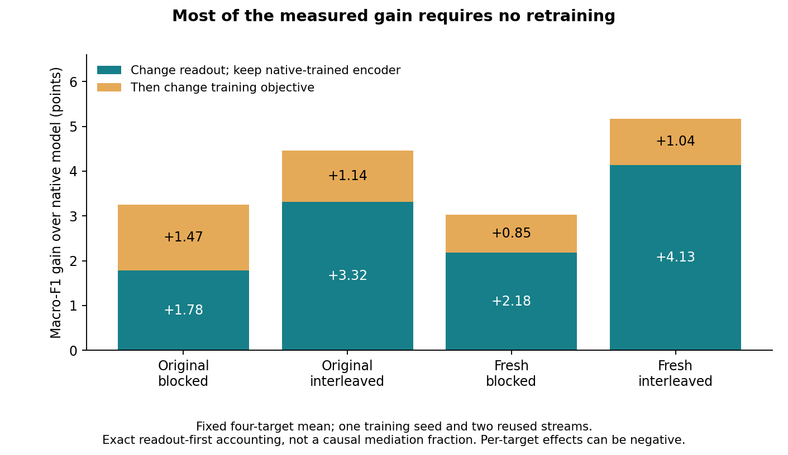

# Separate what transfers from how it is used

Current figure-led advisor brief, 7 September 2026. Supersedes the pending
training-benefit direction in earlier decision notes; not an expanded manuscript.

**The result worth leading with.** In the matched social experiment, replacing
learned episode inference with a fixed support-centered ridge readout improves
the native-trained encoder's four-target mean macro-F1 by 1.78–4.13 points.
Training the encoder directly through a strengthened ridge objective adds
0.85–1.47 points. The total improvement is 3.02–5.17 points across two schedules
and two reused episode streams. Thus 55–80% of this measured gain is available
without retraining. These are exact readout-first score differences, not an
order-independent causal attribution or a target-label-based selector.

**Explanation, at the level established.** End-to-end graph-ICL accuracy combines
the signal in graph-encoded examples with a particular learned way of constructing
and using episode-level class references. In these settings, that learned use
does not extract all the classification utility available to a fixed support-fitted
rule. Social interventions further isolate changes to reference construction at
fixed attention and final query vectors. This is a computational location of
failure, not a validated universal geometric cause.

**A substantive public generality result.** Original-style Wiki → FB15K-237
PRODIGY also benefits from the trained intermediate readout beyond text and exact
initialization. Across two training seeds, later inference improves either tested
encoder while later encoder outputs hurt either inference module. The public
result therefore contradicts the tempting explanation that the readout gap is
caused simply by increasingly worse inference weights. It does not establish the
social fixed-query pathway in the public architecture.

**The strongest counterevidence changes the claim.** Strengthened direct training
matches or exceeds native/joint training on panel macro-F1, rejecting our proposed
special representation-learning benefit from native inference. Centering and
learned source-training scale changed together; neither alone is identified as
the cause. Target exceptions remain: fresh blocked Facebook loses 0.39 macro-F1
points from direct retraining, and interleaved suspension loses 3.14, relative to
native training under the common centered readout. Election gains essentially
nothing from either change. The temporal support-specific bridge and nominated
GILT compensation test also failed. There is no universal harmful-support story.

**Exact contribution supported.** A scoped empirical account of why native graph
transfer scores can mislead representation and architecture judgments, coupled
with a demonstrated evaluation correction: compare strong matched readouts before
attributing failure to the encoder, and strengthen the direct objective before
attributing a training advantage to learned episode inference. Ridge fitting,
auxiliary objectives and component swaps are established tools, not our novelty.
This is more useful than another edge-removal table, but the evidence does not
yet compel an 8+ significance judgment or establish a new general mechanism.

**Advisor decision.** Lead with the learned-use limitation and retain the public
opposing-component result as its important explanatory boundary. Do not sell a
new training method or rescue the rejected training-benefit hypothesis. No more
factorization or target-substitution sweeps. If pursuing the practical training
comparison further, its first gate is a fixed second-initialization replication
of the exact direct/native comparison—not additional objective tuning. No such
run is launched by this brief.

Evidence: `CONTRIBUTION_REQUIREMENTS.md` contains full tables, exceptions and
receipts; `compare_centered_training.py` checks every additive identity over all
20 target/schedule/stream cells and all four metrics. Figure uses the previously
fixed four-target panel; all five targets remain in the companion decision figure.
Private worktree `.worktrees/role-topology`, branch `codex/role-topology-interactions`.
