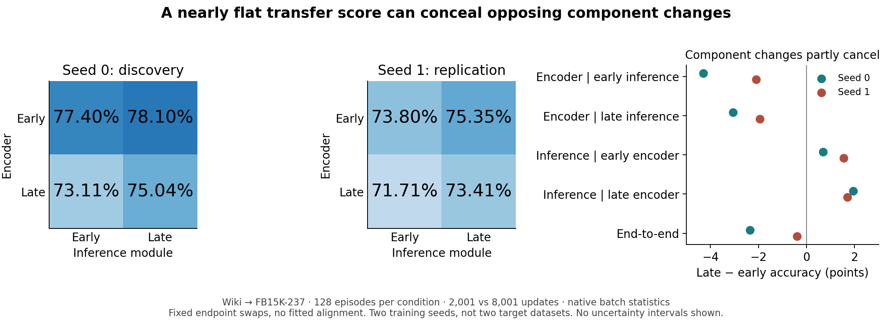

# A flat transfer score can conceal opposing component changes

Private figure-led argument, 7 September 2026. Candidate intellectual direction,
not a claim that the publication goal is achieved. No new experiment was run
for this synthesis.

**Explanation supported by the current contrasts.** The public model's loss
with additional pretraining is not caused by a uniformly deteriorating inference
module. Replacing early inference with late inference improves either encoder;
replacing early encoder outputs with late outputs hurts either learned inference
module. Yet a fixed support-fitted classifier retains approximately the same
aggregate accuracy. The adverse change is therefore readout-dependent: later
features are less useful to both tested learned inference modules, without a
comparable loss under this fitted readout. Later inference partly compensates
in the endpoint crossover; this is not a causal account of training gradients.

**Strongest surviving alternative.** Different information may be gained and
lost, with a per-episode fitted classifier adapting to that changed organization.
Its flat mean masks 1,313 correctness transitions among 10,240 query occurrences.
We therefore cannot claim preserved information, mere coordinate drift, or an
identified geometric defect. 'Compatibility' currently names a measured
dependence on the consumer, not its underlying mechanism.

**Generality result and its boundary.** This occurs in the original-style
Wiki-to-FB15K-237 architecture/protocol, beyond the short social models. The
native-versus-fitted-readout divergence survives freezing BatchNorm to trained
checkpoint statistics. However, it is one training seed; the temporal crossover
has only been tested with batch statistics. The designated seed-one run is
ongoing. Public whole-module swaps do not replicate the social support-only
value intervention, which holds queries fixed. Those experiments supply
complementary, not identical, causal evidence.

**Exact potential contribution.** End-to-end target scores can misidentify
which learned component improved and whether encoded target signal became
less usable. Combining role-specific interventions with temporal component
crossovers distinguishes failures in graph-conditioned class-reference use
from the blanket explanations 'poor features' and 'bad inference weights.'
The public crossover makes that distinction consequential: inference improves
while the complete model regresses. The social factorial supplies the separate
case where changing support content alters predictions with queries fixed.

This is not a new representation/readout decomposition or stitching method;
those have close precedents. `FINDINGS_TEMPORAL_NOVELTY_BOUNDARY.md` records
the primary-source comparison. The candidate novelty is the specific causal
attribution of graph-transfer deterioration, not generic compatibility.

**Advisor decision.** Make the already-designated seed replication the next
decision point, not a new selector or geometry sweep. Do not yet expand the
manuscript around a shared support-specific mechanism. Replication would
strengthen this readout-dependent deterioration result; it would not by itself
explain the origin of the compatibility change or establish an 8+ contribution.

**Seed-one decision update (2026-09-07).** The prespecified component directions
replicate, even though pronounced end-to-end deterioration does not. Accuracy
for E2k/I2k, E2k/I8k, E8k/I2k, E8k/I8k is respectively 73.7988%, 75.3516%,
71.7090%, 73.4082%. Later inference helps by 1.5527 and 1.6992 percentage
points; the later encoder hurts by 2.0898 and 1.9434 points. The matched
native trajectory falls only 0.3906 points; centered ridge falls 0.2832.
Thus the stronger prospective result is opposing component changes hidden by
an almost-flat total, not a replicated large temporal collapse. This is
functional attribution conditional on the tested modules, not proof of
training-gradient compensation, coordinate drift, or preserved information.
The endpoint centered trained readout also beats native inference, exact
initialization, and text (78.3425%, 72.3825%, 70.2175%, 71.6100%, 500 episodes).
Do not combine these endpoint and crossover claims into one success criterion.

Verified all 512 crossover rows (128 unique episode ordinals per condition)
and all 16 aggregate means to 1e-12; execution status is complete. Tucker
source: `prodigy-publickg-paired-state/log/publickg_crossover_seed1_20260907/summary.json`,
SHA256 `22c68738f422d2815f8661f5ef2039ce6004dbd79c3edb138673654d07ecfdb9`.
This check recomputes saved metric rows, not tensor-level parity or input pairing.
Normalization validation remains live (PID 280945); finish the already-running
pipeline and its pairing audit before revising the figure or manuscript.

**Normalization completion.** Seed-one frozen-running-statistics native accuracy
is 70.2051% at 2k and 69.8730% at 8k; centered ridge is 77.8418% and 79.3164%.
All 32 means recomputed from 256 saved rows agree within 1e-12; execution is
complete. Summary SHA256:
`3827e707ff2c6b27df2a6e536ef69d7228477644f77f09caace86930312dd394`.
The endpoint readout gap is not restricted to evaluation batch statistics.
The large native temporal decline remains seed-dependent; no frozen-statistics
component crossover was run, so do not assert that its four directions survive
this change. The all-500-episode cross-seed input audit is now running read-only.

**Audit correction and fair baseline boundary.** The initial cross-seed audit at
0e68737d crashed because it treated the graph-batch input as a tensor. The
5fda4243 fix recursively compares graph fields; its three local tests pass,
including rejecting changed edge attributes and batch pointers. The producing
worktree reports exact pairing across 500 episodes with the corrected audit;
an independent corrected rerun is underway from `prodigy-publickg-input-audit`.
Neither evaluation was changed. The stronger initialization baseline is actually
the uncentered readout, 72.6675%, not the centered 70.2175% quoted above.
Trained centered ridge still exceeds it by 5.6750 points. Native NLL is better
than ridge NLL: classification gains do not establish calibration superiority.

**Independent pairing closure.** The corrected read-only audit completed:
500 episodes, exact inputs and query truth, zero mismatches. It checks both
inventories against saved file hashes before comparing all input fields.

**Episode-level breadth, not statistical independence.** Recomputed paired
accuracy signs from all saved crossover metric rows (positive/negative/tied):

| Change | Seed 0 | Seed 1 |
|---|---:|---:|
| Later inference, early encoder | 67 / 45 / 16 | 78 / 33 / 17 |
| Later inference, late encoder | 84 / 30 / 14 | 84 / 31 / 13 |
| Later encoder, early inference | 24 / 90 / 14 | 36 / 77 / 15 |
| Later encoder, late inference | 33 / 91 / 4 | 44 / 72 / 12 |

All eight medians agree with their mean direction. This rules out an account
based solely on a small number of extreme episode differences, but substantial
exceptions remain. These are descriptive paired episode counts, not independent
entity observations, binomial significance tests, or an episode-level predictor.

**Current advisor decision.** The replicated result is opposing component
changes, not a large universal temporal collapse. One bounded bridge test is
scientifically justified before adopting a shared support-reference explanation:
cross early/late support rows with early/late query rows at fixed late inference,
using the existing episodes and representations. The complete-encoder endpoints
already exist; only two mixed conditions per seed are new. A late-support cost
at both query endpoints, replicated across seeds, would support a reference-input
localization; equal or larger query effects would contradict a support-dominant
bridge. Keep label rows fixed and do not fit alignment. Public metagraph inference
can change final queries, so fixed pre-metagraph query rows do not reproduce the
social fixed-final-query mediation. Check existing role interventions before
launching: this is a decision, not authorization to repeat a closed experiment.

Evidence and exact provenance: `FINDINGS_PUBLIC_CROSSOVER_BRIDGE.md` and
`data/public_crossover_bridge_20260907.json`. Figure generated by
`plot_public_crossover_bridge.py` and visually inspected. Local worktree
`.worktrees/role-topology`, branch `codex/role-topology-interactions`, HEAD
`65946f82`. Private, uncommitted; existing manuscript PDF remains unchanged.
