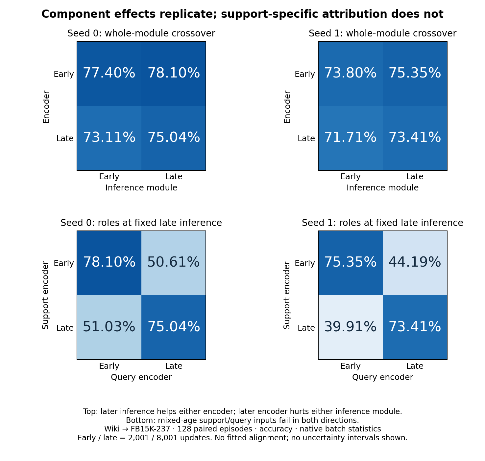
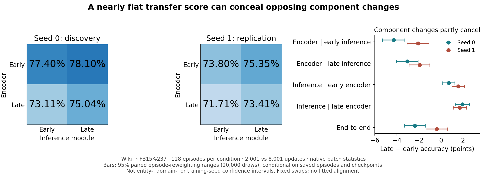

# Transfer scores hide opposing changes in graph-ICL components

Private decision brief, 7 September 2026. This is the current argument, not an
expanded manuscript or a declaration that the publication goal is achieved.

**What we now know.** In original-style Wiki → FB15K-237 PRODIGY, later inference
improves either tested encoder, while the later encoder reduces accuracy with
either inference module. All four directions replicate in a second training
initialization on exactly the same 128 episodes. Seed one's native accuracy
barely moves (73.80 → 73.41%), yet replacing only inference helps by 1.55–1.70
points and replacing only the encoder hurts by 1.94–2.09 points. End-to-end
stagnation therefore conceals opposing functional changes. This is an attribution
under fixed component swaps, not a claim about compensating training gradients.

**Explanation and its strongest alternative.** The later encoder's outputs are
less useful to both learned consumers, but approximately retain aggregate utility
under a fixed support-fitted ridge rule. That locates a readout-dependent loss;
it does not establish unchanged information or coordinate drift. Different query
subsets can gain and lose information while ridge adapts to changed geometry.
Seed zero has 1,313 ridge correctness transitions despite its flat mean. Seed
one's weak total decline is the strongest counterexample to a broad temporal
collapse claim, not a failed replication of the four component directions.

**Why this matters beyond the initial social example.** A representative public
architecture and recipe reproduce the distinction between useful encoded signal
and its learned use. At the seed-one endpoint, trained centered ridge reaches
78.34%, versus native 72.38%, the strongest tested initialization readout 72.67%,
and text 71.61%. Native NLL is better: this is not calibration dominance. Frozen
checkpoint normalization retains the readout advantage; the four component
directions have not been tested under that normalization. Two training seeds on
one target are not two target replications.

**Relation to the social finding.** The nine-source intervention map and the
support key/value experiments show that graph context can help or harm class
reference construction, depending on the target and source. Public whole-module
swaps do not yet identify that same support-specific cause. Keep these as
complementary evidence, not a single established mechanism.

**Contribution we can defend.** A diagnostic account of graph-ICL transfer that
separates improvement in inference from changes in the signal it consumes, with
replicated opposing component effects concealed by aggregate accuracy. Generic
representation/readout decomposition and model stitching are prior art; the
specific graph-transfer attribution must carry the contribution. This is not yet
a predictive geometric explanation or an adaptation method.

**Decisive counterexample now completed.** The temporal role crossover rejects
the support-specific bridge in both seeds. Mixing early supports with late
queries yields 50.61% / 44.19%; the reverse mix yields 51.03% / 39.91%, versus
75–78% with matched encoder ages. Late supports hurt early queries but help late
queries. The 51.50 / 64.66-point interactions preclude a simple role-independent
damage account. Endpoint parity passes. Mixed-age input sensitivity is observed;
coordinate drift as the cause of natural transfer decline is not established.

**Generality boundary.** The separately predeclared GILT COVID Political →
TwiBot-20 crossover also failed its joint directional prediction. Native
conditions are near chance (50.42–50.81%); metric directions disagree. It is not
a controlled architecture comparison and does not establish how competent GILT
transfer would behave, but it cannot support an architecture-general compensation
claim. Intermediate ridge helps there without replicating the temporal account.

**Advisor decision.** Stop the proposed unified support-reference mechanism
story. Preserve the two-seed public component result and social fixed-query
localization as distinct findings. Do not launch an alignment rescue, another
role partition, or a replacement GILT target. The paper's current defensible
identity is diagnostic empirical work: distinguish encoded-signal utility,
learned consumption, and joint support/query dependence before attributing a
transfer score. An 8+ contribution is not yet established merely by combining
these findings; novelty and practical consequence must survive comparison with
existing representation/readout and stitching work.

Evidence: crossover hashes and recomputed means in
`ARGUMENT_READOUT_DEPENDENT_TRANSFER.md`; independent 500-episode input/label
pairing audit passes with zero mismatches. Figure checks both pinned summaries
and all 512 metric rows per seed. Private local worktree `.worktrees/role-topology`,
branch `codex/role-topology-interactions`; no push or manuscript expansion.

## Paired sensitivity check — completed 7 September

The eight component-effect directions persist under paired resampling of the
128 saved episodes (20,000 draws, fixed RNG 20260907). These are pointwise 95%
empirical reweighting ranges, not confidence intervals over entities, target
graphs, or training seeds. Repeated entities and shared graph structure are not
modeled. Both seeds use the same episodes; they are not pooled as 256 independent
observations. Every component-effect sign also survives deleting any single
episode, a deterministic influence check requiring no independence assumption.

| Late minus early accuracy, percentage points | Seed 0 mean [range] | Seed 1 mean [range] |
|---|---:|---:|
| Encoder, early inference fixed | −4.30 [−5.31, −3.28] | −2.09 [−3.08, −1.11] |
| Encoder, late inference fixed | −3.06 [−4.04, −2.08] | −1.94 [−2.90, −1.02] |
| Inference, early encoder fixed | +0.69 [+0.14, +1.25] | +1.55 [+0.99, +2.13] |
| Inference, late encoder fixed | +1.93 [+1.29, +2.58] | +1.70 [+1.09, +2.30] |
| End-to-end | −2.36 [−3.30, −1.44] | −0.39 [−1.38, +0.60] |

**Decision:** retain the opposing-component result as the principal public
finding, including seed one's nearly flat end-to-end result. Do not present
these ranges as formal confirmation of a population-wide conjunction. This
addresses episode-weight sensitivity, not the missing predictive explanation or
cross-architecture scope. Further uncertainty controls are not the priority.
The support-specific bridge and nominated GILT prediction remain rejected;
neither is rescued by more precise public component estimates.

Reproduction: `plot_crossover_replication.py --seed0 <seed0-summary> --seed1
<seed1-summary> --output <figure>`. The script checks the two pinned SHA-256
digests, all cell sizes, paired ordinals, and aggregate means, then prints ranges
and leave-one-episode-out extrema. No model execution or manuscript expansion.
