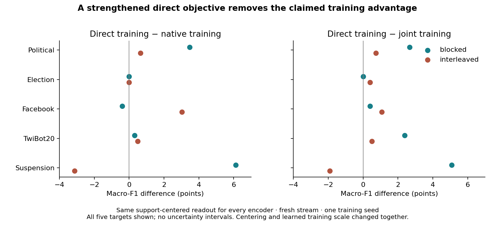

# What would readers understand or do differently?

Private advisor assessment, 7 September 2026. This does not replace the original
publication goal with a lower-bar diagnostic deliverable.

## Strongest candidate question

**What transfers in graph in-context learning: encoded signal, its learned use,
or their joint construction within an episode?** The evidence distinguishes these
objects. It does not support assigning one scalar transferability value to an
encoder from its final model score and then treating that as an explanation.

## Evidence-backed consequences

1. **Do not diagnose a representation from native inference alone.** Public
   trained intermediate features beat exact initialization and text under the
   fixed centered readout, while native predictions discard much of that advantage.
   This calls for strong matched readouts when assessing claimed graph pretraining
   benefits. Probing itself is prior art, not our invention.
2. **Do not infer which component improved from a training curve.** Public
   late inference improves both tested encoders in two seeds, while later encoder
   output harms both inference modules. A near-flat total hides opposing changes.
   This is a demonstrated attribution failure for this recipe, not an established
   general law or a checkpoint-selection method.
3. **Do not treat support and query quality as independent properties.** Mixed
   encoder ages cause large interaction effects. This invalidates the nominated
   additive role account, not all possible role-localized explanations. It may
   reflect off-distribution combinations and does not identify the natural defect.
4. **Attention changes alone need not explain context utility.** The social
   interventions isolate support values at fixed attention and final queries;
   values can help on political classification and hurt on bots, while routing
   changes have a different consequence. This is scoped pathway evidence, not
   proof of the same pathway in public M2 inference.

## What is still missing for a high-impact contribution

The component and readout interventions are not novel techniques. Their use on
graph ICL must establish a consequential misunderstanding or a useful, specific
evaluation correction, rather than merely demonstrate that these tools also
work on graphs. We have examples of misleading final scores; we do not yet
have a validated predictor of failure, a general geometric mechanism, a superior
adaptation algorithm, or a demonstrated change to an established benchmark
conclusion across model families. Those claims must not appear as accomplished.

The practical recommendation presently supported is an evaluation requirement,
not deployment selection: report exact-initialization/text/intermediate/native
comparisons, and perform paired component attribution when making claims about
the cause of transfer changes. A support-only selector has already failed and
cannot be reintroduced as the practical payoff.

## Decisions already made

- Do not assert one shared support-reference mechanism across public and social
  experiments; the temporal role bridge failed.
- Do not claim architecture-general compensation; the nominated GILT test failed.
- Do not launch alignment or replacement-target sweeps to recover those claims.
- Do not expand the manuscript simply to accommodate more experiments.
- Assess the empirical contribution against the closest prior and its concrete
  reader consequence before selecting the final paper identity.

## Working contribution pitch

**When graph-transfer scores hide what models learn.** Graph in-context
prediction combines pretrained representations with learned episode-level
inference. We investigate which computation accounts for transfer performance,
rather than treating the final score as a measure of representation quality.
In an original-style public PRODIGY setting, continued pretraining improves
the inference component while changing encoder outputs adversely for both
tested inference states. This opposing direction replicates across two training
initializations, including one with an almost-flat end-to-end trajectory.
A fixed support-fitted readout reveals useful trained signal beyond text and
exact-initialization controls. Separate social-graph interventions show that
support content can change class-reference utility while attention and final
queries remain fixed. These findings establish distinct failure locations, not
one universal mechanism: mixing encoder ages across episode roles produces large
interactions, and a nominated GILT scope test does not replicate compensation.
The empirical contribution is a demonstrated ambiguity in attributing graph
transfer performance, together with paired interventions that resolve that
ambiguity in the tested settings.

## Comparison with the user-supplied framing example

In *Better with Less* (Xu et al., arXiv:2311.01038v2), the introduction moves
from a data-scaling observation to a data-selection framework and evaluated
downstream benefits. The useful writing lesson is a concrete problem followed
by a demonstrated consequence. Its method payoff cannot be borrowed for our
failed selector. Our pitch must foreground the attribution result and claim
only the practical evaluation consequences actually demonstrated.
Primary source checked 7 September 2026:
https://arxiv.org/html/2311.01038v2 (abstract and introduction).
This is framing work only; the manuscript has not been expanded.

Evidence map: `ARGUMENT_REPLICATION_DECISION.md`,
`DECISION_TEMPORAL_ROLE_BRIDGE.md`, `DECISION_KV_GENERALITY.md`, and
`FINDINGS_TEMPORAL_NOVELTY_BOUNDARY.md`. Worktree `.worktrees/role-topology`, branch
`codex/role-topology-interactions`; private and uncommitted.

## Next decisive evidence: training use versus evaluation use

Read-only audit on 7 September found a strengthened direct-training comparator
already running in Tucker tmux `centered-ridge-full`, parent runner PID 301351,
interleaved trainer PID 303857. These identities were verified live, not inferred
from a marker. Do not duplicate the job or pull its worktree. Producing branch
`codex/centered-ridge-training`, local revision `e7115d99`; its README fixes the
comparator and evaluation before outcomes.

The consequential question is: **can learned episode inference help learn
representations yet be unnecessary or harmful for using them on a target?**
This distinguishes removing a module at evaluation from removing its training
gradient. It is an empirical claim to test, not a novel auxiliary-head idea.

The existing centered-readout export was independently re-read and its SHA-256
checked against `b87f9ddfd0d1a8fa2c7025f8ab4953aa099f3c345113ba50e93990f661891202`.
All five fresh-stream targets follow; numbers are macro-F1 percentage point
differences, not uncertainties.

| Target | Training gradient benefit, blocked / interleaved | Centered minus full on joint-trained encoder, blocked / interleaved |
|---|---:|---:|
| COVID Political | +3.644 / +9.188 | +4.893 / +5.189 |
| Election2020 | +6.267 / +1.562 | −0.391 / −0.391 |
| Facebook page-reference | +9.563 / +9.425 | +4.096 / +1.263 |
| TwiBot20 | +2.946 / +3.106 | +7.189 / +3.051 |
| Ukraine suspension | −1.896 / −1.221 | +0.149 / −1.588 |

Training benefit compares joint versus isolated native-loss gradient access,
with both evaluated by the same support-centered ridge. Deployment compares two
readouts of the same joint-trained checkpoint. Three supported targets show
both advantages under both schedules and streams. Election is the useful
counterexample: training benefit does not entail deployment harm. Suspension
does not support a broad claim and remains visible. These are one training seed
and two reused streams, not independent training replications.

**Strongest alternative:** the old direct objective was uncentered and used
fixed scale one. Its weak optimization could produce the apparent special value
of native gradients. The existing comparator centers on supports and learns a
positive temperature from source training, while matching initialization,
episodes, budget, optimizer and schedules. Target evaluation stays fixed.

**Advisor decision before outcomes:** prioritize that existing comparison over
further public crossover or query-accounting controls. Require the same centered
evaluation for strengthened direct, native-trained and joint-trained encoders,
reporting both schedules and all targets. Do not judge direct training by its
untrained native solver's diagnostic logits. If strengthened direct training
closes the gap, drop the special training-benefit interpretation. If a substantial
gap persists, retain the bounded training/evaluation distinction, then assess
whether its size and consistency warrant replication. Do not retrospectively
turn a small residual into a predeclared success threshold. This is not a rescue
of the failed temporal support bridge or GILT compensation prediction.

No duplicate experiment or manuscript expansion was performed. Current numbers
are from `public_prodigy_kg/data/social_centered_readout_20260907/summary.json`
in `/private/tmp/prodigy-publickg-paired-state`; comparator results remain pending
at this audit. This decision does not declare the publication goal achieved.

### Training completion independently verified

Subsequent read-only Tucker audit found the training session and processes gone,
and full `DONE.json` reports two arms, 2,500 steps, `smoke: false`. Running the
recorded verifier at Tucker revision `fc9a0396` passed for both arms: exact initial
model tensors, matched consumed source payloads (IDs, roles, topology), and 625
episodes from each of the four sources. This is not a bytewise feature audit.

- Blocked checkpoint SHA-256:
  `a24f72ad6a4634de449cfab47adc02fff7cb732a66771b3e49f86a4f00a67f63`;
  learned positive scale 36.4286232.
- Interleaved checkpoint SHA-256:
  `298e63881c1ab7e912f6cc37df833642b9d51a74106d1ddcf597dbcac7a54a29`;
  learned positive scale 22.0144043.

The prepared local `centered_ridge_training/test_evaluate.py` passes both tests
(query-label exclusion from the fit and global probability-tie accounting).
These are unit checks, not end-to-end parity evidence. At the latest check there
was no tmux server, target `execution_status.json`, or deployed `evaluate.py` in
the Tucker comparator checkout. Therefore training is complete, evaluation is
not running, and no target result exists to support either scientific outcome.
Do not restart training. The next required action is deploying the reviewed
evaluator through git and running its fixed cached-episode comparison, preserving
the producing worker's uncommitted local evaluator files rather than staging or
overwriting them from this worktree. The existing cache root is
`/dataMeR1/phil/gfm/prodigy-encoder-solver-isolation/log/isolation_eval_20260907`.

### Completed decisive outcome: strengthened direct training closes the gap

The producing worker deployed evaluator `7e111c20` in a separate Tucker checkout,
`/dataMeR1/phil/gfm/prodigy-centered-ridge-eval`. Process 307894 completed the fixed
five-target, two-stream, two-schedule evaluation. Its status is complete. Source
summary SHA-256: `ec6339f8fa96e0a0df0b1e537894a48993cdb75207aa44bcdfd69abdc557284c`.
An independent read-only audit checked all 640 output files and 320 unique input
files against their receipts: zero mismatches. This audit verifies file integrity,
not a separate rescore of every saved prediction tensor.

Fixed-four mean macro-F1, **strengthened direct minus reference**, percentage points:

| Stream / schedule | Native-trained | Joint-trained | Old isolated | Old ridge-only |
|---|---:|---:|---:|---:|
| Original / blocked | +1.466 | +2.561 | +8.522 | +8.578 |
| Original / interleaved | +1.141 | +1.266 | +7.175 | +6.231 |
| Fresh / blocked | +0.846 | +1.365 | +6.969 | +7.280 |
| Fresh / interleaved | +1.038 | +0.676 | +6.496 | +5.437 |

Every encoder is evaluated by the same support-centered, scale-one ridge rule.
Accuracy panel differences are also positive in all four stream/schedule cells.
Against native training, fresh blocked AUC is slightly lower (−0.068 points),
so there is no all-metric dominance. The five-target view retains suspension's
schedule reversal: direct-minus-native macro-F1 is +6.109 blocked and −3.138
interleaved. One training seed cannot establish robust superiority of a method.

**Advisor decision:** reject the special learned-inference training-benefit
interpretation, as specified before these outcomes. The earlier gradient-access
contrast remains real for the old objective but does not establish that the
contextual solver provides a representation advantage over strengthened direct
training. Both centering and training scale changed together; their individual
causal roles are not identified. Do not launch a factorization sweep to preserve
the rejected story or relabel a simpler ridge objective as a novel framework.

The useful conclusion is now that a poor native transfer score and a weak direct
training baseline can jointly mislead architecture attribution. Training-objective
alignment is a viable alternative in this setting. Whether that can become a
consequential contribution requires independent evidence; these gains alone do
not meet the publication goal. The public component crossover remains valid but
does not supply a shared cause for this objective comparison.

Private compact export retains all 80 metric rows, panel means, receipt count,
and the full source-summary hash under `data/centered_ridge_eval_20260907/`.
`compare_centered_training.py` verifies the old summary hash, unique condition
inventories and matched raw-readout metrics, then recomputes comparisons and
panels directly from rows. The compact export is not the byte-identical full
summary; its file hash is distinct. Figure rendered and inspected locally.
