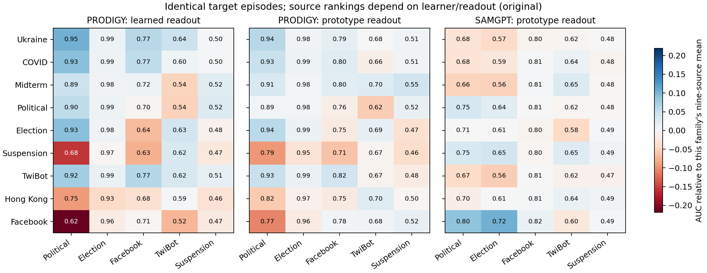
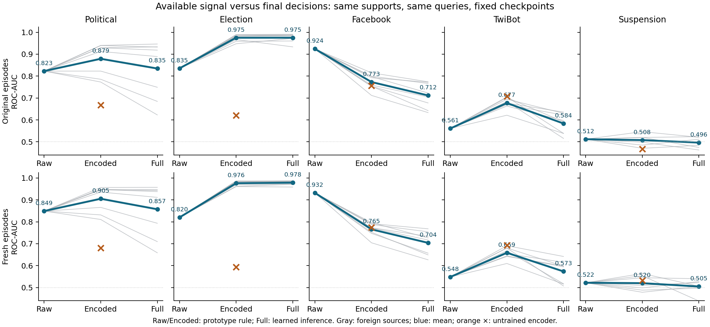

# Source usefulness changes across trained families and readouts

6 September 2026. Completed focused replay: nine source specialists, five targets,
two existing 128-episode streams. This is an exploratory comparison of existing
trained families, not a controlled causal comparison of architecture alone.

## Main result

Ukraine and COVID's political advantage is not portable to SAMGPT. With the exact
same support/query identities, labels, class pairs, and cosine-prototype rule,
Ukraine exceeds Hong Kong by .1172/.0910 AUC in PRODIGY but trails it by
.0151/.0160 in SAMGPT (original/fresh). COVID shows the same reversal:
+.1065/+.0799 in PRODIGY versus −.0146/−.0172 in SAMGPT.

The reversal involves the wider source ranking, not only Hong Kong. Political
nine-source rank correlation between the two prototype readouts is
−.617/−.567; on Election it is −.550 in both streams. Facebook is SAMGPT's
strongest political source (.8006/.8224), but its PRODIGY prototype scores
(.7729/.8106) are well below Ukraine (.9400/.9567). Differences in source graph
views, objectives, feature dimensions, training schedules, and inference graph
context remain possible explanations. It would be wrong to assign this effect
to architecture alone or assert that graph properties have no effect.

Numbers are absolute AUC. Color is the deviation from each family's nine-source
mean on that target, so it emphasizes source ranking rather than target difficulty.
All cells, including source=target, appear; foreign-source summaries exclude those
diagonals. The second-stream figure is `figures/cross_model_sources_fresh.png`.

## The readout can reverse the apparent donor ranking

On TwiBot, Ukraine beats Hong Kong with PRODIGY's full learned computation by
.0442/.0177 AUC. On the same cached representations and inputs, the prototype
readout reverses the ranking: Hong Kong beats Ukraine by .0251/.0263. Hong Kong
also exceeds Ukraine in SAMGPT by .0194/.0218.

This is an operational readout intervention within each fixed PRODIGY model,
not a comparison between unrelated encoder coordinates. It bypasses the whole
post-U learned inference computation; it does not isolate one of its parameters.
Replacing it with prototypes improves TwiBot AUC for all nine PRODIGY specialists
on both streams (gains .0412–.1682 original and .0390–.1731 fresh). Across the
eight foreign sources, raw-feature prototypes score .5609/.5481, trained U
prototypes .6770/.6586, and the full model .5836/.5734. Useful target signal
exists in the fixed representation, but much of its benefit over raw features
is absent from the deployed readout's scores. Crucially, the existing untrained
U prototype scores .7073/.6931 on these same episodes. This is not evidence that
pretraining created the representation benefit: architecture and graph context
already expose useful signal, and the trained U mean is lower than this control.
The untrained full model scores .3305/.3330, so learned full-model improvement
over its initialization coexists with this remaining readout penalty. The
untrained reference is one initialization, not a random-initialization average.

On Facebook, prototypes also improve all nine PRODIGY specialists in both
streams, but neither trained family reaches the raw-description baseline:

| Facebook readout | Original | Fresh |
|---|---:|---:|
| Raw 768-dimensional features | .9243 | .9321 |
| Shared random 50-dimensional projection | .8523 | .8313 |
| PRODIGY U, foreign-source mean | .7728 | .7655 |
| SAMGPT, foreign-source mean | .8061 | .7740 |
| PRODIGY full, foreign-source mean | .7116 | .7038 |

The feature projection is one meaningful loss of available label signal, but
the SAMGPT embedding/prototype result remains below even its projected-input
control on this target. This is not a causal attribution of the remaining gap
to pretraining: graph aggregation and learned transformation are still combined.
Election behaves differently: PRODIGY's full and prototype means are nearly
identical and strong. No universal "always replace the readout" claim follows.

## The same actual examples can change source preference

All 24 earlier outcome-selected cases are carried over without reselection.
The original political example at cached node 60598 is correct for Ukraine and
wrong for Hong Kong under full PRODIGY; with SAMGPT's common prototype readout,
Hong Kong is correct and Ukraine is wrong. Both PRODIGY U probes are correct.
The Facebook reporter at node 15827 is wrong for Ukraine under full PRODIGY
and its U prototype, but correct under Ukraine SAMGPT. These cases illustrate
different failure locations, not representative case frequencies. SAMGPT cosine
score margins are small; its approximately .5 softmax values must not be compared
as calibrated confidences against PRODIGY's scaled logits.

The complete paired counts are retained. For example, among 3,072 original
political queries, Ukraine PRODIGY and Ukraine SAMGPT are both correct on 1,919,
both wrong on 173, PRODIGY-only correct on 802, and SAMGPT-only correct on 178.
The analogous Facebook counts are 539, 115, 170, and 200 out of 1,024. Query
occurrences repeat across episodes; these are not independent-node confidence
intervals.

## What was matched, and what was not

Matched: target graph artifacts and feature version; exact support/query IDs,
class pairs and labels; 10 supports/class; common prototype algebra; canonical
pooled AUC orientation; both existing episode streams. The target graph-file
hashes match the independently established cached-feature/context inventory.
All native labels at the cached centers match the episode class map.

Not matched: SAMGPT GraphCL seed39 step500 versus PRODIGY NM seed0 step2500;
sampled source graph views; 50 versus 768 input dimensions; full symmetrized
target graph/three-layer GCN versus sampled directed subgraphs and S/U pooling.
SAMGPT is its frozen base encoder without downstream prompt optimization, not
the full native prompt-adaptation method. A new initialization seed was not run.
The sampled-view sidecars inspected on Tucker make the data distinction concrete:
Ukraine, Hong Kong and Facebook SAMGPT views each contain 150,000 nodes, but
8,402,978 / 935,835 / 167,622 directed edges respectively. The first two are
seed39 multi-start snowball induced subsets; Facebook retains its whole artifact.
Original corpus size is not the same thing as the graph supplied to this learner.

The original SAMGPT table used all classes (30 for Facebook), 12 queries/class,
and episode-mean AUC; those metrics are not directly comparable with the earlier
PRODIGY table. The new matched replay removes these avoidable protocol differences.
Its 45 native embedding exports reproduce saved native AUC within 5.43e-5 and
accuracy within .000326. The initial 1e-4 accuracy gate stopped on one of 3,072
decisions; a documented rerun retained all errors, kept the 1e-4 AUC gate, and
allowed .001 accuracy error. This is numerical agreement, not bit-exact replay.

## Publication decision

Do not build the paper around a universal Ukraine/COVID advantage or a graph-only
similarity explanation. The sharper candidate is **transferred representation
versus transferred decision rule**: good graph representations can make weak
in-context predictions, and the readout itself can reverse source rankings.
The existing three-seed support-to-label intervention gives a concrete fixed-model
mechanism behind part of that problem. The cross-family reversal defines the
boundary: the larger encoder/training-data interaction is still unresolved.

Next work should be a paper draft and one targeted utility or falsification test,
not another exhaustive diagnostic sweep. Small SAMGPT margins are a lead for a
cheap representation-geometry check, not yet evidence of representation collapse.

## Artifacts

- `data/cross_model_matching/`: 290 metric cells, 180 error partitions, 20 source-rank
  comparisons, 696 rows covering all 24 cases, native provenance/error receipts.
- `analyze_cross_model_matching.py`: source contrasts, raw controls, both figures.
- Tucker: `/dataMeR1/phil/gfm/prodigy-mechanisms-crossmatch/log/crossmatch_full_v2_20260906`, complete.
  Native embeddings and per-query logits remain there. Failed first attempt and
  separate smoke are preserved. Runtime revision `47b89335`.
- Local branch/worktree: `codex/target-performance-mechanisms` at
  `/Users/philipp/projects/gfm/prodigy-mechanisms`; private Tucker Git transport only.
