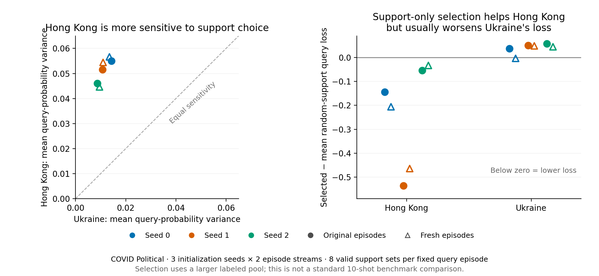

# Valid support examples change which fixed queries a model gets right

6 September 2026. **Complete prospective intervention on existing benchmarks;
not unseen-task confirmation or a benchmark-fair 10-shot method.**

The political support-side finding is not limited to artificial edge deletion.
With eight sets of real, unmodified support graphs and every query held fixed,
Hong Kong's mean query-probability variance is **3.8–5.3 times Ukraine's**, across
all three initialization seeds and both episode streams. Between **52–63%** of
Hong Kong's query occurrences change between correct and incorrect somewhere
among the eight sets; Ukraine's corresponding range is **13–18%**.

Support-only held-out scoring predicts useful changes for Hong Kong: selecting
the lowest-loss support set reduces political query NLL in every seed on both
streams. AUC also increases in all six comparisons, by **.0150–.0647** relative
to the mean of the eight random-support evaluations. The same selection rule
increases Ukraine's query NLL in five of six comparisons. Support held-out loss
is therefore a **model-dependent** proxy for query performance, not an intrinsic,
universal ranking of good examples.

## 1. Protocol and evidence gates

All six existing original-policy controls are included: Ukraine/Hong Kong ×
seeds 0, 1, 2, fixed step 2500. All five classification targets and both
established episode streams are evaluated. Neither model weights nor graph
features/edges are altered. This is not new training, and the two streams have
already been studied in earlier analyses.

For each recipient episode, select eight balanced support sets of ten examples
per class. Candidates are actual support occurrences from other cached episodes
in that same target/stream. Sample uniformly over eligible unique center IDs
within class, then over their cached subgraph occurrences. Exclude the recipient
episode and **every recipient query center identity**. Preserve the sampled
subgraphs, features, and edges exactly. Plans are generated once without query
ground-truth labels, then shared across all six models. Dataset labels are not
edited. Each stream's pool has 2,560 support occurrences, representing between
1,560 and 2,373 distinct centers depending on the target/stream.

Score each candidate using ten balanced leave-one-pair-out folds: hold out one
support per class, use the other nine per class as supports, and score the two
held-out examples through the actual frozen metagraph and cosine classifier.
Choose minimum mean held-out NLL; ties use fixed draw order. No target query
features or labels enter this score. All eight candidate query outcomes are
then retained for evaluation, alongside the original baseline, the selected
candidate, and the same model's mean-probability **eight-context ensemble**.

The independently validated evidence contains:

- **60 model/target/stream cells**, 660 aggregate metrics, and 61,440 episode/draw
  records. Every one of 204,800 sampled support positions was independently
  reproduced from the stored metadata and declared random generator.
- All 60 original baselines match saved checkpoint/input identities and metrics;
  all 1,920 cached baseline batch reconstructions are bit exact.
- Query vectors before and after the single-layer metagraph remain bit exact
  across all 15,360 substituted batch forwards. Query inputs are unchanged.
- All 60 direct full-graph replacement checks match cached factorization with
  **zero error**. Real-input query-feature/query-label tampering leaves the
  selector unchanged. Model weights and buffers remain unchanged.
- Selection, per-episode query losses, and correctness counts independently
  reproduce the aggregate metrics. Context cohorts conserve counts. One
  1.07e-8 variance-summary residual was traced to float32 reduction rounding
  using the saved predictions in float64; raw results and forward checks were
  not changed. Its receipt is retained.

## 2. Both declared political predictions pass

First, Hong Kong is more sensitive to natural support choice than Ukraine in
every matched seed/stream. The variance ratio is descriptive: probability
saturation and baseline query difficulty can contribute, so it is not a causal
training-source effect or a fraction of the donor gap explained.

The effect occurs among both context-bearing and isolated queries. Across the
six political evaluations, Hong Kong's mean fraction changing correctness is
.593 among queries with context and .536 among isolated queries; Ukraine's
corresponding values are .113 and .246. These are query occurrences across a
fixed set of eight support draws, not frequencies over all possible supports.

Second, choosing supports by the prespecified support-only score lowers Hong
Kong's political query loss in every seed on both streams:

| Seed | Original: NLL change | Fresh: NLL change | Original: AUC change | Fresh: AUC change |
|---|---:|---:|---:|---:|
| 0 | −.1439 | −.2061 | +.0280 | +.0301 |
| 1 | −.5361 | −.4641 | +.0647 | +.0498 |
| 2 | −.0542 | −.0335 | +.0206 | +.0150 |

All changes are selected-candidate score minus the arithmetic mean score of
the eight individual random-support evaluations. NLL was the declared primary;
AUC is a retained secondary result. The selector also beats Hong Kong's original
single-support-set baseline in NLL and AUC in all six comparisons, but that was
not substituted for the declared random-draw reference.

## 3. Why this is not a universal support-quality rule

After centering losses within each fixed recipient episode, support-CV loss and
query loss correlate **positively** for Hong Kong on political classification
in every seed/stream (r=.224 to .602). The same relationship is **negative** for
Ukraine in all six (r=−.207 to −.027). Thus the source/model difference is not
merely an across-episode correlation driven by some queries being harder.
There is no query-IID significance claim: support draws share query sets, and
nodes recur across episodes and streams.

Across three seeds, political selection changes mean NLL by −.2447/−.2346
for Hong Kong, but **+.0481/+.0296 for Ukraine** (original/fresh). Ukraine's
mean AUC change is −.0002/+.0035. Its NLL deterioration must not be described
as a comparable deterioration in ranking accuracy. Calibration, class balance,
and whether easy-to-cross-validate supports represent the queries remain
possible explanations; this experiment does not separate them.

Other targets prevent a blanket selection claim. Source-averaged NLL changes
are mixed, including worse means for both sources on Facebook and TwiBot in
both streams, despite positive mean AUC changes there. Hong Kong improves mean
Election NLL on both streams; Ukraine does not. Ukraine's suspension NLL means
improve on both streams, but Hong Kong reverses between streams. Every seed,
target, stream, and metric remains in the exported table.

The eight-context probability ensemble has **lower political NLL than the CV-
selected single set in every source/seed/stream**. It also exceeds the selected
set's Hong Kong AUC in five of six comparisons. We are not claiming CV selection
is the strongest inference strategy. Averaging uses multiple support contexts
at prediction time and has a different computation budget; all comparisons
use the same fixed checkpoint, not an ensemble of separately trained models.

## 4. What this changes

Combined with the [support-edge pathway](FINDINGS_ROLE_CONTEXT.md), we now have
two complementary interventions: altered graph processing with supports fixed,
and natural support replacement with all graphs unaltered. Both identify a
substantial, source-dependent political support-side vulnerability. The same
query can be easy or hard for a checkpoint depending on the labeled context
used to construct its class representations. Query-only source/target distances
miss that part of the prediction problem.

This still does not identify what property of Hong Kong versus Ukraine
pretraining taught the difference. Next tests should distinguish class balance,
calibration, and support diversity/representativeness, then connect the measured
behavior to exact pretraining episodes and objective gradients. Training-size,
collection-window, and source-overlap explanations have not been causally
replaced by this support-choice result. Pair/LOO models and other architectures
remain outside this study.

Selecting among eight sets requires access to more than the twenty labels in
a standard episode, using a candidate pool labeled in other cached episodes.
Only recipient-query identities are excluded; this is not a globally disjoint
train-only support-pool protocol. Do not report the selected scores as fair
standard 10-shot benchmark gains or evidence of a new general selection method.

## Evidence and reproduction

- Raw compact receipts and complete support plans: `data/natural_support_replay/`.
  Derived metrics, selection effects, within-episode loss relationships, and
  primary outcomes: `data/natural_support_*.{csv,json}`.
- Rebuild with modules `analyze_natural_support` and `plot_natural_support`.
  Six runtime tests cover natural substitution, query leakage, independent CV
  folds, and fixed selection; three analysis tests cover sampling, accounting,
  and retention of failed predictions. Full real-data validation also passes.
- Runtime `9b3993dd`, Tucker worktree
  `/dataMeR1/phil/gfm/prodigy-mechanisms-role`, output
  `log/natural_support_full_20260906/`. Both full and preceding smoke are complete.
  Per-query predictions remain on Tucker; no new raw profile texts are published.
- Local branch `codex/target-performance-mechanisms`, worktree
  `/Users/philipp/projects/gfm/prodigy-mechanisms`; private Git only, CPU-only
  replay, no production changes or user-job interruption.
