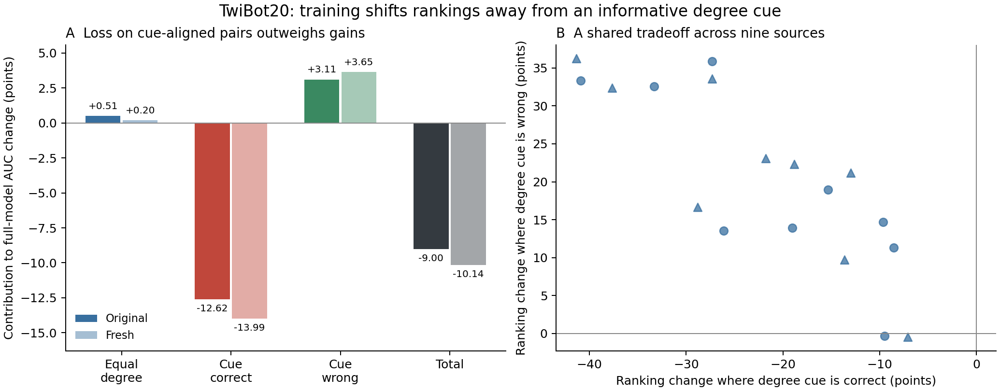

# Trajectory contribution decision — 7 September 2026

Private research note; do not push. Existing manuscript candidates are not
submission-ready. This note supersedes neither the full replay record nor its
failed predictions.

## New saved-result check: not specific to ridge

Recomputed endpoint differences directly from the two local
`data/corrected_sampler_{original,fresh}/twibot20.jsonl` files, without model
forwards or selecting checkpoints. All nine source models are included at
updates 100 and 2500. These are **globally pooled AUC**, not the within-episode
AUC values used in the manuscript's main left panel. Accuracy refers to saved
production-evaluation metrics. Values below are percentage-point changes,
averaged across nine sources; streams are not training seeds.

| Readout | AUC original / fresh | Accuracy original / fresh | Positive AUC cells original / fresh |
|---|---:|---:|---:|
| S0_pool prototype | +5.7016 / +6.3264 | +4.0184 / +4.0654 | 9/9 / 9/9 |
| S0_pool ridge | +5.1286 / +5.5765 | +3.3673 / +3.5120 | 9/9 / 9/9 |
| U1_pre_meta prototype | -2.0137 / -3.0184 | -3.1250 / -3.5192 | 2/9 / 0/9 |
| U1_pre_meta ridge | -1.6458 / -2.5888 | -2.7669 / -3.3529 | 2/9 / 1/9 |
| Full model | -8.1775 / -9.2959 | -6.3115 / -7.6172 | 0/9 / 0/9 |

Pooled-prototype accuracy improves in all 18 source-stream cells; its smallest
gain is 0.1302 points. Both U1 readouts decline in accuracy in all 18 cells.
Full-model accuracy declines in 17/18 cells, so do not extend its universal
AUC sign to accuracy. The prototype improvement is not evidence of universal
statistical significance for individual sources.

Code inspection: `setup/target_performance_mechanisms/replay.py:episode_probe`
normalizes each support and query vector, averages normalized supports by
class, normalizes the prototypes, and applies cosine scoring. No ridge solve
or regularization parameter enters this rule. Therefore the pooled improvement
is not solely an interaction with ridge's fixed regularization. This does not
rule out directional geometry, internal magnitude effects before this stage,
normalization elsewhere, or dataset-specific cues. Prototype and ridge remain
two related readouts, not evidence about all recoverable information.

## Advisor decision: recover the graph-specific question

The narrow question now is whether training loses a directed-role distinction
that this particular target rewards, rather than whether another classifier
can exploit intermediate features. The current evidence makes that question
testable, not answered:

- Incoming-degree probes are strong on the reconstructed retweet target.
- Historical training reduces agreement with that cue while increasing
  agreement with biography/context probes.
- Actual inspected cases distinguish retweet recipients from retweeters at
  nearly equal neighborhood sizes (93 versus 97 sampled context nodes).
- **Strongest counterexample:** restoring Ukraine's initial projections can
  increase full-model degree agreement while reducing its AUC. More agreement
  with a useful cue is not a sufficient repair or causal explanation.
- The corrected center-branch trends differ from historical trends. Do not
  transplant the historical universal center-degradation claim.

An independent reviewer, asked for a competing explanation rather than a score,
identified this same target-cue mismatch as the strongest unresolved alternative.
No new training or graph-ablation sweep is justified by that agreement.

## One nominated analysis, before another experiment

Use saved corrected-checkpoint predictions and the exact cached query graphs.
Fix the endpoint contrast (100 versus 2500), all nine sources, both streams,
and S0_pool/U1/full before computing the following results. Prototype and ridge
must retain their identities rather than be pooled.

Within each episode, partition positive-negative query pairs into:

1. Equal sampled incoming degree.
2. Different degree, ordered correctly by the support-fitted degree cue.
3. Different degree, ordered incorrectly by that cue.
4. Different degree but tied cue scores, if present; do not silently drop ties.

Report pair mass, early/late correct-ranking fractions (half-credit for score
ties), and each group's weighted contribution to the mean episode-AUC change.
Use equal episode weights to reproduce that estimand, not an unspecified
global pair weighting. Verify exact pair coverage, cached input identities,
query/class orientation and reconstruction of each endpoint AUC. The group
membership is fixed across checkpoints; query labels are used for explanatory
accounting, not adaptation or a deployable selector.

**Prediction nominated now:** full-model decline is concentrated in degree-cue
aligned pairs that were correctly ordered early; equal-degree pairs change
little. Broad deterioration among equal-degree pairs contradicts this narrow
account. Sparse equal-degree groups make it inconclusive. Report magnitudes
and coverage rather than introducing a post-result success threshold.

This is an observational decomposition, even if the prediction holds. Its role
is to choose between directed-role cue mismatch and a more general downstream
failure before selecting a causal intervention. It cannot alone establish a
generality result, explain support suppression, or complete the 8+ contribution.

Do not expand the manuscript, rerun degree-balanced training, or promote the
failed isolation method while this decision is unresolved.

## Completed pair accounting: a cue-specific ranking tradeoff

The nominated analysis completed at code `75612bfc` in the isolated Tucker
worktree `/dataMeR1/phil/gfm/prodigy-degree-pairs`. No models were run or trained.
All 36 endpoint prediction files, all cached input hashes, all reused pooled
AUCs and all reconstructed within-episode AUCs passed the implemented checks.
The private aggregate artifact is `data/degree_pair_accounting_20260907.json`;
360 rows cover nine sources, two streams, five readouts and four pair groups.
Four synthetic unit tests pass; a separate read-only code audit found no
material correctness blocker.

**Figure.** A: source-mean contributions sum to the full-model change in mean
within-episode AUC, not globally pooled AUC. Opaque/pale bars denote original/
fresh episodes. B: each source appears once per stream (circle/triangle),
showing conditional ranking changes within the two unequal-degree groups.
These are descriptive paired results, not independent training seeds or error
bars. Conditional group ranking is episode-weighted ranking credit divided by
episode-weighted group mass, not an average of conditional episode AUCs.

| Pair group | Pair mass original / fresh | Contribution to full-model AUC change, points |
|---|---:|---:|
| Equal incoming degree | 24.05% / 23.05% | +0.505 / +0.204 |
| Different degree, degree cue correct | 59.85% / 60.10% | -12.616 / -13.991 |
| Different degree, degree cue wrong | 16.10% / 16.85% | +3.111 / +3.646 |
| Different degree, cue tied | 0% / 0% | 0 / 0 |
| Total | 100% / 100% | **-9.000 / -10.141** |

The cue-correct group deteriorates for **all nine sources in both streams**.
The cue-wrong group improves for **eight of nine in both streams**; Hong Kong
is the exception with small negative contributions (-0.052/-0.079 points).
Equal-degree pairs occur in every episode, so the conditional check is not
empty. Their average improves slightly, but three sources decline per stream;
Election is an important counterexample (-1.280/-2.995 points of total AUC
contribution). Thus the account is source-broad, not an exhaustive explanation
of every source's errors.

Full-model conditional ranking on cue-correct pairs drops from .882/.883 to
.671/.650. On cue-wrong pairs it rises from .235/.216 to .428/.432. Equal-degree
ranking changes .524/.511 to .545/.520. The nominated prediction about the
location of net deterioration is supported. The narrower phrase "previously
correct pairs" is not separately established: the saved accounting includes
half-credit ties. Its loss columns must be called **lost ranking credit**, not
counts of initially correct predictions becoming wrong.

The stage contrast also becomes concrete. U1 ridge loses 5.207/6.184 points
on cue-correct pairs, gains 2.521/2.750 on cue-wrong pairs and gains .449/.209
on equal-degree pairs. Pooled ridge instead gains 2.957/3.277 points on
cue-correct pairs and .984/.957 on equal-degree pairs. Both readouts retain
all sources; pooled cue-correct gains are not individually universal (seven
of nine original, eight of nine fresh).

### What this explains, and the remaining alternative

The aggregate decline is now located in distinctions supported by an
informative, collection-dependent structural cue. Training does not simply
worsen all target rankings. This is a more specific account of the trajectory
than "the full readout is bad," and it links the aggregate result to the
previously inspected recipient/retweeter examples.

**It does not yet show active substitution of biography semantics for degree.**
Attenuating a strong but imperfect degree-aligned ranking with noise can lower
cue-correct performance, improve cue-wrong performance toward chance and leave
equal-degree pairs near chance. That competing explanation can produce this
signature without learning a useful replacement cue. This means weakening a
degree-associated component relative to other components, not uniform positive
rescaling of logits, which preserves AUC except for numerical ties.
Historical cue-correlation
changes and improvement on other targets are relevant, but are not a causal
test on these corrected checkpoints. Nor does this partition establish that
degree itself is the manipulated cause: it may proxy for other graph features.

**Advisor decision:** retain the cue-specific tradeoff as the explanatory
result; do not promote it to causal feature substitution, support-reference
damage, or a successful repair. Before selecting another training intervention,
the unresolved distinction is attenuation versus systematic replacement of
the target's structural distinctions. The current public benchmark remains
a useful counterexample to blanket context removal, not a generality result
for this newly localized trajectory. No manuscript expansion follows yet.

## Diagnostic weighting and generality feasibility

Read-only aggregate calculation retains the observed equal-degree mass `m_e`
and replaces the two unequal-degree masses by `(1-m_e)/2` each. Its endpoint
change is `equal_change_contribution + (1-m_e)*(cue_correct_change +
cue_wrong_change)/2`, with the latter changes conditional on their groups.
Original/fresh source means are -0.1611/-0.4280 points, versus the actual
-9.0000/-10.1409. Only four/three of nine sources improve under this diagnostic;
it is not universal reversal. Pair reweighting conditional on correctness of a
label-fitted cue is not a realizable new graph, conventional benchmark AUC,
fairness correction, or causal percentage explained. The original AUC remains
the benchmark result.

The compact figure-led contribution argument is in
`ARGUMENT_CUE_DEPENDENT_TRANSFER.md`. The one selected generality candidate is
the same-account original-relation graph comparison, not another training sweep.

Read-only Tucker preflight found the original `raw/Twibot-20/edge.csv` contains
33,488,192 post rows, 117,110 friend rows, and 110,869 follow rows. Filtering
user-user endpoints to the current 162,990 retweet-graph nodes retains 93,405
friend and 68,507 follow rows, before direction resolution/deduplication.
Of 205,730 user-relation endpoints, 148,307 are in the current node set.

| Labeled class | Users | No incident original user relation, before / after filtering | Newly isolated | Mean incident relation rows, before / after |
|---|---:|---:|---:|---:|
| Human | 5,237 | 10 / 15 | 5 | 18.43 / 13.65 |
| Bot | 6,589 | 2 / 4 | 2 | 20.02 / 15.41 |

Thus wholesale loss of labeled-node neighborhoods is not supported by this
preflight. It does not establish matched sampled exposure: the original
relations are much sparser than the 2,010,925-edge reconstructed retweet graph,
and different neighborhood content is intrinsic to this contrast. Exact cached
episode coverage, sampled degree distributions, and the semantics/direction of
`friend` versus `follow` still need validation before model evaluation.
Do not guess relation direction, silently union reverse relations, or call an
induced matched-node graph the untouched original benchmark. No alternate graph
was created and no evaluation was launched during this feasibility audit.

The pre-outcome joint prediction in the compact argument is recorded before
any follow-graph degree probe or model outcomes: weaker incoming-degree cue
alignment and a smaller full-model training decline in both streams. Failure
of either component must be reported; weakening of the cue with an unchanged
or worse training decline specifically contradicts the nominated explanation.

## Matched follow graph staged, no model outcomes yet

Code `ca35a6c3`, isolated Tucker worktree
`/dataMeR1/phil/gfm/prodigy-follow-matched`. Three direction-validation unit
tests pass, plus a local PyG wrapper-copy check. The complete original public
sample verifies 605 `friend` and 534 `follow` edges against the authors' named
following/follower lists. Therefore the follower-to-followed graph keeps
`friend` rows and reverses `follow` rows; combining them without reversing
would have mixed two directions. Evidence is the
[authors' sample](https://github.com/BunsenFeng/TwiBot-20/blob/main/TwiBot-20_sample.json),
not an inference from class outcomes.

Artifact `/dataMeR1/phil/data/twibot20/graphs/follow_matched.pt` has 162,990
nodes and 161,550 unique directed edges, 515,853,610 bytes. SHA256:
`87d88de9162e4ee2e0cfd8e183304f216d5da264ee1e7b31d8fe74f35c3b5b6b`.
The experiment worktree's graph catalog was registered before construction;
the laptop role-topology catalog now mirrors the verified diagnostic inventory
and remains uncommitted/private. The original retweet graph was not overwritten.

Independent reload verified exact user order, feature tensors, labels, all
split masks, and graph-wrapper edge/feature agreement. Stale retweet-specific
edge views were omitted from the new artifact. Node/profile payloads remain
unchanged. Construction used CPU only in `bio-embeddings-v001`; its tmux job
is terminal. No follow-graph model prediction or degree-probe result has been
computed. The frozen joint generality prediction is unchanged.

Next implementation requirement: reconstruct both streams from the exact cached
support/query center IDs and labels, using the existing sampler for the new
relations, and verify sampled coverage before endpoint inference. Do not rely
on an equal RNG seed to prove identical episode membership when graph sampling
can consume randomness differently.

## Matched episodes complete; degree-cue prediction passes

At `95f87d93`, both streams' 32 batches were rebuilt from the exact saved
center IDs using the production sampler (two hops, fanouts 9/9, cap 101).
All ordered centers, center features/labels, support/query/task tensors and
reference input hashes pass. Neighborhood-sensitive fingerprints are newly
computed; original fingerprints are retained separately. Two synthetic cache
tests pass. No neural-model forward was needed for this stage.

Degree probe mean within-episode AUC:

| Relations | Original stream | Fresh stream |
|---|---:|---:|
| Retweet | .71878 | .71625 |
| Matched follow | .50458 | .49778 |

Globally pooled degree AUC is .72383/.71120 versus .50347/.50389; these
estimands are distinct. The earlier retweet degree-probe results reproduce.
The first component of the frozen joint prediction—substantially weaker degree
alignment on follows—is supported. The model-trajectory component is not yet
known and cannot be inferred from this probe.

Among 3,072 query occurrences per stream, follow sampling isolates 6/3 versus
430/436 on retweets. Thus loss of usable query neighborhoods does not account
for the weaker cue. Mean sampled follow context sizes are approximately 25–30
nodes, versus 53–59 on retweets, depending on class/stream. Human and bot query
mean incoming counts are both approximately 5 on follows; on retweets they
are approximately 6.2 versus 1.5. These are sampled counts, not full-network
properties or bot definitions. Aggregate evidence is retained in
`data/matched_follow_coverage_20260907.json`.

## Endpoint evaluation launched; do not claim a result yet

Evaluator tests cover semantic tie-breaking and within-episode AUC; all four
cache/metric tests pass. The initial launch at `8258be0a` stopped before model
inference because the existing parser requires an integer device sentinel.
The failed output and log are preserved. Correction `4706ffbb` uses `-1` and
restarted only after the original process was confirmed terminal.

Current experiment worktree: `/dataMeR1/phil/gfm/prodigy-follow-eval`.
Output: `log/matched_endpoints_20260907_retry`; log: `follow_eval_retry.log`;
tmux: `follow-eval`. All nine sources and both endpoints (100/2500), both
streams, and all 17 existing decoders are included. No training. Model inference
is CPU-only with two threads and GPUs hidden.

Each checkpoint must reproduce its original **first reference batch** logits
bit-exactly before follow inference; do not describe this as all-batch replay
parity. All new-cache hashes and final model-state/buffer digests are checked.
A read-only independent implementation audit found no material correctness gap.
Once results finish, raw-center decoder equality against old saved predictions
will provide an additional identity check without any new forward passes.

This changes sampled neighbors and their features, graph density and the sampling
realization together with relation type. It is a matched-account **relation-setting
generality test**, not an isolated causal intervention on incoming degree.

### Launch correction and direct smoke verification

The numeric `-1` correction also stopped before inference: the legacy parser
always constructs a `cuda:<number>` descriptor and cannot represent CPU there.
Both failed attempt directories/logs are retained; neither is a scientific
outcome. The established `make_model` cached-replay factory constructs CPU
tensors without moving them to that parsed descriptor. A direct Tucker smoke
with descriptor `0`, GPUs hidden, and the actual first checkpoint/reference
batch verifies all model tensors on CPU and bit-exact reference logits.

At `1abc2b0e`, the evaluator follows that verified factory convention and adds
an explicit all-parameters/all-buffers CPU assertion. The confirmed-terminal
checkout was fast-forwarded, and the new output is
`/dataMeR1/phil/gfm/prodigy-follow-eval/log/matched_endpoints_20260907_cpu`,
with log `follow_eval_cpu.log` and tmux `follow-eval`. This supersedes the
earlier retry path for status checks. The support/query caches, hypotheses,
checkpoint selection and tolerances are unchanged.

Before inspecting partial endpoint outcomes, retain this interpretation gate:
a reduced follow-graph decline with both endpoints near chance supports only
the scoped graph-setting dependence, not useful transfer, successful adaptation,
or a sufficient response to the weak-model objection. Report absolute endpoint
performance alongside changes. A smaller decline is not itself a repair.

## Completed generality result: construction-dependent training decline

`matched_endpoints_20260907_cpu/DONE.json` confirms all 612 rows and 36
source-endpoint-stream receipts completed at `1abc2b0e`. Every checkpoint
passes exact first-reference-batch full-logit parity, unchanged model state and
normalization buffers, and all new-input hashes. The evaluator is terminal.
Private aggregate results: `data/matched_follow_endpoints_20260907.json`.

Mean within-episode AUC, averaged over all nine sources:

| Graph | Early original / fresh | Late original / fresh | Change, AUC points |
|---|---:|---:|---:|
| Retweet | .69157 / .68466 | .60157 / .58325 | -9.000 / -10.141 |
| Matched follow | .54802 / .54445 | .54984 / .54612 | +0.182 / +0.167 |

Every source has a more positive follow than retweet training change in both
streams; mean difference-in-changes is +9.182/+10.308 points. This is not a
claim that every follow model improves: five of nine improve on original
episodes and four of nine on fresh episodes. Source/stream replication still
does not supply independent training seeds or a second account population.

On follows, pooled ridge improves +2.161/+1.133 points (eight of nine sources
per stream), and U1 ridge improves +2.424/+.906 points (six/five sources).
Full-model absolute performance remains weak; terminal retweet AUC is still
higher than terminal follow AUC. This is not a follow-graph repair method.

The frozen joint prediction is supported: the structural probe becomes weak
and the aggregate training decline disappears. The figure
`figures/matched_relation_argument.png` shows the cue change, absolute endpoint
performance and all source-level difference-in-changes. It was rendered and
visually inspected; the compact argument now includes the completed result.

### Additional raw-input probe check: exactness qualified, not concealed

The post-run raw-center equality check failed for ridge at bit level. Of 2,304
prediction tensors, all 1,152 prototype tensors are exact; ridge max absolute
error is 4.1723e-7. Across all 72 raw-center aggregate cells, accuracy and F1
are identical, max AUC discrepancy is 4.2386e-7 and NLL discrepancy 1.1921e-7.
Do not report all raw-center tensors as bit-exact.

A fixed-input first-batch diagnostic resolves the observed difference for that
batch: the old recorded replay used four CPU threads, the new replay two.
Recomputing its raw ridge with two threads exactly matches the new predictions;
four threads exactly matches the old predictions (cross-setting max error
2.3842e-7). No neural-model rerun or relaxed scientific criterion was used.
This thread-count explanation is directly checked on the nominated first batch,
not asserted as an exhaustive proof for every floating-point difference. Exact
center-feature/task identity and full-model first-batch parity remain intact.

### Advisor decision after independent contribution assessment

The strongest supported paper identity is **construction-dependent negative
transfer**, not successful support suppression or semantic cue substitution.
The graph setting determines whether the early model has a large advantage
that later training loses, even with accounts, features, labels, task identities
and checkpoints fixed. Pair accounting identifies degree-aligned comparisons
as a specific explanatory channel; it is not isolated causal degree mediation.

The strongest remaining objection is also visible: removing a useful graph
setting starts the model near chance and leaves less advantage to lose.
Neighborhood content, density and sampling exposure change together. This
limits the mechanism claim rather than invalidating the graph-setting
interaction. Keep the earlier support/reference localization complementary
unless directly connected; do not market this as useful adaptation. The full
8+ contribution goal remains open. No new training sweep or manuscript expansion
has been launched on the strength of this result alone.

## Next bounded decision: equal early ranking opportunity

Before inspecting joint transition outcomes, nominate one saved-prediction
analysis. For each identical within-episode positive/negative query pair,
partition by BOTH relation settings' step100 ranking credit (wrong, tied,
correct). The nine exhaustive strata exactly account for the already observed
follow-minus-retweet difference in training changes, retaining half-credit
ties and equal episode weights. Primary readout is full inference; pooled
ridge and U1 ridge are supporting stage checks, not alternate success gates.

The discriminating question is whether the interaction extends to comparisons
initially correct under both settings, or initially wrong under both settings.
These comparisons begin with equal ranking opportunity. If the interaction
instead lies chiefly in retweet-only early wins, the relation test primarily
removes an initial advantage. This is a decision criterion, not a directional
prediction registered before seeing the endpoint results. An independent
reviewer recommended the same decomposition before new neural experiments.

This can reject a literal excess-initial-wins-only explanation, not all
attenuation models: early confidence and neighborhood content may differ even
within the jointly correct group. No causal mediation, repaired benchmark,
or independent-sample significance is licensed by these conditional scores.

### Completed equal-opportunity accounting: stronger preservation claim fails

Code/tests revision `47bbec0e`, isolated Tucker worktree
`/dataMeR1/phil/gfm/prodigy-relation-transitions`, output
`log/relation_transitions_20260907/results.json`. The process is terminal.
All 486 source/stream/readout/stratum rows and 72 prediction-file receipts are
complete; current cache hashes, center IDs/features, labels and metric
reproduction passed. No model forward or training. Private aggregate copy:
`data/relation_transitions_20260907.json`.

Four unit tests passed. Independent code review also checked 400 random cases
with ties against sklearn AUC and same-start cancellation. Conditional scores
below divide source/episode-weighted credit by source/episode-weighted mass;
they are not mean conditional episode AUCs or account-independent estimates.

Full inference, original/fresh streams:

| Joint early rank state | Pair mass | Contribution to follow-minus-retweet change (points) |
|---|---:|---:|
| Both correct | .3891 / .3830 | −2.9966 / −2.3670 |
| Both wrong | .1494 / .1538 | +.6507 / +.9500 |
| Retweet correct, follow wrong | .3016 / .3007 | +26.0911 / +26.3425 |
| Retweet wrong, follow correct | .1582 / .1606 | −14.5725 / −14.6243 |
| Any tie (remaining strata) | .0018 / .0020 | +.0093 / +.0066 |

The nine-stratum sum exactly reproduces +9.1821/+10.3079 points. On the
53.84%/53.68% of comparisons with the SAME early credit, the total interaction
is **−2.3459/−1.4169 points**, favoring retweet. This sign holds for eight/nine
sources on original and seven/nine on fresh. The initial-disagreement strata
contribute +11.5280/+11.7248 points, more than the net interaction.

On jointly correct pairs, late correct-ranking credit is **.6810/.6593 for
retweets versus .6040/.5975 for follows**. Retweets retain more credit for
eight/nine sources in both streams. Follow does recover more initially wrong
shared pairs (.4735/.4763 versus retweet .4300/.4146), so not literally every
component comes from additional retweet wins. But that smaller positive
contribution is outweighed by retweet's better retention of shared successes.

Supporting stage checks agree on that direction: jointly correct pairs favor
retweet for all nine sources in both streams for pooled ridge and U1 ridge.
Their weighted contributions are respectively −5.1631/−4.8454 and
−7.1500/−6.6111 points. No alternate readout rescues the preservation claim.

**Advisor decision:** the matched-follow result remains real graph-setting
dependence and a successful nominated cue/trajectory prediction, but it is
not evidence of better preservation or a correction. It chiefly removes an
initial advantage. Lead with the cue-conditioned ranking tradeoff and
stage-resolved distinction; retain follow as an explicit boundary condition.
Do not present this as a newly established causal mechanism, and do not
launch a wider relation sweep to accumulate the same interaction. The
unresolved contribution gate is a computational explanation connecting the
observed cue loss to class-reference construction, or a distinct consequential
principle with representative validation. The 8+ goal remains open.

Private figure `figures/relation_transition_argument.png` was rendered and
visually inspected. It juxtaposes shared-success retention with the exact
major-stratum interaction contributions; tie strata remain in the underlying
accounting. The compact argument and related-work decision are updated, not
the manuscript. Code/tests only were pushed; all new results/figures/prose
remain uncommitted in the local role-topology worktree.

## Computational bridge decision: directed correspondence, not bad supports

The existing corrected replay did not save embeddings (its launcher omitted
`--save-embeddings`), so a claim to have traced the new nine-source effect to
final class-reference activations would be false. Existing initial-projection
restoration also has opposite source effects, and corrected U1 probe decline
precedes the learned metagraph. Do not presume a support-only defect.

An independent researcher proposed a distinct causal question: does early
inference match directed structural roles between supports and queries?
Reverse directed background edges on supports, queries, or both, leaving the
sampled nodes, biographies, undirected skeleton, pooling and metagraph fixed.
Unlike follow replacement, this cannot erase the early advantage by replacing
neighborhood membership. Hypothesized signature: one-sided reversal harms
early ranking, two-sided reversal recovers it, and this matching contrast
weakens later. Such a result would identify what is attenuated, not prove
semantic substitution or isolated degree mediation.

First perform a no-forward prerequisite using the cached inputs: support-fitted
ridge on signed center role `in_degree - out_degree`. Edge reversal negates
this variable exactly, whereas it does not generally negate incoming degree.
Compare to the existing log-incoming-degree probe on both streams. Proceed
under this rationale only if signed-role mean episode AUC is at least .65 in
both streams and no more than .05 below incoming-degree AUC. These are a
pre-outcome feasibility gate, not a significance threshold or neural-test
success criterion. If it fails, do not run the reversal factorial as a test
of the known degree cue. No neural intervention is launched at this stage.

### Prerequisite completed: directed-role hypothesis is testable

Read-only CPU diagnostic in Tucker worktree `prodigy-relation-transitions`
at `47bbec0e`, reusing `standardized_probe` on the corrected replay inputs.
All 64 cached batch hashes passed. No new model forward, training or remote
file write. The command completed successfully; aggregate receipt is
`data/directed_role_prerequisite_20260907.json`.

| Support-only scalar probe | Original episode AUC | Fresh episode AUC |
|---|---:|---:|
| log1p incoming degree | .718777 | .716254 |
| log1p outgoing degree | .576660 | .593235 |
| signed incoming minus outgoing degree | .714166 | .724284 |

The nominated feasibility gate passes both streams. Importantly, outgoing
degree alone is weaker: reversing all edges does not preserve incoming-degree
utility by fiat. Signed role is a viable observable whose polarity reverses
exactly, but the neural model has not been shown to use it. Do not advertise
the signed probe as the mechanism result.

**One next neural test, now justified:** fixed-neighborhood directed reversal
crossed by support/query role, at corrected steps100/2500. Preserve the actual
architecture, frozen normalization, nodes/features/labels, pooling edges and
metagraph. Reverse only background edge endpoints and verify each node's
incoming/outgoing degree exchange plus reversal involution. Keep intact,
support-only, query-only and both conditions. Primary estimator is within-
episode AUC; inspect absolute endpoints alongside interaction
`C = (A_intact + A_both - A_support - A_query)/2`.

Directional prediction: early one-sided reversals hurt, both-sided reversal
exceeds both one-sided conditions, and C weakens from100 to2500. Positive C
alone is not recovery if both-sided AUC falls to chance. Prespecify meaningful
early recovery as retaining at least half the intact above-chance advantage
on the source-mean AUC in each stream; also show every source, without using
this aggregate criterion to imply universal signs. All nine existing sources
are the fixed panel, not source selection after outcomes. This is a new
intervention prediction, not a previously unseen target-data test.

Require support-only reversal to leave final query embeddings bit-exact in
this one-M/evaluation-BN model; verify native endpoint logits and unchanged
weights/buffers. Intermediate readouts may localize effects but cannot replace
the native primary criterion. If the pattern fails, stop using directed-role
matching as the proposed bridge to class-reference construction. If it holds,
it identifies a computation sensitive to directed correspondence, not isolated
degree mediation, semantic replacement, or a deployment fix.

### Reversal implementation and launch

Code/tests pushed as `665469c2`; local branch
`codex/role-topology-interactions`, worktree `.worktrees/role-topology`.
Three local tests pass: exact reversal involution/input preservation, final
query preservation under support reversal, and label-blind selection/rejection
of cross-subgraph edges. Independent code review found no material blocker.

Tucker's isolated worktree `/dataMeR1/phil/gfm/prodigy-directed-roles` is pinned
to that revision. No existing reversal process/output was present before
launch. tmux `directed-roles` launched at 11:06:35 Tucker time on September7;
CPU PID210415, two threads, GPUs hidden, no training. Output is
`log/directed_roles_20260907`, log `directed_roles.log`. The first completed
checkpoint passes all32 native-batch bit-exact logits, both query-invariance
contrasts, all cache identities and unchanged weights/buffers.

The full target is 36 checkpoint/stream blocks, 432 metric rows: nine sources,
two saved steps, two streams, four edge-direction conditions, three readouts.
Actual query/reference vectors and U1 representations are retained privately
on Tucker for downstream interpretation. No partial performance was used to
revise the prediction. The local `analyze_directed_roles.py` requires the exact
complete grid and implements the already recorded source-mean gates. At this
entry the job is running, not a completed result.

### Completed reversal test: consistent alignment effect, failed full recovery gate

The original PID210415 is terminal; the same output has both `DONE.json` and
`results.json`. All36 checkpoint/stream blocks and432 metric rows completed
at `665469c2`, without restart. The36 receipts verify all1,152 native-batch
logits bit-exact, 2,304 final-query role checks bit-exact, cached input
identities and unchanged weights/buffers. Private aggregate artifacts are
`data/directed_roles_20260907.json`, `data/directed_roles_receipts_20260907.json`
and `data/directed_roles_summary_20260907.json`. Activations remain on Tucker.

Mean within-episode AUC, averaged equally over the nine sources:

| Step | Condition | Original | Fresh |
|---|---|---:|---:|
|100|Intact|.691572|.684661|
|100|Support reversed|.413213|.407561|
|100|Query reversed|.428009|.400466|
|100|Both reversed|.581410|.581208|
|2500|Intact|.601572|.583252|
|2500|Support reversed|.523498|.514163|
|2500|Query reversed|.517334|.490111|
|2500|Both reversed|.566153|.538891|

Each early one-sided intervention harms every source in both streams; both
reversed exceeds both one-sided arms in all18 source/stream comparisons.
The native alignment contrast C falls from21.5881/22.8921 to6.3446/5.8934
AUC points, decreasing for every source in both streams.

**The joint primary gate fails.** Both reversal retains42.496%/43.977% of the
early intact above-chance advantage, below the prescribed50%. The recovery
thresholds are .595786/.592330 versus actual .581410/.581208: shortfalls of
1.4376/1.1122 AUC points. Do not move the threshold, silently disregard it,
or substitute the passing U1/pool probe gates. The effect is partial recovery,
not full reversal equivariance or a demonstrated repair.

Supporting stage evidence: pooled-ridge C changes15.0877 to13.5634 points
on original and15.1509 to14.4096 on fresh (six/five source declines).
U1-ridge C changes26.4139 to18.9887 and27.4866 to19.4863 (allnine decline
in both streams). Native dependence on relative orientation weakens much
more than the pooled-readout contrast. These are different readouts/stages,
not an additive decomposition or proof of information-theoretic preservation.

Independent review agrees: use **orientation-alignment sensitivity** as the
defensible controlled signature, not demonstrated signed-degree matching.
Most native contrast contraction combines aligned-condition deterioration
with one-sided conditions improving toward chance. Calling this beneficial
robustness would conceal the loss of useful discrimination. Reversal changes
message recipients/content despite fixed node membership; generic support/query
distribution mismatch remains a competing explanation.

**Advisor decision:** the stronger nominated bridge is rejected in its
prespecified form. Retain the source-broad causal factorial signature as a
constraint on the explanation, not as the explanation of natural transfer
decline or a support-only defect. No wider reversal sweep, revised gate,
new training or manuscript expansion follows. The strong mechanism/publication
goal remains unresolved; a weaker title alone will not complete it.

The completed figure is `figures/directed_role_argument.png`. The private
one-page decision PDF is `output/pdf/directed_context_decision.pdf` in this
worktree, built by `build_directed_role_brief.py`. The PDF is one letter-sized
page and was rendered for visual inspection. Only code/tests through665469c2
were pushed; the summaries, figure, brief and prose remain uncommitted.

## Advisor-selected next question: prediction of natural ranking loss

Do not prioritize the algebraic identity that reversal-score interaction is
the inner product of query and reference changes. In this single simultaneous
M update, queries and class references depend on their own respective role's
inputs. Decomposing that product would explain the intervention score, not
necessarily ordinary transfer deterioration. No new model run is warranted.

Instead nominate one saved-prediction analysis before its outcomes: does early
orientation dependence identify which initially correct native query pairs
are subsequently lost? Start with Hong Kong on both streams. Keep other eight
source outcomes in this analysis uninspected until the discovery decision.

For each within-episode positive/negative pair initially ranked correctly by
native float32 probabilities, define loss at2500 as one minus native ranking
credit (wrong1, tie.5, correct0). Predictor is the early four-arm interaction
of pairwise binary-logit margins, `(I+B-S-Q)/2`. Baseline confidence is the
early native pairwise logit margin. Use stored float32 logits converted to
float64 for subtraction; do not replace the original probability-based AUC
estimand when defining correctness/loss. No model forwards or refitting neural
weights are needed.

Primary comparison: high versus low interaction within early native-margin
deciles crossed with the four existing degree-cue groups. Weighted empirical
inverse-CDF quantiles use only early predictors, with exact interaction median
ties assigned low. Preserve equal-episode pair weights before conditioning.
Standardize both arms to the same eligible-pair stratum masses; exclude strata
without both arms and report their lost coverage. Crude and margin-only
comparisons are diagnostic, not replacement primary criteria. Ten bins and
the high/low rule will not be tuned after viewing outcomes.

Advance to the other eight sources only if Hong Kong's primary adjusted
high-minus-low loss contrast is positive in both streams, with at least80%
eligible-pair mass coverage in each. This is an exploratory discovery gate,
not a significance or publication threshold. Freeze the rule before the
cross-source check and retain effect sizes, source signs and coverage. Call
the exercise retrospective validation: checkpoint outcomes already exist,
and sources/streams share accounts; individual pairs are not independent
replications. If the relationship disappears after these controls, stop
using reversal sensitivity to explain ordinary deterioration. This separate
question does not rescue the failed half-advantage recovery prediction.

## Frozen orientation-risk discovery result: stop this bridge

Completed on Tucker in `prodigy-orientation-risk`, detached code revision
`1f261789`, using saved predictions only (zero new model forwards/training).
The tmux session and its PID221773 were terminal when checked. Aggregate
receipt: `data/orientation_risk_hk_20260907.json`; remote source is
`log/hk_discovery_20260907/results.json`. Native endpoint episode AUCs were
reconstructed exactly to the runner's 1e-12 tolerance. Six helper tests pass.

Hong Kong's primary high-minus-low subsequent ranking-loss contrast after
initial-margin decile × degree-cue adjustment is **+2.1860 percentage points
on original, −0.0722 points on fresh**. Eligible-pair coverage is99.9918%
and99.9829%, respectively. Standardized high/low risks are36.4364%/34.2504%
and34.5100%/34.5821%. The two-stream positive-sign discovery gate **fails**;
the other eight source risk outcomes will not be evaluated under this plan.

Crude contrasts are−11.5235/−12.7025 points: early orientation-sensitive
rankings look more durable before confidence adjustment, not less. Margin-only
adjustment changes those to+2.5471/−0.9119 points. The changing sign shows why
the raw association is not a satisfactory bridge to natural deterioration.
Deciles only coarsely control confidence, and pairs share accounts; these are
descriptive conditional comparisons, not statistical significance or mediation.

**Advisor decision:** retain the causal orientation-alignment signature but
do not claim it predicts natural ranking loss beyond confidence and degree
cues. This particular predictive bridge did not replicate across streams.
Do not tune bins, swap predictors or sweep the other sources to rescue it.
The stronger publication goal remains open. The next direction decision must
start from the positive cue-conditioned ranking tradeoff and the independently
localized support-reference effect, without asserting they form one mechanism.
Only the three analysis-code/test files were committed and pushed on
`codex/role-topology-interactions` from local `.worktrees/role-topology`;
this result and all scientific prose remain private and uncommitted.

## Subsequent fixed-input task switch rejects structural-to-content replacement

The complete design, input-only amendments and48-cell outcome are in
`DECISION_TASK_SWITCH.md`. Native Hong Kong receive-edge classification rises
.65944→.90934/.63502→.91678 while content-feature classification rises
.50109→.66970/.48985→.65457. Both tasks share the exact same graph points,
support/query roles and label vectors; only support class assignments and
scoring labels differ. All individual polarities improve. The nominated
structural-decline/content-gain conjunction fails decisively.

Do not claim pretraining generally erases the ability to use this structural
cue: the late native model follows it well when it defines the support task.
Receive-edge presence is not degree order, and the balanced diagnostic bank
differs from bot episodes. The open question is why this usable capability
does not translate to the original target—not demonstrated objective-induced
erasure. No conditional NM-interference training or alternate-rule search.
Figure: `figures/task_switch_argument.png`; code-only revision7485bf84.

The subsequent bounded support-exception falsifier also fails: at40% balanced
support flips, native receive-edge AUC still improves by7.17/9.56points with
training. All clean graph inputs and decoder outputs reproduce exactly;
see the completed section of `DECISION_TASK_SWITCH.md`, code9db58f85.
Do not infer learned intolerance from a larger clean-to-noisy drop when late
absolute performance remains better. No further synthetic noise/rule sweep.

## Nominated natural-pair K/V generality succeeds; close experiment block

7 September, code65946f82, branch codex/role-topology-interactions, local worktree
`.worktrees/role-topology`. Completed Ukraine-to-TwiBot20 inference test:
values-only within-AUC -6.42/-4.98 points versus keys-only +1.19/+.93, both
streams passing the frozen one-point ordering. Attention changes under keys
but remains exact under values; final queries stay exact throughout. Accuracy
has the same signs. See `DECISION_KV_GENERALITY.md` for full endpoints,
provenance and limitations. No new training; no additional experiment launched.

Advisor plus independent-review decision: center the scoped mechanism paper on
the opposing routing/content consequences and useful/harmful value pathway
across the two natural pairings. Do not present it as explaining this log's
natural bot training decline, or resolving norm/direction/operating-range
alternatives. The private one-page contribution PDF now includes the new
pairing alongside the existing nine-source map, political50k test and public
counterexample. The broader high-contribution goal remains open. No scientific
artifacts were pushed during this synthesis turn.
