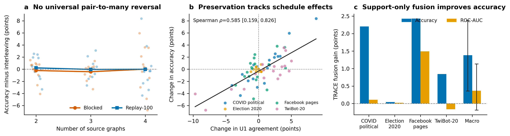

# TRACE schedule scaling — findings

## Result in one sentence

An exact matched-data intervention does **not** reproduce a universal transition from
two-source blocked-training gains to larger-mixture forgetting, but it does show that
schedule-induced changes in target accuracy are predictable from preservation of
support-decodable geometry; a target-label-free TRACE fusion uses that signal to gain
**1.38 accuracy points** over a stronger label-selected fixed checkpoint.



## Controlled design and audit

We trained 27 models: three source-set sizes (2/3/4), three training seeds, and three
schedules (`blocked`, 100-episode replay blocks, and one-episode interleaving). Every arm
received 2,500 optimizer updates. Within each rung and seed, schedules consumed the exact
same source-private sequence of anchors, members, support/query roles, sampled context
nodes, and context edges. Retained-source streams are also exact prefixes across rungs.
The completed receipt is in `data/training_verification.json`.

All models were replayed on five node-classification targets and two disjoint 128-episode
streams. This produces 270 matched model × target × stream cells. The two large targets
contain 3,072 query occurrences per stream, Facebook contains 1,024, and Election and
Ukraine-suspended contain 256. Episode fingerprints and query counts are in
`data/replay_protocol.json`.

## 1. The proposed pair-to-many schedule phase change is not general

The predeclared interaction was

```text
(blocked − interleaved at rung 2)
− mean(blocked − interleaved at rungs 3 and 4).
```

On the fresh stream and four support-competent targets, blocked minus interleaved is
−.0022 accuracy/−.0047 AUC at rung 2 and −.0020/−.0033 at rungs 3–4. The resulting
interaction is −.0001 accuracy (crossed seed × target bootstrap 95% interval
[−.0151, .0119]) and −.0014 AUC ([−.0190, .0167]). Including the chance-level suspended
target or using the independent original stream does not change the conclusion; every
interaction interval spans zero.

Thus the historical 40k-step ladder's large sequential deficit is real for that
protocol, but **source count alone is not a universal switch that makes blocked training
fail**. The old result may require its longer optimization horizon, eight-source scale,
fixed total budget, source order, or historical sampling protocol. This experiment rules
out the simplest order-only generalization at 2–4 sources and 2,500 updates.

No terminal schedule is uniformly best. Across fresh cells, mean differences between
blocked, replay, and interleaved are only a few thousandths, while individual
target/seed effects can be much larger and change sign.

## 2. Fixed 100-episode replay is competitive, not a universal improvement

The original stream selects the better conventional schedule at each rung: blocked for
rung 2, interleaved for rung 3, and blocked for rung 4. Against that frozen choice on the
fresh stream, replay changes accuracy/AUC by +.0064/+.0040 at rung 2,
+.0007/−.0022 at rung 3, and −.0015/+.0013 at rung 4. These are useful engineering
point estimates, not a reliable new training rule.

The contribution is therefore not “100-step replay wins.” The stronger result is that a
target-side health measurement tells us which schedule-induced representations remain
usable.

## 3. Representation preservation predicts the effect of schedule

For every blocked-versus-interleaved and replay-versus-interleaved contrast, we measure
the corresponding change in U1 agreement: whether the final prediction preserves the
decision induced by a support-fitted ridge readout at the pre-metagraph representation.
This uses target support labels but no target query label.

On the four support-competent targets, the change in U1 agreement correlates with the
change in accuracy at **Spearman rho=.585** on the fresh stream, with crossed seed ×
target 95% interval **[.159, .826]**. The disjoint original stream independently gives
**rho=.548 [.101, .897]**. The AUC relationships are positive but inconclusive:
.421 [−.074, .699] fresh and .374 [−.245, .790] original.

This is the causal bridge missing from the earlier singleton study. The training
schedule is experimentally varied while examples and exposure are held exact; schedules
that better preserve target support geometry tend to change target accuracy in the same
direction. Agreement is not meaningful when the support readout itself is at chance, so
the competence gate remains necessary.

## 4. TRACE health fusion improves accuracy without query labels

Each rung/seed provides three checkpoints with identical source composition and examples
but different schedules. TRACE health fusion operates per query:

1. form the support-fitted U1 prediction for each checkpoint;
2. retain checkpoints whose final decision agrees with that U1 prediction;
3. average their full-model probabilities; and
4. if none agree, average all three.

The rule has no fitted weights or temperature and uses no target query labels. A target
is reported only when at least one checkpoint has mean support leave-one-out competence
of .55 or higher. This covers COVID-political, Election-2020, Facebook, and TwiBot-20 in
all nine rung/seed cells and rejects Ukraine-suspended in all nine.

The comparator is deliberately strong: for every target/rung/seed, select one fixed
checkpoint by labeled original-stream AUC, then evaluate it on the fresh stream.

| Fresh supported targets | Accuracy | ROC-AUC |
|---|---:|---:|
| Labeled-discovery fixed checkpoint | .7851 | .8296 |
| TRACE health fusion | **.7989** | **.8333** |
| Difference | **+.0138** | +.0037 |

The accuracy gain occurs in 27/36 cells, ties in six, and loses in three. Its crossed
seed × target 95% interval is **[+.0036, +.0237]**. The AUC gain occurs in 21/36 cells
but remains inconclusive, interval [−.0019, +.0113]. By target:

| Target | Accuracy gain | AUC gain | Accuracy wins |
|---|---:|---:|---:|
| COVID-political | +.0221 | +.0011 | 9/9 |
| Election-2020 | +.0004 | +.0002 | 2/9, six ties |
| Facebook page-reference | +.0243 | **+.0150** | 9/9 |
| TwiBot-20 | +.0084 | −.0016 | 7/9 |

A hard TRACE router also improves supported-target accuracy by +.0125
([+.0027, +.0218]) but lowers AUC by .0031. Soft probability fusion retains the
decision benefit without that ranking tradeoff. If fusion is forced on the rejected
suspended target, mean accuracy falls by .0087; abstention is part of the method.

## Paper-level interpretation

The combined evidence supports a tighter thesis than “interleaving is best” or “more
graphs hurt”:

> Graph pretraining sources and schedules transfer when they preserve decision geometry
> that can be reconstructed from the target's few-shot support set. Global graph
> similarity is at most an upstream correlate; support-conditioned representation
> survival is the proximal, actionable quantity.

This explains why global schedule averages are unstable while TRACE remains useful.
Different schedules preserve different target decisions. Rather than commit to one
universal curriculum, TRACE diagnoses target support, rejects unsupported targets, and
routes or fuses checkpoints according to the geometry that survives.

Together with the singleton-source replication, the evidence now spans two independent
interventions:

- source identity: U1 health predicts transfer across 135 source × target × seed cells;
- training schedule: changes in U1 health predict changes in accuracy across 72
  above-chance matched contrasts per stream; and
- deployment: support-only routing/fusion improves fixed-checkpoint accuracy in both a
  nine-source expert bank and this same-composition schedule bank.

## Boundaries

- This study covers 2–4 sources, 2,500 updates, three seeds, and one architecture. It
  does not erase the historical eight-source/40k finding; it limits its generality.
- Four of five targets pass the predeclared support-competence threshold. Claims about
  useful transfer exclude the rejected suspended target.
- The bootstrap resamples training seeds and targets. Repeated query occurrences and
  rungs are not presented as independent training replications.
- The primary method gain is accuracy. The macro AUC improvement is positive but its
  interval crosses zero.
- Fusion evaluates three checkpoints, so it trades roughly 3× model-forward compute for
  the gain. A health-preserving training regularizer remains future work.
- This intervention identifies preservation as a mediator-like signal; it does not yet
  identify which source gradients create or destroy a target direction.

## Evidence map

- `data/cells.csv`: 270 aggregate model × target × stream cells.
- `data/paired_contrasts.csv`: exact schedule contrasts.
- `data/scaling_interactions.csv`: primary interactions and crossed intervals.
- `data/health_correlations.csv`: preservation–performance relationships.
- `data/selector_results.csv`: fixed, hard-routing, and fusion results.
- `data/selector_gain_summary.csv`: paired method gains and crossed intervals.
- `data/selector_contrast_summary_by_target.csv`: target-wise method effects.
- `data/training_verification.json`: checkpoint and exact-consumption receipts.
- `data/replay_protocol.json`: disjoint replay fingerprints and query counts.
