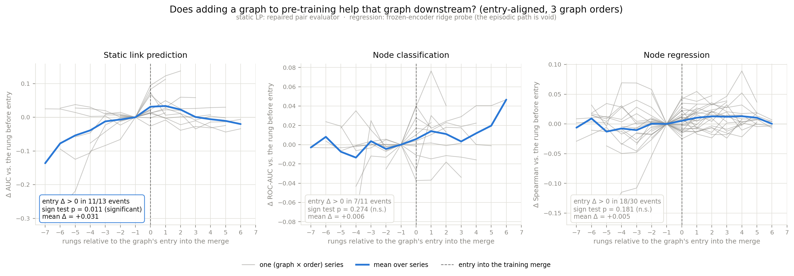

# NM ladder downstream — findings

**Run 2026-07-27. Regression column re-scored 2026-07-29** with the frozen-encoder ridge
probe, after the episodic regression eval was found void. Static LP and classification are
unchanged from the original run — verified byte-identical, not assumed.

## The question

The interpolation ladder's staircase — a graph's metric is flat at its zero-shot level
until that graph enters the training merge, then jumps — had only ever been measured on
**NM**, the objective the encoders were pretrained with (21/21 entry events positive,
p = 4.8e-7). Does it survive on tasks a downstream user would actually run?

24 rows (3 graph orders × 8 rungs) served by 21 distinct 40k checkpoints, no new training.
Entry-aligned sign test: is the metric just after a graph enters the merge higher than just
before?



## Result

| task | positive | p (one-sided) | mean Δ | evaluator |
|---|---|---|---|---|
| **static link prediction** | **11/13** | **0.011** | **+0.031** | repaired pair evaluator |
| node classification | 7/11 | 0.274 | +0.006 | runner (no known defect) |
| node regression | 18/30 | 0.181 | +0.005 | frozen-encoder ridge probe |

**The staircase survives on static link prediction and on nothing else.** Static LP is a
task these encoders were never trained for, scored on the repaired evaluator, and above the
heuristic floors on all 5 graphs (best rung beats best floor by +0.046 … +0.185). Median Δ
+0.019, about 4× smaller than NM's +0.080. The largest entries are order-C
(isolates-first), as in the NM version.

The two feature-channel tasks do not move. That split — topology channel yes, feature
channel no — is the two-channels hypothesis, and it is now measured on evaluators that both
work.

## Why the regression column was rebuilt

The first version of this figure (2026-07-27) scored regression through the runner's
episodic `task_name=regression` path. That path builds a `regression_head` present in no
checkpoint, loads it with `strict=False` so it stays at random init, and `--eval_only`
returns before any optimizer step. The reported number is a **fixed random projection of
the frozen embedding** (`setup/regression_probe_repair/README.md`, found 2026-07-28 —
eleven hours after these figures were first built).

The replacement fits a ridge probe on each episode's support set and scores held-out query
nodes, encoder frozen. Before trusting any of it, the gate reproduced the published
raw-feature floor exactly (midterm: 0.2597 / 0.0546 / 0.0398, Δ = 0.0000 on all three).

**The old column carried no information about the new one.** Across the 30 entry events:

| check | value | reading |
|---|---|---|
| numerically identical | 0/30 | not a stale read |
| same sign | 12/30 | *below* the 15/30 chance line |
| correlation of the Δ vectors | −0.16 | uncorrelated |
| mean \|old − new\| | 0.154 | ~30× the size of the effect being measured |

The headline count is 18/30 both before and after. That is a coincidence, and the table
above is why it must not be reported as agreement or as replication.

## What changed in the conclusion — the null is now real

The 2026-07-27 read of this panel was "**uninformative**, not null": no arm anywhere had
exceeded 0.222 mean Spearman, so a flat result could not be told apart from a
non-measurement. With the probe, that caveat is gone. Encoders clear a ridge probe on the
raw 768-d input features on **10 of 12 (dataset, target) cells**:

| dataset | target | floor (raw x) | best rung | clears floor | best − floor |
|---|---|---|---:|---:|---:|
| twibot20 | followers_count | +0.1597 | +0.3507 | 20/21 | **+0.1909** |
| twibot20 | statuses_count | +0.1184 | +0.2321 | 21/21 | +0.1137 |
| twibot20 | account_age_days | +0.0371 | +0.1309 | 20/21 | +0.0938 |
| covid19_twitter | statuses_count | +0.0559 | +0.1407 | 21/21 | +0.0848 |
| covid19_twitter | account_age_days | +0.0105 | +0.0716 | 20/21 | +0.0611 |
| ukr_rus_twitter | account_age_days | +0.0095 | +0.0615 | 21/21 | +0.0520 |
| midterm | account_age_days | +0.0398 | +0.0872 | 18/21 | +0.0474 |
| midterm | statuses_count | +0.0546 | +0.0938 | 20/21 | +0.0392 |
| ukr_rus_twitter | statuses_count | +0.1252 | +0.1591 | 18/21 | +0.0339 |
| covid19_twitter | followers_count | +0.1188 | +0.1240 | 1/21 | +0.0052 |
| ukr_rus_twitter | followers_count | +0.2090 | +0.1652 | **0/21** | −0.0438 |
| midterm | followers_count | +0.2597 | +0.2064 | **0/21** | −0.0533 |

So the encoders **do** carry profile-regression signal beyond the raw features — and
widening the pretraining corpus still does not improve a graph's own regression when that
graph enters the merge. That is a genuine null about pre-training, not a broken instrument.

Restricting the sign test to the 10 cells where some rung clears the floor does not change
it: **16/25 positive, p = 0.115, mean Δ +0.007**. The result does not depend on carrying
the two dead cells.

## The `followers_count` exception

On midterm and ukr_rus, **no** encoder reaches the raw-feature floor for `followers_count`
— the target raw features predict best on those graphs (0.2597 and 0.2090). covid19 is
borderline at 1/21. The encoder is losing information the 768-d input already had.

This is consistent with the mechanism measured in `pretrain_saturation/FINDINGS.md`: mean
neighbourhood aggregation destroys ~84 % of the node-level signal, and what survives comes
through `SAGEConvSelfLoops`'s self pathway plus residual. Where the raw feature is strongly
node-local and strongly predictive, a 1-layer encoder is a lossy re-encoding of it. Any Δ
computed on those two cells is drift on a degraded channel and is excluded above.

## Caveats

- **1 seed.** Sub-0.02 differences are noise. This holds for all three panels.
- **10-shot power limit.** On a perfectly linear planted signal in 32 dimensions the probe
  recovers ρ = 1.000 at 100 shots but only 0.371 at 10. These embeddings are 256-d and the
  floor 768-d, both far worse conditioned. 10-shot regression numbers are bounded by the
  protocol, not only by the representation.
- **Rung-1 rows are single-source specialists** and beat merged models on their own graph
  (dilution). They have no "before" observation, so they contribute no entry event — but
  exclude them when quoting post-entry stability.
- **No random-init encoder control.** The single most decisive control here, and it does
  not exist anywhere in the repo. `pretrain_saturation` has one for the *void* eval only.
  Without it, "encoders clear the raw-feature floor" is not yet "*pre-training* clears the
  raw-feature floor" — an untrained GNN of the same architecture might too.
- **Temporal LP still excluded.** Same three unrepaired defects as the old static-LP path.

## Reproducing

```bash
bash scripts/experiments/setup/regression_probe_repair/run_gate.sh
```

```bash
GPU=0 bash scripts/experiments/setup/nm_ladder_downstream/run_reg_probe_sweep.sh
```

```bash
python3 scripts/experiments/setup/nm_ladder_downstream/assemble_downstream_tables.py
```

```bash
python3 scripts/experiments/analysis/nm_ladder_downstream/plot_downstream_event_study.py
```

```bash
python3 scripts/experiments/analysis/nm_ladder_downstream/summarize_reg_vs_floor.py
```

`assemble_downstream_tables.py --reg-source runner` rebuilds the superseded 2026-07-27
version from the void path. It exists so the two can be compared; nothing should be quoted
from it.
