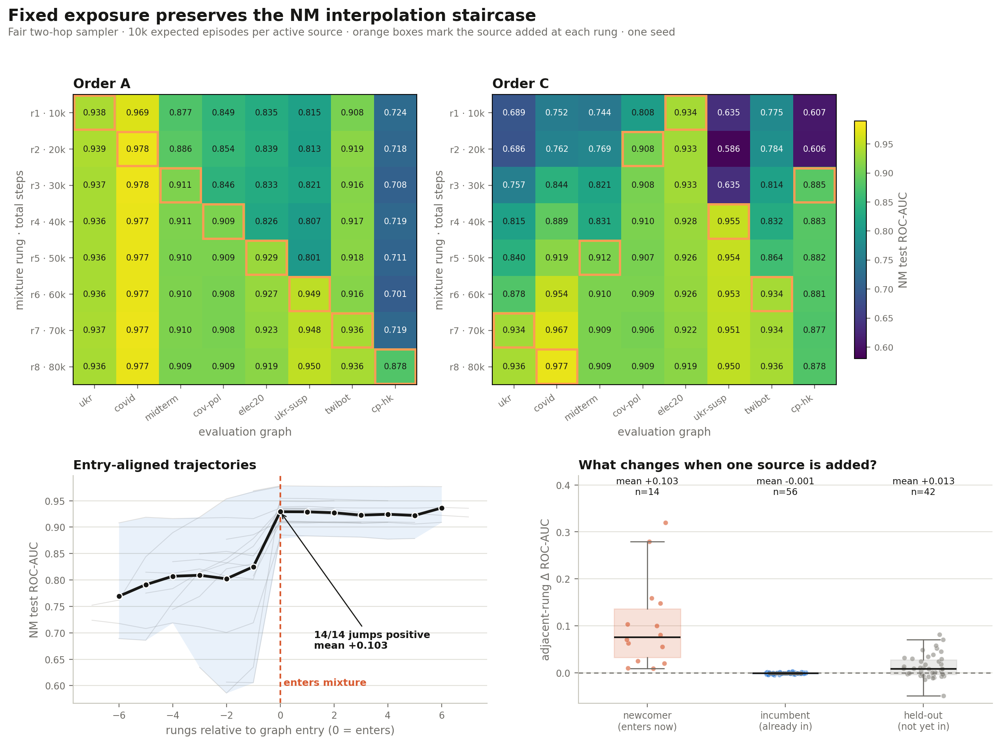

# Fixed-exposure two-hop NM ladder — findings

**Question.** Does the NM interpolation staircase survive when every active source gets
the same expected exposure, rather than sharing one fixed total training budget?

**Answer.** Yes. With 10,000 expected NM episodes per active source, every measurable
source-entry event improves its own graph, by mean **+0.103 ROC-AUC**. Once a graph has
entered, later additions leave it essentially unchanged. The staircase is therefore not
an artifact of progressively starving incumbent sources as the mixture grows.

## Design and execution

- fair two-hop sampler: `n_hop=2`, fanouts `9,9`, node cap 101, one-hop NM walk;
- balanced source sampling, with rung `r` trained for `r × 10,000` steps;
- Orders A and C, eight logical rungs each; one training seed;
- NM 30-way/3-shot evaluation on all eight source graphs; and
- 120/120 physical evaluations completed with zero failures.

There are 15 physical model matrices: eight Order-A models and seven Order-C models.
Order C rung 8 reuses the same all-eight checkpoint as A rung 8. The analysis expands
that shared artifact into two logical trajectories, producing 128 logical cells, but it
does not treat the duplicated rung-8 rows as independent evidence.

The balanced sampler fixes exposure **in expectation**. It does not enforce an exact
10,000-episode quota for every source.

## 1. Every graph improves when it enters the mixture

The clean test is within a trajectory: compare each graph immediately before and after
its own addition. The graph placed at rung 1 has no preceding rung, leaving seven events
per order and 14 total.

| order | rung | graph entering | before | after | Δ ROC-AUC |
|---|---:|---|---:|---:|---:|
| A | 2 | covid19_twitter | .969 | .978 | **+.009** |
| A | 3 | midterm | .886 | .911 | **+.026** |
| A | 4 | covid_political | .846 | .909 | **+.063** |
| A | 5 | election2020 | .826 | .929 | **+.103** |
| A | 6 | ukr_rus_suspended | .801 | .949 | **+.148** |
| A | 7 | twibot20 | .916 | .936 | **+.020** |
| A | 8 | cp_hk_twitter | .719 | .878 | **+.159** |
| C | 2 | covid_political | .808 | .908 | **+.101** |
| C | 3 | cp_hk_twitter | .606 | .885 | **+.280** |
| C | 4 | ukr_rus_suspended | .635 | .955 | **+.319** |
| C | 5 | midterm | .831 | .912 | **+.081** |
| C | 6 | twibot20 | .864 | .934 | **+.071** |
| C | 7 | ukr_rus_twitter | .878 | .934 | **+.055** |
| C | 8 | covid19_twitter | .967 | .977 | **+.010** |

All **14/14** deltas are positive: mean +.103, median +.076, range +.009 to +.319.
The exact two-sided sign-test value is `p = 1.22e-4`. Treat that p-value as descriptive:
the events share training runs and evaluation graphs, so they are not 14 independent
experimental replicates. The sign consistency is more important than the formal test.

The graph-specific pattern is sensible. `covid19_twitter` and `twibot20` already transfer
well before entry and gain little. `cp_hk_twitter` and `ukr_rus_suspended` can be badly
out of distribution and jump sharply when directly represented.

## 2. Fixed exposure prevents meaningful incumbent dilution

Across all 56 incumbent cells—graphs already in the mixture when another source is
added—the adjacent-rung change is:

| statistic | Δ ROC-AUC |
|---|---:|
| mean | **−.0007** |
| median | **−.0006** |
| range | −.0051 to +.0031 |

Although 73% of the changes are negative, their scale is negligible. The direction says
there may still be tiny interference; the magnitude says it does not materially tax an
incumbent under fixed exposure.

The longer-horizon check agrees. From a graph's entry checkpoint through the shared
all-eight checkpoint, the mean change is −.0028 and the median is −.0020. The largest
decline is election2020 in Order C, −.0147; every other trajectory is closer. Thus the
gain created at entry is retained as the mixture expands.

This is the main fixed-exposure result: adding a new source changes the newcomer by
roughly a tenth of an AUC point on average, but changes existing sources by less than one
thousandth per addition.

## 3. Order controls the early baseline, not the eventual in-domain level

Mean ROC-AUC over all eight evaluation graphs:

| rung / steps | Order A | Order C |
|---:|---:|---:|
| 1 / 10k | .864 | .743 |
| 2 / 20k | .868 | .754 |
| 3 / 30k | .869 | .825 |
| 4 / 40k | .875 | .880 |
| 5 / 50k | .887 | .900 |
| 6 / 60k | .903 | .918 |
| 7 / 70k | .907 | .925 |
| 8 / 80k | .927 | .927 |

Order A begins with `ukr_rus_twitter` and `covid19_twitter`, which are broad donors; its
held-out graphs are already strong, and adding sources changes held-out cells by mean
−.0007. Order C begins with narrower political sources; its held-out cells improve by
mean +.0275 as broader donors enter. This explains the large early order gap without
contradicting the entry staircase.

Do not call the identical rung-8 values an independent convergence result: A8 and C8 are
the same all-eight model by design. The useful order evidence is that both paths show
positive entry jumps and near-zero incumbent movement despite very different early
transfer baselines.

## 4. Against matched-40k two-hop, 10k/source is already enough

Order A has the missing controlled comparison: a complete matched-40k ladder trained
and evaluated with the same fair-two-hop sampler, source sets, seed, and NM protocol.
Only the budget schedule changes.

| rung | fixed exposure steps | fixed-exposure mean | matched-40k mean | Δ |
|---:|---:|---:|---:|---:|
| 1 | 10k | .8643 | .8626 | +.0016 |
| 2 | 20k | .8682 | .8644 | +.0038 |
| 3 | 30k | .8686 | .8662 | +.0025 |
| 4 | 40k | .8751 | .8750 | +.0001 |
| 5 | 50k | .8865 | .8859 | +.0006 |
| 6 | 60k | .9030 | .9034 | −.0003 |
| 7 | 70k | .9074 | .9045 | +.0029 |
| 8 | 80k | .9267 | .9223 | +.0044 |

Across all 64 rung × graph cells, fixed exposure minus matched-40k has mean +.0019,
median +.0017, and mean absolute difference .0043. The graph-entry jumps are likewise
indistinguishable: mean +.0756 under fixed exposure versus +.0729 under matched-40k
(difference +.0027; mean absolute difference .0041).

Rung 1 is the sharpest budget test. Giving the UKR-only model 40k rather than 10k steps
does not improve its eight-graph mean: .8626 versus .8643. The eight cell-level
differences are mixed, and its in-domain UKR score is actually higher at 40k (.9455 vs
.9381). The correct conclusion is therefore not that 10k is intrinsically better, but
that **40k buys no measurable aggregate improvement over 10k**.

Fixed exposure retains entry gains slightly better through all-eight: mean post-entry
change −.0022 versus −.0067 under matched-40k, a +.0045 difference. That direction is
consistent with reduced incumbent dilution, but its magnitude remains below the repo's
.02 caution threshold and there are no training replicates.

## 5. The one-hop matrix remains a useful replication check

The historical matched-40k one-hop Order-A matrix is preserved as a separate,
explicitly cross-protocol comparison. Across all 64 rung × graph cells, fixed-exposure
two-hop minus historical one-hop has mean +.0032 and mean absolute difference .0084.
Across the seven graph-entry jumps, the mean difference is −.0006 and the mean absolute
difference is .0106.

That close agreement shows that the interpolation staircase is robust across the
sampler change. It is not a causal exposure comparison: total-step schedule and context
radius both differ. The same-sampler two-hop matrix in §4 is the appropriate control for
the exposure claim.

## Claim boundary

The supported claim is narrow and useful: **under a fair-two-hop, fixed-exposure design,
NM transfer is still coverage-driven. A target improves when its source enters, and its
performance is retained as more sources are added.**

The experiment does not establish:

- exact per-source quotas—the exposure control is stochastic and balanced in expectation;
- training-seed uncertainty—there is one seed;
- full three-order robustness—Order B was intentionally deferred; or
- schedule effects for Orders B/C—the committed matched-40k fair-two-hop control matrix
  currently covers only Order A.

Evaluation episodes are shared across arms, which makes cellwise comparisons paired but
does not create independent evaluation replicates. As elsewhere in this repo, avoid
over-interpreting sub-.02 differences.

## Evidence map

- `data/raw_metrics.csv`: the 120 physical Tucker metric rows.
- `data/logical_results.csv`: 128 logical A/C rung × graph cells with source membership.
- `data/rung_summary.csv`: order/rung means and in-vs-held-out split.
- `data/adjacent_deltas.csv`: newcomer, incumbent, and held-out event deltas.
- `data/entry_jumps.csv`: the 14 source-entry comparisons.
- `data/comparison_to_matched40k_h2_orderA.csv`: controlled fixed-exposure vs
  matched-40k fair-two-hop Order-A pairs.
- `data/comparison_to_matched40k_h1_orderA.csv`: cross-protocol fixed-exposure
  fair-two-hop vs historical matched-40k one-hop Order-A pairs.
- `data/summary.json`: machine-readable headline statistics.
- `figures/fixed_exposure_analysis.{png,pdf}`: the primary figure.
