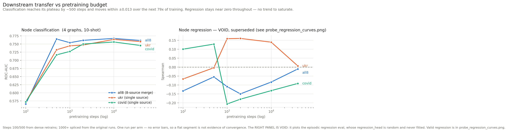
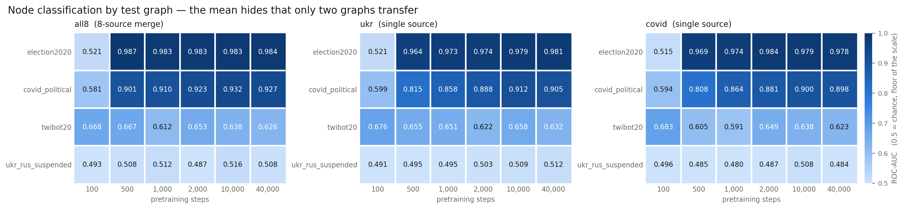
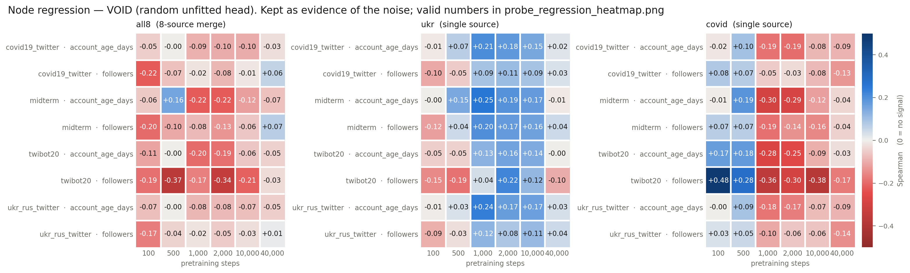
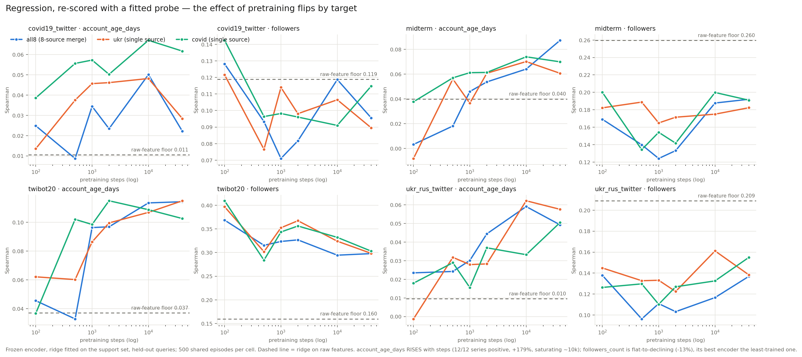

# Pretrain saturation — findings

**Question.** Does downstream transfer performance saturate early in pretraining, and does
the width of the pretraining corpus change when?

**Design.** 3 pretraining corpora × 6 checkpoints (100, 500, 1000, 2000, 10 000, 40 000),
each frozen and scored on node classification (4 graphs, 10-shot) and node regression
(4 graphs × 2 targets, 10-shot). 216 eval jobs, all completed, zero failures.
Setup: [`pretrain_saturation_existing`](../../setup/pretrain_saturation_existing/) (steps
1000+, no training) and [`pretrain_saturation_dense`](../../setup/pretrain_saturation_dense/)
(steps 100/500, three 2100-step retrains).



## 1. Classification transfer saturates very early — before step 500

Mean ROC-AUC across the four labelled graphs:

| step | all8 | ukr | covid |
|---|---|---|---|
| 100 | 0.566 | 0.572 | 0.572 |
| 500 | **0.766** | 0.732 | 0.717 |
| 1000 | 0.754 | 0.745 | 0.727 |
| 2000 | 0.761 | 0.747 | 0.750 |
| 10 000 | 0.767 | 0.764 | 0.756 |
| 40 000 | 0.761 | 0.758 | 0.746 |

Expressed as the fraction of each arm's eventual gain (step 100 → its best checkpoint)
already realised at step 500:

| arm | gain by step 500 | plateau spread, steps 500–40 000 |
|---|---|---|
| all8 | **99.1 %** | 0.013 |
| ukr | 83.4 % | 0.032 |
| covid | 78.5 % | 0.040 |

The remaining **98.75 % of the training budget** (500 → 40 000 steps, an 80× increase)
buys `all8` nothing measurable. This is the headline the experiment was built to test, and
it is only visible because of the dense 100/500 checkpoints — no prior run in this repo
wrote a checkpoint below step 1000, so the entire rise was previously invisible.

## 2. But the mean hides that transfer only works on two of the four graphs



The same three-way split appears independently in all three arms. Per-graph ROC-AUC for `all8`:

| step | covid_political | election2020 | twibot20 | ukr_rus_suspended |
|---|---|---|---|---|
| 100 | 0.581 | 0.521 | 0.668 | 0.493 |
| 500 | 0.901 | 0.987 | 0.667 | 0.508 |
| 1000 | 0.910 | 0.983 | 0.612 | 0.512 |
| 2000 | 0.923 | 0.983 | 0.653 | 0.487 |
| 10 000 | 0.932 | 0.983 | 0.638 | 0.516 |
| 40 000 | 0.927 | 0.984 | 0.626 | 0.508 |

Three separate things are going on, and averaging them into one curve misrepresents all
three:

- **covid_political and election2020** carry the entire effect. Both jump between step 100
  and 500 and are then flat to 40 000. This is where "saturates by step 500" is true.
- **ukr_rus_suspended sits at chance (0.487–0.516) at every checkpoint.** Pretraining
  never does anything for it. A flat line at 0.5 is not saturation.
- **twibot20 gets *worse* with pretraining** — 0.668 at step 100 down to 0.626 at 40 000,
  its best checkpoint being the *least*-trained one.

Against a random-init encoder these two are unambiguous: covid_political 0.429 and
election2020 0.403 untrained (both *below* chance), versus 0.932 and 0.987 pretrained —
gaps of +0.50 and +0.58. Whatever else is uncertain here, this effect is real.

**`election2020` reaching 0.987 deserves scrutiny before it is cited.** A near-perfect
frozen-probe ROC-AUC after 500 pretraining steps is more consistent with an easy or leaky
label than with representation quality.

## 3. Corpus width changes how fast, not how high

All three arms converge to 0.746–0.767 — a 0.021 spread, comparable to the plateau
wobble of a single arm. What differs is the approach: `all8` is 99 % of the way there at
step 500, the two single-source arms 79–83 %, and they keep creeping up until ~10 000.

So the prior expectation — that a wider mixture needs *more* steps — is not what the data
shows; if anything the broad corpus arrives **sooner**. State this weakly: the gaps
(0.013 vs 0.032/0.040 in plateau spread) are the size of the run-to-run noise this
experiment cannot measure (§5).

## 4. Node regression measures nothing — and there is a mechanism, not just a null



Mean Spearman never leaves the band around zero and has no coherent trend in step.
Across all 144 cells: 50/144 positive, mean −0.029, median −0.043, range −0.38 to +0.48.

**A random-init encoder does just as well** (`data/random_init_floor.csv`, measured
2026-07-27 with the `RANDOM_INIT` sentinel):

| | pretrained (18 ckpts × 4 cells) | random init |
|---|---|---|
| mean \|ρ\| | 0.150 | 0.069 |
| max \|ρ\| | 0.484 | **0.174** |

An **untrained** encoder reaches ρ = +0.174 on twibot20/followers_count, and **62 % of
all pretrained cells fall below that value**. There is no evidence any of these encoders
carry usable signal for 10-shot profile regression.

**Why, mechanically — corrected 2026-07-27.** An earlier version of this file said "there
is no regression head at all". That is **wrong**. `models/general_gnn.py:30` constructs a
`regression_head` (Linear→ReLU→Linear) whenever `task_name == "regression"`, and line 158
predicts with it, bypassing `decode()` entirely. That head appears in **no** NM/CL/FP
checkpoint (verified: 38 tensors, zero matching `regression_head`), and `load_checkpoint`
uses `strict=False`, so it silently stays at its **random initialisation**. `--eval_only
True` returns at `trainer.py:1529` before any optimizer step, so it is never fitted.

Both mechanisms hold at once. The collator does feed the support targets in as metagraph
edge attributes (`metagraph_edge_value = y_values * (~query_mask)` — correctly masked, no
leakage), so support values reach the encoder; and the readout sitting on top of them is an
untrained random MLP. Either alone would void the measurement. Credit for the correction to
the `experiment/regression-probe-repair` session (`694e5d9`).

**Consequently the apparent structure in this panel is noise**, including the one pattern
that looked alarming: `ukr` flips sign negative→positive across the 500→1000 boundary and
`covid` flips positive→negative, in 5/8 and 8/8 cells, with 500→1000 the largest adjacent
gap for both — and that boundary is exactly the splice. It aligned suspiciously with the
pre/post-code-drift split (`all8`'s historical run is post-drift and shows 1/8 cells and a
+0.006 delta). But a channel whose untrained floor is |ρ| = 0.17 has no signal to be
discontinuous; sign flips are what a quantity centred on zero does. See §5 for why the
channel that *does* carry signal shows no boundary effect at all.

## 4b. Re-scored with a fitted probe — the channel works, and it saturates by step 100

The random-init floor proves the *old* measurement was dead. It does not say whether a
properly fitted readout would find a saturation signal. The
`experiment/regression-probe-repair` session (`694e5d9`) built one: encoder frozen, ridge
fitted on the support set, scored on held-out query nodes, protocol lifted verbatim from
`setup/topology_feature_ssl/leakage_baseline.py:74`. All 18 checkpoints re-scored on
4 graphs × 2 targets, 500 shared episodes per cell (`data/reg_probe/`).

**Architecture check passed silently**: `load_frozen_encoder` prints `[load] missing=…
unexpected=…` only on a mismatch, and no `[load]` line appeared for any of the 18 × 4
loads (`gnn_type=sage` for every arm).

**The probe is stable where the old eval was not.** Old numbers swung across a 0.40 range
with no structure; the probe's pooled mean moves within ~0.035 across the whole step axis
— but see below, that pooled figure is itself misleading.

Mean Spearman over 4 graphs × 2 targets:

| step | all8 | ukr | covid |
|---|---|---|---|
| 100 | 0.113 | 0.114 | 0.126 |
| 500 | 0.091 | 0.111 | 0.111 |
| 1 000 | 0.105 | 0.120 | 0.117 |
| 2 000 | 0.108 | 0.124 | 0.123 |
| 10 000 | 0.126 | 0.132 | 0.130 |
| 40 000 | 0.124 | 0.121 | 0.131 |



**The step-trend flips sign by target, and the pooled mean hides it.** Pooled over all 24
arm×cell series the trend looks weak (mean rank-correlation with step +0.331, 17/24
positive). Split by target it is not weak at all — it is two opposite effects cancelling:

| target | rank-corr with step | series positive | step 100 → 40 000 |
|---|---|---|---|
| `account_age_days` | **+0.757** | **12/12** | 0.025 → 0.068 (**+179 %**) |
| `followers_count` | −0.095 | 5/12 | 0.211 → 0.183 (−13 %) |

So **`account_age_days` does saturate**, rising monotonically to a plateau around step
10 000 — later than classification's step 500, and consistently across every arm and
dataset. **`followers_count` does not rise at all**; its best encoder is usually the
least-trained one.

Note which target is which. `followers_count` carries the **high** raw-feature floors
(0.119–0.260) and `account_age_days` the near-zero ones (0.010–0.040). The pattern is
therefore consistent with pretraining adding contextual/structural signal that the node
features do not encode, while diluting node-local signal that they already encode well —
the same dilution the `mean_nb(x)` measurement below quantifies. Stated as a hypothesis:
this experiment establishes the correlation, not the mechanism.

**Encoders beat the raw-feature floor on 6 of 8 cells** — the opposite of the
midterm-only impression:

| dataset | target | floor | best encoder | |
|---|---|---|---|---|
| twibot20 | followers_count | 0.1597 | **0.4095** | +0.250 |
| twibot20 | account_age_days | 0.0371 | 0.1150 | +0.078 |
| covid19_twitter | account_age_days | 0.0105 | 0.0670 | +0.057 |
| ukr_rus_twitter | account_age_days | 0.0095 | 0.0622 | +0.053 |
| midterm | account_age_days | 0.0398 | 0.0872 | +0.047 |
| covid19_twitter | followers_count | 0.1188 | 0.1424 | +0.024 |
| midterm | followers_count | 0.2597 | 0.2000 | −0.060 |
| ukr_rus_twitter | followers_count | 0.2090 | 0.1612 | −0.048 |

**`twibot20` degrades with pretraining on this task too** — 0.37/0.41/0.40 at step 100
falling to ~0.30 at 40 000, best-at-least-trained for all three arms. That is the same
direction as its classification behaviour (§2), from an independent measurement, which
makes it the most reproducible anti-result in this experiment.

**Why encoders can exceed the raw-feature floor at all.** `SAGEConvSelfLoops` does not
replace a node with its neighbourhood mean: it adds a dedicated `lin_self_loops(x)` root
projection and a residual `+ x`. Measured on midterm/followers_count — raw `x` scores
0.2597, `mean_nb(x)` alone scores **0.0415**, and `[x ; mean_nb(x)]` scores 0.2615. So mean
aggregation destroys ~84 % of that signal on its own, and everything above 0.04 comes from
the self pathway.

Not checked against `../node_regression/data/features_only_floor.csv` — the probe
reproduces that file's midterm numbers to four decimals, so it is the same floor.

### The 144 `sat_*` rows in `../node_regression/data/node_regression.csv` are VOID
They came from the random-head episodic path and are superseded by `data/reg_probe/`.
They were left in place rather than deleted (the shared CSVs are append-only and other
experiments' rows sit beside them), but they must not be read as a representation
measure.

## 5. What this evidence cannot support

- **There are no error bars.** One pretraining run per arm. Two *identical* reruns of the
  `all8` config — same seed, same GPU, same code — land 546 apart in weight space (‖w‖ ≈
  1208), because PyG scatter message-passing uses non-deterministic CUDA atomics and
  training is chaotic. The plateau in §1 spans ±0.013; **whether that is stability or
  scatter is not determined by this data.** The three replicate runs are trained and sit
  in `prodigy-sat/state`; evaluating one costs ~48 jobs and would settle it.
- **The curve is spliced.** Steps 100/500 come from retrains done 2026-07-27; steps 1000+
  from runs of 2026-06-14 (ukr, covid) and 2026-07-09 (all8).
  `setup/pretrain_saturation_dense/check_splice.py` passes, but **weakly**: a model trained
  on a *different corpus* sits 587 away, versus 546 for the same-config null, so the test
  would also pass a model it should reject. Weight-space distance cannot resolve trajectory
  identity after ~1000 chaotic steps; always compute the unrelated scale (√2·‖w‖ ≈ 1708
  here) before trusting a distance threshold.

  **The best available evidence on the splice is the classification panel itself.** It is
  the only channel with signal well above its random-init floor, and its 500→1000 step —
  the joint — moves by −0.011 / +0.012 / +0.010 for all8/ukr/covid, i.e. no more than the
  plateau wobbles anyway. The one apparent discontinuity showed up in regression (§4),
  which the random-init floor shows is measuring nothing. The stronger test remains
  available and unrun: evaluate the dense `state_dict_1001` against the historical
  `state_dict_1000` in metric space (~12 jobs per arm).
- **Steps ≥1000 are labelled one step short.** Pre-2026-07-26 checkpoints hold N+1
  completed steps under the name N. Irrelevant numerically; do not present the axis as
  exact.
- **Eval episodes are fixed by split name**, so the ± inside an eval log is the spread
  across episodes within one eval, not a confidence interval. Do not report it as one.

## Reproducing

```bash
/opt/homebrew/bin/python3.11 build_tables_and_figure.py
```

Reads the shared per-task CSVs, filters to `sat_*` model keys, and rewrites
`data/pretrain_saturation_{long,wide}.csv` and the figure.
