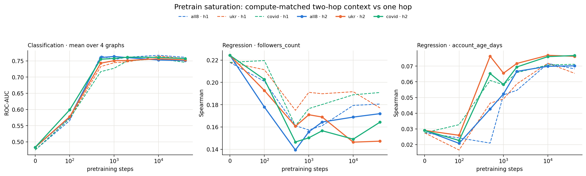

# Compute-matched two-hop pretrain saturation — findings

**Question.** Does the early saturation seen with one-hop sampled context persist when
the encoder receives genuine two-hop context at approximately the same per-subgraph
compute budget?

**Answer.** Yes for classification. Two-hop context reproduces the same sharp rise by
step 500 and flat 500–40 000 plateau. It does not produce a consistent downstream gain
over one hop. The repaired regression probe also preserves the earlier target split:
`account_age_days` improves later, while `followers_count` is best at step 0 and declines
with training.

## Controlled intervention

The historical one-hop sampler uses fanout 100, so a center subgraph contains at most
about 101 nodes and 100 sampled edges. A literal `n_hop=2` pilot reused fanout 100 and
expanded toward the 2 000-node cap. It was roughly 20 times larger per subgraph, ran much
more slowly, and confounded radius with compute. That pilot used `sat_h2_*` names, was
stopped early, and is excluded from every committed table.

The registered rerun changes only the context radius as closely as this sampler permits:

- `n_hop=2`;
- fanouts `9,9` (about 100 nodes and 99 sampled edges at maximum);
- hard node cap 101; and
- `neighbor_matching_walk_hops=1`, preserving the original direct-neighbour NM positive.

The same sampler settings are used for pretraining and downstream embedding extraction.
The architecture remains `S,U,M` with one background message-passing layer; two-hop
nodes reach the global subgraph pooling readout, so this is not an `S2` experiment.

## Execution record

Three fresh arms (`all8`, `ukr`, `covid`) ran from initialization through exactly 40 000
optimizer steps, with checkpoints at 0, 100, 500, 1 000, 2 000, 10 000, and 40 000.
The three step-0 PyTorch archives have different file bytes but tensor-identical model
states; the resolver hashes model tensors and collapses them to one shared evaluation.

Downstream evaluation completed without logged failures:

- 76/76 classification cells: 19 distinct checkpoints × 4 graphs, fixed 10-shot
  episodes, ROC-AUC;
- 152 frozen-encoder regression cells: 19 checkpoints × 4 graphs × 2 targets, 500
  shared 10-shot ridge-probe episodes, Spearman; and
- 8 raw-feature regression floors.

The primary regression metric is Spearman. Some ridge fits have extreme RMSE/R² values;
those scale-sensitive diagnostics are retained in the raw evidence but are not used for
the saturation claim.

## Classification saturation is robust to two-hop context

Mean ROC-AUC over the four labelled graphs:

| step | all8 | ukr | covid |
|---:|---:|---:|---:|
| 0 | 0.483 | 0.483 | 0.483 |
| 100 | 0.576 | 0.578 | 0.599 |
| 500 | **0.760** | 0.743 | 0.755 |
| 1 000 | **0.764** | 0.751 | 0.757 |
| 2 000 | 0.760 | 0.751 | **0.761** |
| 10 000 | 0.753 | **0.757** | 0.761 |
| 40 000 | 0.751 | 0.753 | 0.757 |

By step 500, the arms have realized 98.3% (`all8`), 92.4% (`ukr`), and 96.2%
(`covid`) of their step-0-to-best gain. The entire 500–40 000 range spans only 0.013,
0.014, and 0.006 ROC-AUC respectively. Increasing the training budget another 80 times
does not improve the mean classification result.

## Two hops do not consistently beat one hop

Across the 84 paired classification cells, compute-matched two-hop context changes mean
ROC-AUC by +0.0072 (median +0.0033), with 48/84 cells positive. The effect is not uniform:

| pretraining arm | mean two-hop minus one-hop ROC-AUC |
|---|---:|
| all8 | -0.0004 |
| ukr | +0.0032 |
| covid | +0.0187 |

The pooled advantage is concentrated at steps 100–1 000 (+0.014 to +0.015). It is
slightly negative at 10 000 (-0.0059) and essentially zero at 40 000 (-0.0010). Without
independent training replicates for this intervention, the cell-level differences do not
support a general claim that two-hop context improves transfer. They do support the
stronger qualitative conclusion that early saturation is unchanged.

## Regression keeps the target-specific split

Mean Spearman over four graphs:

| target | arm | step 0 | step 500 | step 10 000 | step 40 000 |
|---|---|---:|---:|---:|---:|
| followers | all8 | **0.224** | 0.139 | 0.169 | 0.172 |
| followers | ukr | **0.224** | 0.161 | 0.147 | 0.147 |
| followers | covid | **0.224** | 0.147 | 0.149 | 0.164 |
| account age | all8 | 0.029 | 0.043 | 0.070 | **0.070** |
| account age | ukr | 0.029 | 0.076 | **0.077** | 0.076 |
| account age | covid | 0.029 | 0.065 | 0.076 | **0.077** |

`followers_count` does not benefit from NM pretraining in either context regime; its
shared untrained encoder is the best point. `account_age_days` improves and plateaus
later, around 2 000–10 000 steps depending on arm. Relative to one hop, two hops reduce
mean followers Spearman by 0.008–0.020 but increase account-age Spearman by 0.002–0.012.
This opposite target response cancels in pooled regression averages and should not be
summarized as one scalar effect.

## Claim boundary

This experiment establishes that the classification saturation result is not an artifact
of restricting sampled context to one hop when per-subgraph node/edge budgets and the NM
positive definition are held approximately fixed. It does **not** test deeper message
passing, larger two-hop samples, or a two-step NM objective. It also does not establish
two-hop superiority: the paired differences are small, heterogeneous, and lack training
replicates.

## Evidence map

- `data/pretrain_saturation_nhop2_long.csv`: 252-row standalone two-hop matrix.
- `data/nhop_comparison.csv`: 252 paired two-hop-minus-one-hop cells.
- `data/summary.csv`: arm/task saturation diagnostics.
- `data/regression_floors.csv`: eight raw-feature probe floors.
- `data/reg_probe/`: four per-graph CSVs and JSON provenance sidecars.
- `figures/nhop_comparison.png`: committed comparison figure.
