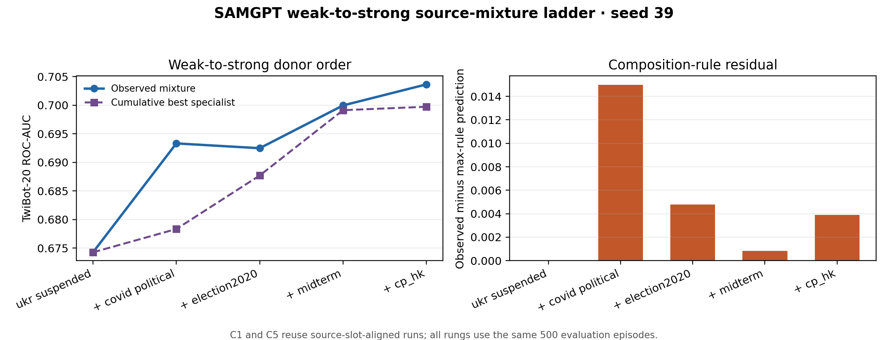

# SAMGPT weak-to-strong source-mixture ladder

## Result

The weak-to-strong order provides a deliberately diagnostic test: every newly
added source has a higher single-source TwiBot-20 ROC-AUC than the preceding
cumulative maximum.

| rung | source added | observed mixture | cumulative max specialist | residual |
|---:|---|---:|---:|---:|
| C1 | ukr_rus_suspended | .6743 | .6743 | +.0000 |
| C2 | covid_political | .6933 | .6783 | +.0150 |
| C3 | election2020 | .6925 | .6877 | +.0048 |
| C4 | midterm | .7000 | .6991 | +.0008 |
| C5 | cp_hk_twitter | **.7036** | .6997 | +.0039 |

Across the five rungs, the best-donor rule has **MAE .0049**, RMSE .0073, and
maximum absolute error .0150. All residuals are non-negative, so the rule
underpredicts rather than upper-bounds the mixtures in this order.

The endpoint improvement is **+.0294 ROC-AUC** from C1 to C5. A descriptive
paired bootstrap over the same 500 evaluation episodes gives
**[+.0229, +.0358]**. The largest adjacent improvement is C2−C1 at +.0191
([+.0150, +.0233]). C3 is slightly below C2 (−.0008, interval
[−.0039, +.0021]) even though `election2020` raises the specialist maximum.

## Interpretation

The maximum rule remains a useful approximation, but the fit is less exact than
in the original Order-C prefix (MAE .0013). The C2 mixture exceeds both of its
single-source constituents by .0150 AUC, and the predicted C3 step is absent.
Conversely, C4 and C5 lie within .004 of the cumulative specialist maximum.

This order therefore weakens a literal rung-by-rung max interpretation while
remaining consistent with a broader coverage account: strong donors predict the
level of the later mixture, with a small positive mixture residual on this held-out
target. The larger nine-graph, three-order neighbor-matching ladder is needed to
determine whether this behavior generalizes beyond one downstream target.

## Design

- seed 39 and 200 full-graph epochs per active source;
- GraphCL pretraining with mean per-source loss;
- one shared deterministic 768→50 Gaussian feature projection;
- five fixed prompt slots tied to source identity;
- frozen cosine prototypes on the same 500 deterministic 10-shot TwiBot-20
  episodes at every rung; and
- TwiBot-20 held out from pretraining.

C1 reuses the slot-aligned `ukr_rus_suspended` specialist. C5 reuses the existing
five-source endpoint because its active source--slot pairs are identical. C2--C4
are the canonical successful runs from the weak-to-strong worktree. The interrupted
C2 directory ending in `151534Z` is excluded; the canonical C2 run ends in
`151624Z`.

This remains a fixed-exposure rather than fixed-total-compute design. Runtime grows
from 26 seconds for C1 to 343 seconds for C5, so the result does not isolate source
diversity from additional compute.

## Evidence

- [`data/rung_summary.csv`](data/rung_summary.csv)
- [`data/paired_deltas.csv`](data/paired_deltas.csv)
- [`data/specialist_summary.csv`](data/specialist_summary.csv)
- [`data/max_rule_comparison.csv`](data/max_rule_comparison.csv)
- [`data/max_rule_metrics.csv`](data/max_rule_metrics.csv)
- [`analyze.py`](analyze.py)
- W&B: [C1](https://wandb.ai/eibl-usc/graph-clip/runs/09wiftde),
  [C2](https://wandb.ai/eibl-usc/graph-clip/runs/944unlcl),
  [C3](https://wandb.ai/eibl-usc/graph-clip/runs/gegra20u),
  [C4](https://wandb.ai/eibl-usc/graph-clip/runs/vp0e2mtj), and
  [C5](https://wandb.ai/eibl-usc/graph-clip/runs/odpa0zvf).

Intervals are descriptive paired-episode bootstraps. They quantify variation over
the fixed evaluation episodes, not training-seed uncertainty.
