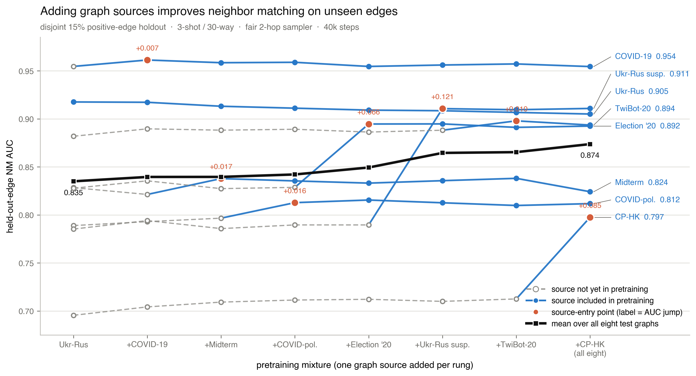

# Split-aware two-hop NM ladder analysis

This folder is reserved for evidence from
`../../setup/nm_ladder_train_test_nhop2/`. Every reported cell must use background
message passing and held-out NM positives; historical full-adjacency NM scores are not
copied into the result table.

After all eight terminal models have been evaluated on all eight graphs:

```bash
python3 scripts/experiments/analysis/transfer/ablations/prodigy_nm/split_integrity/nm_ladder_train_test_nhop2/assemble_results.py \
  --log-root /dataMeR1/phil/gfm/prodigy-nmlsplit-h2/log
```

The assembler requires all 64 cells and emits a wide table plus an entry-aligned long
table under `data/`. `--allow-partial` is diagnostic only. Add `FINDINGS.md` only after
the complete evidence is committed.

## Figure

```bash
/opt/homebrew/bin/python3.11 \
  scripts/experiments/analysis/transfer/ablations/prodigy_nm/split_integrity/nm_ladder_train_test_nhop2/plot_ladder.py
```


