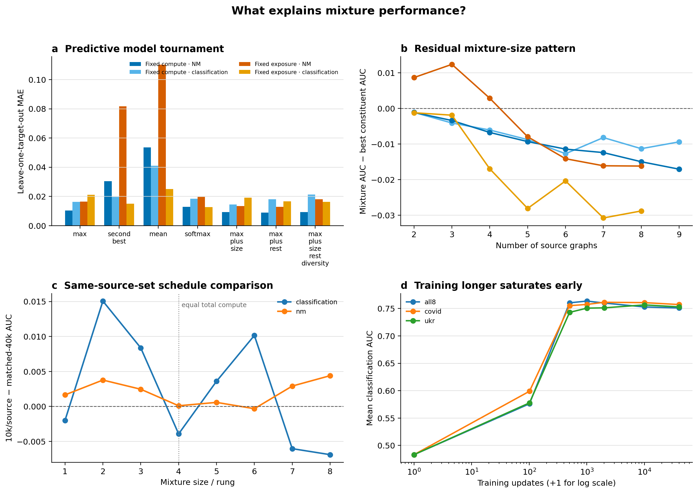

# What explains mixture performance?

## Question

Is a mixture determined by its best constituent specialist, or do mixture size, the
remaining constituents, graph choice, diversity, and training duration add explanatory
power?

This analysis combines the fixed-compute final-core ladders with the fixed-10k/source
two-hop ladders over the four downstream targets shared by both. It excludes rung 1,
where a constituent comparison is tautological. The canonical table contains 304 logical
mixture cells:

| setting | cells | orders | training seeds |
|---|---:|---:|---:|
| fixed compute, NM | 96 | 3 | 3 (seed means) |
| fixed compute, classification | 96 | 3 | 3 (seed means) |
| fixed exposure, NM | 56 | 2 | 1 |
| fixed exposure, classification | 56 | 2 | 1 |

## Method

Every mixture is represented by the target AUCs of its constituent specialists. Derived
predictors include the maximum, second-best, mean, mean of the non-best constituents,
score spread, source count, and mean pairwise distance between four-target specialist
transfer profiles. The last quantity is **transfer-profile diversity**, not an intrinsic
graph-statistic measure.

Predictive models are evaluated by leave-one-target-out cross-validation. Linear models
are refit without the held-out target. The soft-max rule fits its concentration parameter
on the other three targets. Error comparisons are paired by cell, but confidence
intervals and sign-flip tests operate on target-by-order trajectories so adjacent ladder
rungs are not treated as independent replicates.

## 1. NM is best explained by a dominant donor plus a small mixture correction

The literal max rule is already strong: MAE is .0104 under fixed compute and .0165 under
fixed exposure. The second-best and mean rules are much worse:

| NM setting | max | second best | mean |
|---|---:|---:|---:|
| fixed compute | **.0104** | .0305 | .0536 |
| fixed exposure | **.0165** | .0818 | .1102 |

Relative to max, second-best increases MAE by .0201 under fixed compute (trajectory
bootstrap 95% interval [.0081, .0347], exact cluster sign-flip p=.0044) and by .0652
under fixed exposure ([.0329, .1029], p=.0156). Equal contribution from all constituents
is decisively inconsistent with NM.

Small corrections can improve point prediction. `max + mean-of-rest` reaches MAE .0088
under fixed compute and .0129 under fixed exposure. However, its improvement over max is
not stable at the trajectory level: both cluster intervals include zero. The supported
claim is therefore **dominant-donor behavior with possible small dilution/interference**,
not a precisely estimated additive contribution from every source.

## 2. Classification is less uniquely tied to the best donor

Classification has a different boundary. Under fixed compute, max MAE is .0163 and the
best small correction (`max + source count`) reaches .0144, but the trajectory-level
difference is not distinguishable from zero. Under fixed exposure, soft-max reaches
.0127 versus .0212 for literal max; its trajectory-clustered improvement is -.0085
[-.0137, -.0030], with exact sign-flip p=.039.

The fitted fixed-exposure soft-max concentration is stable across held-out targets
(15.3--18.2). This is finite—not the max-rule limit—and supports a distributed top-of-the-
constituent-envelope interpretation. Second-best is also competitive at .0149. This does
not establish that every source contributes equally: the plain mean remains worse at
.0250.

## 3. Number of graphs changes the residual, but not as a pure causal size effect

The residual `mixture AUC - best constituent AUC` becomes more negative as source count
increases in three settings:

| setting | mean trajectory slope per log source count | cluster 95% interval |
|---|---:|---:|
| fixed compute, NM | -.0106 | [-.0151, -.0061] |
| fixed compute, classification | -.0065 | [-.0153, +.0020] |
| fixed exposure, NM | -.0230 | [-.0382, -.0098] |
| fixed exposure, classification | -.0233 | [-.0376, -.0090] |

This is a **gap-to-an-improving-envelope** result. It does not say that absolute AUC falls
by those amounts: as sources are added, the best available specialist prediction itself
usually rises. The slope says mixtures retain slightly less of that expanding envelope.

Fixed compute holds total updates constant, so its NM slope cannot be caused by longer
training. Fixed exposure holds expected exposure per source constant, so its slope cannot
be explained by progressively starving incumbents. Together they support a small
mixture-size/interference term on top of composition, strongest relative to the max
envelope.

## 4. Graph choice matters strongly for NM; classification evidence is weaker

To remove target difficulty and mixture size, both predicted and observed AUC were
demeaned within each `(target, number of sources)` stratum. The remaining association
asks whether choosing a stronger constituent set at the same size predicts a stronger
mixture.

| setting | within-target/size correlation | stratified permutation p |
|---|---:|---:|
| fixed compute, NM | **.983** | <.0001 |
| fixed exposure, NM | **.980** | .00015 |
| fixed compute, classification | -.012 | .940 |
| fixed exposure, classification | .556 | .118 |

Thus graph choice is not reducible to “any `k` graphs” for NM. The current classification
ladders do not establish a graph-choice effect after target and size are controlled. The
fixed-exposure estimate is directionally positive but has only two orders and one seed.

## 5. Transfer-profile diversity adds no robust predictive improvement

Adding transfer-profile diversity to max changes cross-validated MAE by -0.0008 to
-0.0036 across settings. Every trajectory-bootstrap interval includes zero. Adding it to
the size/rest model likewise fails to improve consistently. Score spread helps the
one-seed fixed-exposure classification panel (-.0081 MAE versus max, p=.031), but this was
one of several correlated candidate summaries and is not replicated in fixed compute.

The defensible current result is **no independent diversity effect detected**. This does
not rule out intrinsic structural or feature diversity; the current orders provide too
few same-size source-set alternatives, and transfer-profile diversity is only one proxy.

## 6. Longer training does not explain the composition effects

Order A provides a same-source-set, same-sampler comparison between fixed 10k/source and
matched 40k total. Across all cells, fixed-exposure minus matched-40k is +.0019 NM AUC and
+.0023 classification AUC. At rung 4, both schedules use exactly 40k total updates:

- NM difference: +.00009;
- classification difference: -.00393.

The direction does not change materially above versus below the equal-compute rung. In
the independent two-hop saturation runs, classification realizes most of its gain by 500
updates and remains on a narrow plateau through 40k. Therefore “train any graph longer”
is not a plausible explanation for the observed source-set structure at these budgets.

This conclusion is about the tested 500--40k plateau. It does not imply compute is
irrelevant before saturation, nor does it replace a full factorial experiment with
several independently sampled mixtures at each size.

## Statistical and causal boundary

- Leave-one-target-out has only four folds. It measures transfer to a held-out target,
  but model rankings should not be read as high-precision population estimates.
- Fixed-exposure results have one training seed and two source orders.
- Source sets are nested within orders. Source-specific additive coefficients are not
  identifiable without more mixture orders or deliberately crossed subsets.
- Fixed-exposure and classification constituent scores use the registered specialist
  matrix as a predictive reference; they are not same-budget causal specialist controls.
- The tested diversity variable is derived from specialist transfer profiles. Intrinsic
  graph diversity requires separately specified structural/feature distances.
- Cluster tests have 8 or 12 trajectories. Exact p-values are reported where useful, but
  effect sizes and replication across schedules are more important.

## What additional mixture orders buy

Additional orders should be chosen to cross source identities at the same mixture sizes,
not merely permute adjacent similar graphs. With at least 5--8 source sets per size and
three seeds, the next analysis can fit partially pooled source effects, separate source
count from identity, and test structural diversity without relying on nested-order
collinearity.

## Evidence

Generated by `analyze_mixture_explanations.py`:

- `data/mixture_explanations/mixture_cells.csv`: canonical 304-cell feature table;
- `cross_validated_predictions.csv`: held-out-target predictions for every model;
- `model_comparison.csv`: MAE/RMSE/bias/correlation tournament;
- `paired_model_tests.csv`: trajectory-clustered comparisons against max;
- `mixture_size_tests.csv` and `graph_choice_tests.csv`;
- `schedule_comparison_{cells,summary}.csv`;
- `classification_saturation_summary.csv`;
- `figures/pngs/mixture_explanation_model_comparison.png` and PDF.
